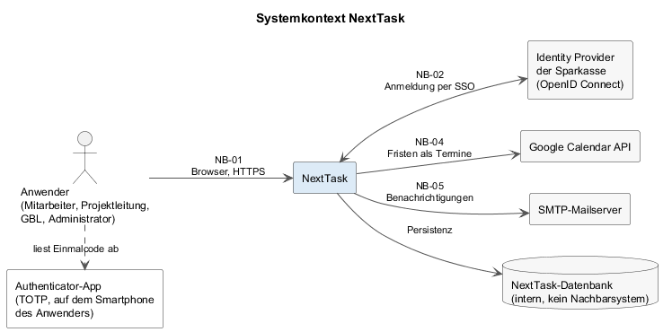
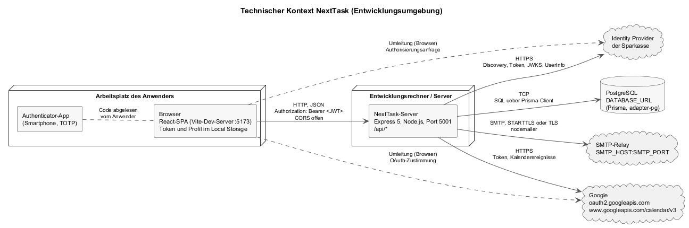

# 3 Kontextabgrenzung

[Kapitel 2](A02-randbedingungen.md) hat die Randbedingungen aufgezählt; dieses Kapitel setzt NextTask in seine Umgebung. Zwei Fragen:

- **Fachlicher Kontext**: Mit wem tauscht NextTask Informationen aus, und was bedeuten sie?
- **Technischer Kontext**: Über welche Kanäle, Protokolle und Zugangsdaten läuft jeder Austausch?

Der fachliche Kontext ist in der Spezifikation festgelegt ([`P2`](../spec/P2-architekturueberblick.md), Verträge in [`S1`](../spec/S1-nachbarsysteme.md)). Dieses Kapitel übernimmt ihn und ergänzt die technischen Bindungen, die die Spezifikation bewusst auslässt.

---

## 3.1 Fachlicher Kontext

*Quelle: [`../spec/diagrams/p2-systemkontext.plantuml`](../spec/diagrams/p2-systemkontext.plantuml).*

| Nachbar | Information hinein / hinaus | Fachliches Ereignis |
|---------|-----------------------------|---------------------|
| **Browser des Anwenders** (NB-01) | Alle Eingaben und Anzeigen der Masken DLG-01 bis DLG-12 | Jede Bedienung |
| **Identity Provider der Sparkasse** (NB-02) | Hinaus: Autorisierungsanfrage; hinein: bestätigte Identität (Subjekt, E-Mail, Name, Gruppen) | SSO-Anmeldung (UC-03) |
| **Authenticator-App** (NB-03) | Einmalig: gemeinsames Geheimnis per QR-Code; danach nur der abgelesene Code über den Anwender | Einrichtung und Anmeldung mit zweitem Faktor (UC-02, UC-04) |
| **Google Calendar** (NB-04) | Hinaus: ganztägiger Termin je Frist einer zugewiesenen Aufgabe; hinein: Terminkennung | Aufgabe anlegen, ändern, terminieren, löschen; Kalender verbinden (UC-11 bis UC-16, UC-25) |
| **SMTP-Mailserver** (NB-05) | Hinaus: Benachrichtigung bei Zuweisung, Erwähnung, Test | Aufgabe zuweisen, kommentieren, Profil testen (UC-05, UC-11, UC-12, UC-15) |

Weitere Nachbarn gibt es nicht: kein Kernbanksystem, kein Dokumentenmanagement, keine Überwachung, kein Scheduler (NG-01, NG-05, README der Spezifikation zu B2).

---

## 3.2 Technischer Kontext

*Quelle: [`diagrams/a03-technischer-kontext.plantuml`](diagrams/a03-technischer-kontext.plantuml).*

| Kanal | Protokoll und Bindung | Zugangsdaten | Code |
|-------|-----------------------|--------------|------|
| **Browser → Server** | HTTP mit JSON; Basisadresse aus `VITE_API_URL`, mit `http://localhost:5001/api` als Entwicklungs-Fallback; Kopf `Authorization: Bearer <JWT>` aus dem Local Storage; CORS ohne Einschränkung (`cors()` ohne Optionen). 401 löst im Browser das Löschen von Token und Profil und die Umleitung zu `/login` aus. | JWT, signiert mit `JWT_SECRET`, sieben Tage | `client/src/api/axios.js`, `server/src/index.js`, `server/src/middleware/auth.js` |
| **Browser → Identity Provider** | Umleitung des Browsers auf die Autorisierungsadresse aus dem Discovery-Dokument; Rückleitung auf `SSO_REDIRECT_URI` (Server) und danach auf `SSO_FRONTEND_REDIRECT_URI` (Browser, `/login?sso=callback&code=…`). | keine im Browser | `client/src/pages/LoginPage.jsx` |
| **Server → Identity Provider** | HTTPS mit `fetch`: Discovery (`/.well-known/openid-configuration`, 10 Minuten zwischengespeichert), Token-Endpunkt (Authorization Code mit PKCE, Client-Authentifizierung nach `SSO_CLIENT_AUTH_METHOD`), JWKS (zwischengespeichert), UserInfo. ID-Token-Prüfung mit RS256. | `SSO_CLIENT_ID`, `SSO_CLIENT_SECRET` | `server/src/utils/sso.js`, `server/src/routes/auth.routes.js` |
| **Browser → Google** | Umleitung auf `accounts.google.com` mit `access_type=offline`, `prompt=consent`, Scope `calendar.events` und Profil; Rückleitung auf `<Server>/api/calendar-integration/callback`, danach auf `APP_BASE_URL/settings?calendar_status=…`. | keine im Browser | `client/src/pages/SettingsPage.jsx` |
| **Server → Google** | HTTPS mit `fetch`: `oauth2.googleapis.com/token` (Code-Tausch, Token-Erneuerung), `openidconnect.googleapis.com/v1/userinfo`, `www.googleapis.com/calendar/v3/calendars/primary/events` (POST, PATCH, DELETE). | `GOOGLE_CALENDAR_CLIENT_ID`, `GOOGLE_CALENDAR_CLIENT_SECRET`; Refresh-Token je Anwender verschlüsselt in `User.calendarRefreshToken` | `server/src/utils/calendarIntegration.js`, `server/src/routes/calendarIntegration.routes.js` |
| **Server → SMTP** | SMTP über `nodemailer.createTransport` mit `SMTP_HOST`, `SMTP_PORT`, `SMTP_SECURE` (TLS ab Verbindung) sonst STARTTLS; HTML und Text je Mail. Kein Eingang. | `SMTP_USER`, `SMTP_PASS`; Absender `EMAIL_FROM` | `server/src/utils/taskNotificationMailer.js` |
| **Server → PostgreSQL** | TCP mit dem `pg`-Treiber hinter `@prisma/adapter-pg`; ein `PrismaClient` je Prozess, per Middleware an jede Anfrage gehängt (`req.prisma`). | `DATABASE_URL` (mit `sslmode=require` bei entfernten Datenbanken) | `server/src/index.js`, `server/prisma/schema.prisma` |
| **Authenticator-App** | Kein Netzkanal. `otpauth://`-Adresse als QR-Code und Text bei der Einrichtung; TOTP nach RFC 6238 mit SHA-1, sechs Ziffern, 30 Sekunden. | Geheimnis verschlüsselt in `User.twoFactorSecret` | `server/src/utils/twoFactor.js` |

**Ports und Prozesse in der Entwicklungsumgebung.** Zwei Prozesse auf derselben Maschine: Vite-Entwicklungsserver auf 5173 (liefert die Browser-Anwendung) und Express auf 5001 (`PORT` in `.env`; Vorgabe im Code ist 5000, die Browser-Anwendung erwartet 5001). Beide startet `npm run dev` im Wurzelverzeichnis über `concurrently`. Die Datenbank läuft nicht im Projekt; `DATABASE_URL` zeigt auf eine lokale oder entfernte PostgreSQL-Instanz.

**Was den Kontext verlässt.** Über die Kanäle nach außen gehen: Aufgabentitel und Frist (Google), Aufgabentitel, Projektname, Frist und Kommentartext (Mail), keine Daten an den Identity Provider außer dem Anmeldewunsch. Passwörter der Sparkasse erreichen NextTask nie (CON-03); Passwörter von NextTask verlassen den Server nie.
