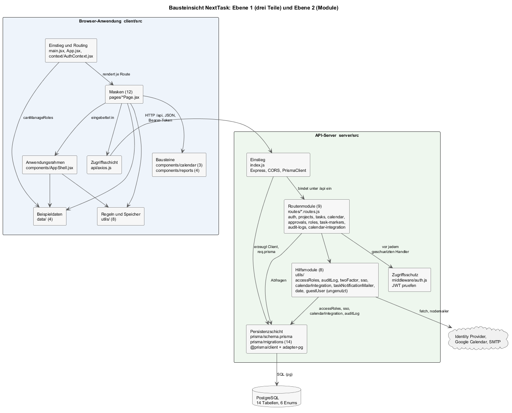

# 5 Bausteinsicht

Die Bausteinsicht zerlegt NextTask von außen nach innen. Jede Ebene öffnet einen Baustein der vorherigen Ebene als Whitebox und beschreibt die enthaltenen Bausteine als Blackbox.

- **Ebene 0** ist der Kontext aus [Kapitel 3](A03-kontextabgrenzung.md): NextTask als ein Kasten zwischen seinen Nachbarn.
- **Ebene 1** ([5.1](#51-whitebox-gesamtsystem)) öffnet diesen Kasten: drei Teile, die als getrennte Prozesse laufen.
- **Ebene 2** ([5.2](#52-ebene-2)) öffnet Browser-Anwendung und API-Server bis auf Modulebene.
- **Ebene 3** ([5.3](#53-ebene-3-zugang)) öffnet ein Modul, in dem eine Architekturentscheidung steckt: den Zugang (Anmeldung, zweiter Faktor, SSO).

Jeder Baustein entspricht einem Verzeichnis oder einer Datei im Repository; nichts ist geplant oder gedacht. Die Zerlegung endet, wo eine weitere Ebene nur Code wiederholen würde. Blackboxes sind mit den Feldern Zweck, Schnittstellen, Abhängigkeiten, Code, erfüllte Anforderungen und offene Punkte beschrieben; Whiteboxes mit Diagramm, enthaltenen Bausteinen, Beziehungen und Entwurfsentscheidungen. Felder ohne Aussage entfallen.

*Quelle: [`diagrams/a05-bausteine.plantuml`](diagrams/a05-bausteine.plantuml).*

---

## 5.1 Whitebox Gesamtsystem

**Enthaltene Bausteine**

| Baustein | Verantwortung | Code |
|----------|---------------|------|
| **Browser-Anwendung** | Alle Masken (B1), Routing im Browser, Sitzung im Local Storage, Aufruf der Schnittstelle, Erzeugung des Statusbericht-PDF (B3). | `client/` (rund 16.000 Zeilen, davon 11.800 in den Masken) |
| **API-Server** | Fachliche Regeln (F3), Zugriffsschutz, Audit-Log, Anbindung der Nachbarsysteme, Datenzugriff. Schnittstelle unter `/api`. | `server/src/` (rund 4.900 Zeilen) |
| **Datenbank** | Dauerhafte Ablage aller Entitäten aus D1. Schema wird vom Server vorgegeben (Prisma), der Prozess läuft außerhalb des Projekts. | `server/prisma/` (Schema und 14 Migrationen) |

**Beziehungen.** Die Browser-Anwendung kennt den Server nur über HTTP-Aufrufe an `/api/*` mit JSON und Bearer-Token; sie importiert keinen Servercode und teilt keine Module mit ihm. Der Server kennt die Browser-Anwendung nicht; er liefert sie auch nicht aus (in der Entwicklung tut das Vite). Nur der Server spricht mit der Datenbank und mit den Nachbarsystemen. Damit gibt es genau eine Richtung: Browser → Server → Datenbank/Nachbarn.

**Entwurfsentscheidungen.** Die Dreiteilung ist [ADR-001](A09-architekturentscheidungen.md#adr-001-getrennte-browser-anwendung-und-rest-api); die gemeinsame Sprache [ADR-002](A09-architekturentscheidungen.md#adr-002-javascript-durchgängig-react-im-browser-express-auf-dem-server); die Datenbank [ADR-003](A09-architekturentscheidungen.md#adr-003-postgresql-mit-prisma-als-persistenz). Kein gemeinsames Paket für Typen oder Validierung zwischen Browser und Server: Die Enum-Werte aus D2 sind auf beiden Seiten als Zeichenketten bekannt, der Server normalisiert ([AF-04](../spec/F3-anwendungsfunktionen.md#af-04--status-priorität-und-eingaben-normalisieren)).

**Offener Punkt.** Die Browser-Anwendung hält Projekte, Backlog und Board in mehreren Masken selbst (Local Storage, [B1.5](../spec/B1-dialogspezifikation.md#b15-stand-der-anbindung)). Die Beziehung Browser → Server ist für diese Daten nicht durchgängig; siehe [8.9](A08-querschnittliche-konzepte.md#89-zustand-im-browser).

### 5.1.1 Blackbox Browser-Anwendung

| Feld | Inhalt |
|------|--------|
| **Zweck** | Rendert die zwölf Masken aus B1, hält Filter- und Anzeigezustand, ruft die Schnittstelle des Servers auf, leitet ohne Token zur Anmeldung. |
| **Angebotene Schnittstelle** | Die Adressen aus [B1.1](../spec/B1-dialogspezifikation.md#b11-dialogindex) (`/login`, `/`, `/projects`, `/my-tasks`, …) im Browser; Tiefe Verweise über `?taskId`, `?section`. |
| **Benötigte Schnittstelle** | `/api/*` des Servers (Basisadresse fest in `api/axios.js`); Umleitungsziele von Identity Provider und Google. |
| **Abhängigkeiten** | React 19, React Router 7, axios, Tailwind 4, lucide-react (Icons), @dnd-kit (Ziehen im Backlog), html2canvas und jspdf (PDF). Bauen mit Vite 8. |
| **Erfüllte Anforderungen** | Alle DLG-xx; UC-10 vollständig; UC-06 vollständig (Abmelden ist reine Browserlogik). |
| **Offene Punkte** | Beispieldaten und Local-Storage-Persistenz in Dashboard, Projekte, Board, Kalender, Reports, Dokumente (B1.5); Farbstreifen-Laden fehlerhaft (B1.5 Nr. 1). |
| **Verfeinert in** | [5.2.1](#521-whitebox-browser-anwendung) |

### 5.1.2 Blackbox API-Server

| Feld | Inhalt |
|------|--------|
| **Zweck** | Setzt die fachlichen Regeln aus F3 durch, schützt Ressourcen, schreibt das Audit-Log, spricht Nachbarsysteme an, liest und schreibt die Datenbank. |
| **Angebotene Schnittstelle** | HTTP/JSON unter `/api`, neun Bereiche ([P2.3](../spec/P2-architekturueberblick.md#p23-grobstruktur)); Fehlerformat `{ message, error? }` ([S1.2](../spec/S1-nachbarsysteme.md#s12-nb-01--browser-des-anwenders)). `GET /` liefert eine Lebenszeichen-Meldung. |
| **Benötigte Schnittstelle** | PostgreSQL über `DATABASE_URL`; Identity Provider, Google, SMTP nach [Kapitel 3.2](A03-kontextabgrenzung.md#32-technischer-kontext). |
| **Abhängigkeiten** | Express 5, @prisma/client 6 mit adapter-pg, jsonwebtoken, bcryptjs, nodemailer, qrcode, cors, dotenv. Entwicklung mit nodemon. |
| **Erfüllte Anforderungen** | AF-01 bis AF-11; UC-01 bis UC-05, UC-07 bis UC-09, UC-11 bis UC-25 serverseitig; NFR-15a bis 15d; QK-01 bis QK-07. |
| **Offene Punkte** | Keine Berechtigungsprüfung auf Projektebene bei Aufgaben ([QK-02](../spec/N2-querschnittskonzepte.md#qk-02-berechtigungen)); keine Begrenzung von Anmeldeversuchen; offene CORS-Regel. |
| **Verfeinert in** | [5.2.2](#522-whitebox-api-server), [5.3](#53-ebene-3-zugang) |

### 5.1.3 Blackbox Datenbank

| Feld | Inhalt |
|------|--------|
| **Zweck** | Hält die 14 Entitäten aus [D1](../spec/D1-datenmodell.md) als 14 Tabellen mit sechs Enum-Typen, Fremdschlüsseln, Eindeutigkeiten und Löschregeln. |
| **Angebotene Schnittstelle** | SQL über den PostgreSQL-Treiber `pg`; im Code nur über den generierten Prisma-Client sichtbar. |
| **Abhängigkeiten** | PostgreSQL-Server außerhalb des Repositories (lokal oder bei einem Anbieter); `sslmode=require` bei entfernten Instanzen. |
| **Erfüllte Anforderungen** | D1.6 Eindeutigkeiten und Löschregeln als Datenbankregeln; NFR-15d-01 (Einträge in `AuditLog` haben keinen Update- oder Delete-Pfad im Code). |
| **Offene Punkte** | Statuswerte der Berichtsbasis als Text ohne Datenbankprüfung (R-06); `Task.markerId` ohne Fremdschlüssel. |
| **Verfeinert in** | Schema und Abbildung auf D1 in [8.1](A08-querschnittliche-konzepte.md#81-domänenmodell-und-persistenz). |

---

## 5.2 Ebene 2

### 5.2.1 Whitebox Browser-Anwendung

**Enthaltene Bausteine** (alle unter `client/src/`):

| Baustein | Dateien | Verantwortung |
|----------|---------|---------------|
| **Einstieg und Routing** | `main.jsx`, `App.jsx`, `context/AuthContext.jsx` | `main.jsx` wendet die gespeicherten Anzeigeeinstellungen an und rendert `App`. `App.jsx` definiert die Routen und drei Wächter: `RequireAuth` (ohne Token → `/login` mit Merken des Ziels), `PublicOnly` (mit Token → Ziel), `RequireAuditAccess` (nur mit `canManageRoles`). `AuthContext` hält Benutzer und Token aus dem Local Storage und bietet `login`, `logout`, `updateUser`. |
| **Anwendungsrahmen** | `components/AppShell.jsx` (513 Zeilen) | Seitenleiste mit den zehn Einträgen, Kopfzeile mit globaler Suche (Strg+K), Erstellen-Menü, Benachrichtigungen (drei feste Beispielmeldungen), Profilmenü. Nimmt je Maske Titel, Suchvorschläge und Menüeinträge entgegen. Verteilt Rollen- und Darstellungsänderungen über `CustomEvent`s (`nexttask:roles-change`, `nexttask:appearance-change`, `nexttask:task-markers-change`). |
| **Masken** | `pages/*Page.jsx`, 13 Dateien | Eine Datei je Maske aus B1 (`ProjectBoardPage.jsx` exportiert nur `ProjectsPage` erneut). Die drei größten: `ProjectsPage` (3.234 Zeilen, inkl. Projektdialog mit sechs Reitern und Ticketdetails), `MyTasksPage` (2.405, Board und Ticket-Editor mit acht Reitern), `SettingsPage` (1.689). |
| **Bausteine** | `components/calendar/` (3), `components/reports/` (4) | Aus Kalender und Reports herausgelöste Teile: Werkzeugleiste, Dialoge und Raster des Kalenders; Kennzahlen, Inhalte und Statusbericht-Vorschau der Reports. |
| **Zugriffsschicht** | `api/axios.js` | Eine axios-Instanz: Basisadresse, Request-Interceptor setzt `Authorization: Bearer` aus `localStorage.token`, Response-Interceptor löscht bei 401 Token und Profil und leitet hart auf `/login`. |
| **Regeln und Speicher** | `utils/` (8 Dateien, 949 Zeilen) | Reine Funktionen: `task.js` (Statuslabels, Fälligkeitsklassen), `effort.js` (Stunden↔Tage, 8 h/Tag), `calendar.js` (Datumsraster), `taskMarkers.js` (Farbstreifen-Zuordnung nach AF-10, Local-Storage-Kopie), `approvalStorage.js` (lokal vorgemerkte Freigaben), `appearance.js` (Darstellung, Datenattribute am `<html>`), `reportExport.js` (HTML-Vorlage des Statusberichts und PDF-Erzeugung, 437 Zeilen). |
| **Beispieldaten** | `data/` (4 Dateien, 1.225 Zeilen) | `bankOrganization.js` (Abteilungen OR-IT/ID/OE, Standardrollen, `canManageRoles`, Local-Storage-Rückfall), `projectFixtures.js` und `taskFixtures.js` (Startbestand für Projekte, Backlog, Board), `calendarConstants.js` (Anzeigetexte für Status und Priorität). |

**Beziehungen.** `App.jsx` importiert alle Masken; jede Maske importiert `AppShell`, meist `axios`, `AuthContext` und die benötigten `utils` und `data`. Masken importieren einander nur an einer Stelle: `MyTasksPage` nutzt den Projektdialog aus `ProjectsPage`. `AppShell` importiert `bankOrganization` (Sichtbarkeit des Audit-Log-Eintrags) und `appearance`. Es gibt keinen globalen Zustand außer `AuthContext`; jede Maske lädt ihre Daten selbst.

**Entwurfsentscheidungen.** Kein Zustandsmanagement-Paket (kein Redux, kein Query-Cache): Jede Maske hält ihren Zustand mit `useState`/`useEffect` und lädt beim Öffnen. Das ist für zwölf Masken ohne geteilte Live-Daten ausreichend und hält die Abhängigkeiten flach; der Preis ist, dass Masken voneinander nichts mitbekommen und über `CustomEvent`s benachrichtigt werden müssen. Die Anzeigetexte der Enums liegen in `calendarConstants.js` und `task.js` doppelt (Kalender- und Board-Schreibweise, [D2.3](../spec/D2-datentypen.md#d23-taskstatusdt)).

**Offene Punkte.** `DepartmentsPage.jsx` ist vorhanden, aber nicht geroutet (`/departments` leitet um). `data/` und die Local-Storage-Persistenz in `ProjectsPage`, `MyTasksPage`, `ReportsPage` sind der Grund für R-01.

### 5.2.2 Whitebox API-Server

**Enthaltene Bausteine** (alle unter `server/src/` bzw. `server/prisma/`):

| Baustein | Dateien | Verantwortung |
|----------|---------|---------------|
| **Einstieg** | `index.js` (40 Zeilen) | Erzeugt die Express-App, aktiviert `cors()` und `express.json()`, erzeugt einen `PrismaClient` mit `PrismaPg`-Adapter und hängt ihn als `req.prisma` an jede Anfrage, bindet neun Router unter `/api/<bereich>` ein, lauscht auf `PORT`. |
| **Zugriffsschutz** | `middleware/auth.js` (23 Zeilen) | Liest `Authorization: Bearer`, prüft das JWT mit `JWT_SECRET`, verlangt `id` und `purpose === 'access'`, legt die Nutzdaten als `req.user` ab. Antwortet sonst mit 401. |
| **Routenmodule** | `routes/<bereich>.routes.js` (9 Dateien, 2.670 Zeilen) | Je Bereich ein Express-Router. Jeder Handler: Eingaben normalisieren, Regeln prüfen, Prisma aufrufen, Audit schreiben, Nebenwirkungen anstoßen, antworten. Details unten. |
| **Hilfsmodule** | `utils/` (8 Dateien, 1.960 Zeilen) | Regeln, die mehrere Routen brauchen; entsprechen den Anwendungsfunktionen aus F3 (Zuordnung in [5.4](#54-zuordnung-zur-spezifikation)). |
| **Persistenzschicht** | `prisma/schema.prisma`, `prisma/migrations/`, `prisma.config.ts` | Schema als Quelle der Wahrheit; der generierte Client ist die einzige Datenbankschnittstelle im Code. |

**Die neun Routenmodule**

| Modul | Präfix | Handler | Nutzt Hilfsmodule | Realisiert |
|-------|--------|---------|-------------------|------------|
| `auth.routes.js` (800 Zeilen) | `/api/auth` | register, login, login/2fa, sso/config, sso/login, sso/callback, sso/exchange, me, me (PUT), me/password, me/2fa/setup, me/2fa/confirm, me/2fa/disable, me/notifications/test | accessRoles, auditLog, twoFactor, sso, taskNotificationMailer, calendarIntegration | UC-01 bis UC-05 |
| `project.routes.js` | `/api/projects` | list (nur eigene), create, :id/reporting (PUT), :id/status-reports (POST) | auditLog | UC-07 bis UC-09 |
| `task.routes.js` | `/api/tasks` | project/:projectId (GET), create, :id (PUT), :id/move, :id/schedule, :id (DELETE), :id/comments | auditLog, taskNotificationMailer, calendarIntegration, date | UC-11 bis UC-16 |
| `calendar.routes.js` | `/api/calendar` | tasks (GET mit Filtern) | date | UC-17, AF-02 |
| `approval.routes.js` | `/api/approvals` | context, list, create, :id/approve, :id/reject, :id/cancel | accessRoles, auditLog | UC-18 bis UC-20 |
| `role.routes.js` | `/api/roles` | list, create, :id (PUT), :id (DELETE), users/:id (PUT), users (POST) | accessRoles, auditLog | UC-21, UC-22 |
| `auditLog.routes.js` | `/api/audit-logs` | list (GET mit Filtern) | accessRoles, date | UC-23 |
| `taskMarker.routes.js` | `/api/task-markers` | list, replace (PUT) | auditLog | UC-24 |
| `calendarIntegration.routes.js` | `/api/calendar-integration` | connect-url, callback, sync, disconnect | auditLog, calendarIntegration | UC-25 |

**Die acht Hilfsmodule**

| Modul | Zeilen | Inhalt | Nutzt |
|-------|--------|--------|-------|
| `accessRoles.js` | 173 | Standardrollen, `ensureDefaultAccessRoles`, `normalizePermissions`, `serializeRole`/`serializeUser`, `userCanManageRoles`, `userCanApproveRequests` | Prisma |
| `auditLog.js` | 91 | `writeAuditLog`, `summarizeChanges`, `pickFields`; Akteur aus `req`, IP aus `X-Forwarded-For` | Prisma |
| `twoFactor.js` | 200 | Base32, TOTP (HMAC-SHA-1), `encryptSecret`/`decryptSecret` (AES-256-GCM), Wiederherstellungscodes (bcrypt), `otpauth://`-Adresse | `crypto`, bcryptjs |
| `sso.js` | 530 | Konfiguration aus `.env`, Discovery- und JWKS-Cache, verschlüsselter `state`, PKCE, Token-Tausch, ID-Token-Prüfung (RS256), Profil, `findOrCreateSsoUser`, Einmaltickets | `crypto`, `fetch`, jsonwebtoken, bcryptjs, accessRoles, Prisma |
| `calendarIntegration.js` | 573 | Google-OAuth (Zustimmungsadresse, signierter `state`, Code-Tausch, Token-Erneuerung), Ereignisse anlegen/ändern/löschen, `syncTaskCalendarEvent`, `syncUserCalendarTasks`, `removeTaskCalendarSyncs`, `serializeCalendarConnection` | `fetch`, jsonwebtoken, twoFactor (Verschlüsselung), Prisma |
| `taskNotificationMailer.js` | 347 | `canSendEmails`, Transport, HTML-Vorlage, Zuweisungs-, Erwähnungs- und Testmail, `extractMentionedUsers` | nodemailer |
| `date.js` | 7 | `parseDate` mit Leerwert | — |
| `guestUser.js` | 39 | `getOrCreateGuestUser`; von keinem Modul importiert (NG-08) | Prisma |

**Beziehungen.** Alle Routen hängen von `auth.js` ab (außer den öffentlichen Handlern in `auth.routes.js` und den beiden Rückleitungen). Hilfsmodule kennen keine Routen und keine Anfragen, mit einer Ausnahme: `writeAuditLog(req, …)` liest Akteur und Herkunft aus der Anfrage. Untereinander hängen nur `sso → accessRoles` und `calendarIntegration → twoFactor` (für die Verschlüsselung des Refresh-Tokens). Kein Modul importiert `index.js`.

**Entwurfsentscheidungen.** Keine Service-Schicht: Routen rufen Prisma direkt. Das hält jeden Handler in einer Datei lesbar; die Kehrseite ist, dass Regeln wie „nur eigene Projekte" (`where: { ownerId: req.user.id }`) in mehreren Handlern wiederholt werden. Der Prisma-Client hängt an der Anfrage statt als Modul-Import, damit Routen ohne Verbindungsaufbau testbar wären. Fehler werden je Handler mit `try/catch` gefangen und als 500 mit deutscher Meldung beantwortet ([8.5](A08-querschnittliche-konzepte.md#85-fehlerbehandlung)).

**Offene Punkte.** `guestUser.js` ist toter Code. `auth.routes.js` trägt mit 14 Handlern und 800 Zeilen die meiste Last; [5.3](#53-ebene-3-zugang) öffnet es.

---

## 5.3 Ebene 3: Zugang

Whitebox von `auth.routes.js` zusammen mit `twoFactor.js` und `sso.js`. Hier liegt die Umsetzung von [ADR-004](A09-architekturentscheidungen.md#adr-004-zustandslose-anmeldung-mit-jwt-totp-und-openid-connect): drei Anmeldewege, die in ein Token münden.

| Teil | Handler / Funktionen | Zustand |
|------|----------------------|---------|
| **Tokenausgabe** | `createToken` (Zugriffstoken, 7 Tage, `purpose: access`), `createTwoFactorChallengeToken` (5 Minuten, `purpose: two_factor_login`), `verifyTwoFactorChallengeToken`, `toPublicUser` | keiner; alles im Token |
| **Weg 1: Passwort** | `POST /register`, `POST /login`, `POST /login/2fa`, `verifySecondFactor` | `User.password` (bcrypt), `User.twoFactor*` |
| **Weg 2: SSO** | `GET /sso/config`, `GET /sso/login`, `GET /sso/callback`, `POST /sso/exchange`; in `sso.js`: `createAuthorizationUrl`, `exchangeAuthorizationCode`, `findOrCreateSsoUser`, `createSsoLoginTicket`, `consumeSsoLoginTicket` | `state` in der Umleitungsadresse (verschlüsselt, 10 Minuten); `SsoLoginTicket` (90 Sekunden) |
| **Zweiter Faktor** | `POST /me/2fa/setup`, `/confirm`, `/disable`; in `twoFactor.js`: `generateBase32Secret`, `verifyTotpCode`, `createRecoveryCodes`, `hashRecoveryCodes`, `verifyRecoveryCode`, `encryptSecret`, `decryptSecret` | `User.twoFactorSecret` (verschlüsselt), `twoFactorLastUsedStep`, `twoFactorRecoveryCodes` (Hashes) |
| **Profil** | `GET /me`, `PUT /me`, `PUT /me/password`, `POST /me/notifications/test` | `User` |

**Was hier entschieden ist.** Der zweite Faktor ist ein eigener Anfrage-Schritt mit eigenem Token statt einer Server-Session mit Zwischenzustand: Nach dem Passwort erhält der Browser ein Challenge-Token, das nur `POST /login/2fa` annimmt und das vom Zugriffsschutz abgewiesen wird (`purpose` ≠ `access`). Die SSO-Rückleitung trägt kein Token, sondern einen Einmalcode, damit das Zugriffstoken nie in einer Adresse (Browser-Verlauf, Proxy-Log) auftaucht. Beide Wege enden in `createToken`; ab da unterscheidet der Server sie nur noch über `authProvider` am Konto.

**Warum keine Ebene 4.** Die Funktionen in `twoFactor.js` und `sso.js` sind Implementierungen von Standards (RFC 6238, OpenID Connect Core). Ihre innere Struktur folgt den Standards, nicht einer Entscheidung von NextTask; sie ist im Code lesbarer als in einer Tabelle.

---

## 5.4 Zuordnung zur Spezifikation

Damit der Weg von der Anforderung zum Code in beide Richtungen nachvollziehbar ist:

| Spezifikation | Browser-Anwendung | API-Server |
|---------------|-------------------|------------|
| UC-01 bis UC-06, DLG-01, DLG-02, DLG-12 (Profil, Sicherheit) | `LoginPage`, `RegisterPage`, `SettingsPage`, `AuthContext` | `auth.routes.js`, `twoFactor.js`, `sso.js` |
| UC-07 bis UC-10, DLG-04, DLG-07, DR-01 | `ProjectsPage`, `ReportsPage`, `components/reports/`, `utils/reportExport.js` | `project.routes.js` (von der Oberfläche nicht aufgerufen, R-01) |
| UC-11 bis UC-17, DLG-03, DLG-05, DLG-06 | `DashboardPage`, `MyTasksPage`, `CalendarPage`, `components/calendar/`, `utils/task.js`, `utils/effort.js`, `utils/calendar.js` | `task.routes.js`, `calendar.routes.js` |
| UC-18 bis UC-20, DLG-08 | `ApprovalsPage`, `utils/approvalStorage.js` | `approval.routes.js` |
| UC-21, UC-22, DLG-11 | `RoleManagementPage`, `data/bankOrganization.js` | `role.routes.js`, `accessRoles.js` |
| UC-23, DLG-09 | `AuditLogPage` | `auditLog.routes.js` |
| UC-24, DLG-12 (Farben) | `SettingsPage`, `utils/taskMarkers.js` | `taskMarker.routes.js` |
| UC-25, DLG-12 (Kalender) | `SettingsPage` | `calendarIntegration.routes.js`, `calendarIntegration.js` |
| AF-01 Berechtigung | `bankOrganization.canManageRoles` (nur Anzeige) | `accessRoles.userCanManageRoles`, `userCanApproveRequests` |
| AF-02 Sichtbarkeit | — | `calendar.routes.js` (Filteraufbau) |
| AF-03 Genehmiger | — | `approval.routes.js` (`findFallbackApprover`, `getEntityContext`, `buildListWhere`) |
| AF-04 Normalisierung | — | `task.routes.js` (`normalizeStatus`, `normalizePriority`, `parseOptionalNumber`), `project.routes.js` (`optionalString`, `optionalDate`, `toStringArray`) |
| AF-05 Projektschlüssel | — | `project.routes.js` (`generateProjectKey`) |
| AF-06 Zweiter Faktor | — | `twoFactor.js`, `auth.routes.js` (`verifySecondFactor`) |
| AF-07 Audit | — | `auditLog.js` |
| AF-08 Kalender | — | `calendarIntegration.js` |
| AF-09 Benachrichtigung | — | `taskNotificationMailer.js`, `task.routes.js` (`notifyTaskAssignment`, `notifyCommentMentions`) |
| AF-10 Farbstreifen | `utils/taskMarkers.js` (`resolveTaskMarker`) | `taskMarker.routes.js` (Standardstreifen, Normalisierung) |
| AF-11 SSO-Konto | — | `sso.js` (`findOrCreateSsoUser`, `resolveAccessRole`) |
| D1, D2 | `data/calendarConstants.js` (Anzeigetexte) | `prisma/schema.prisma` |
