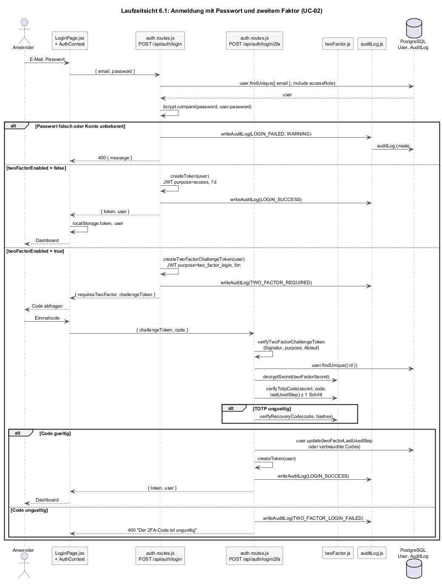
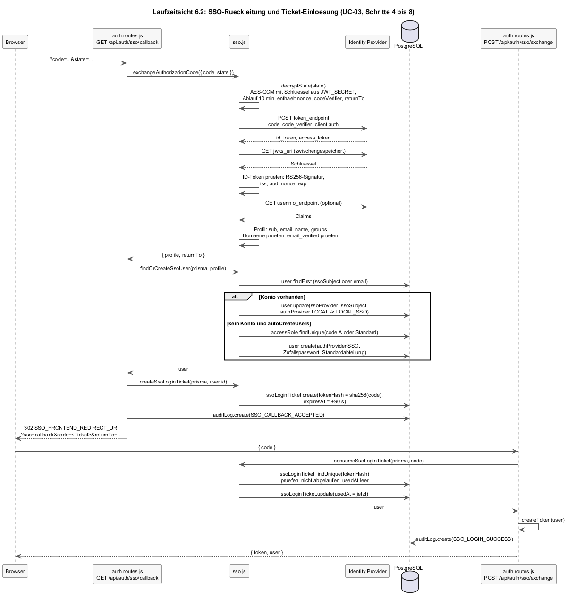
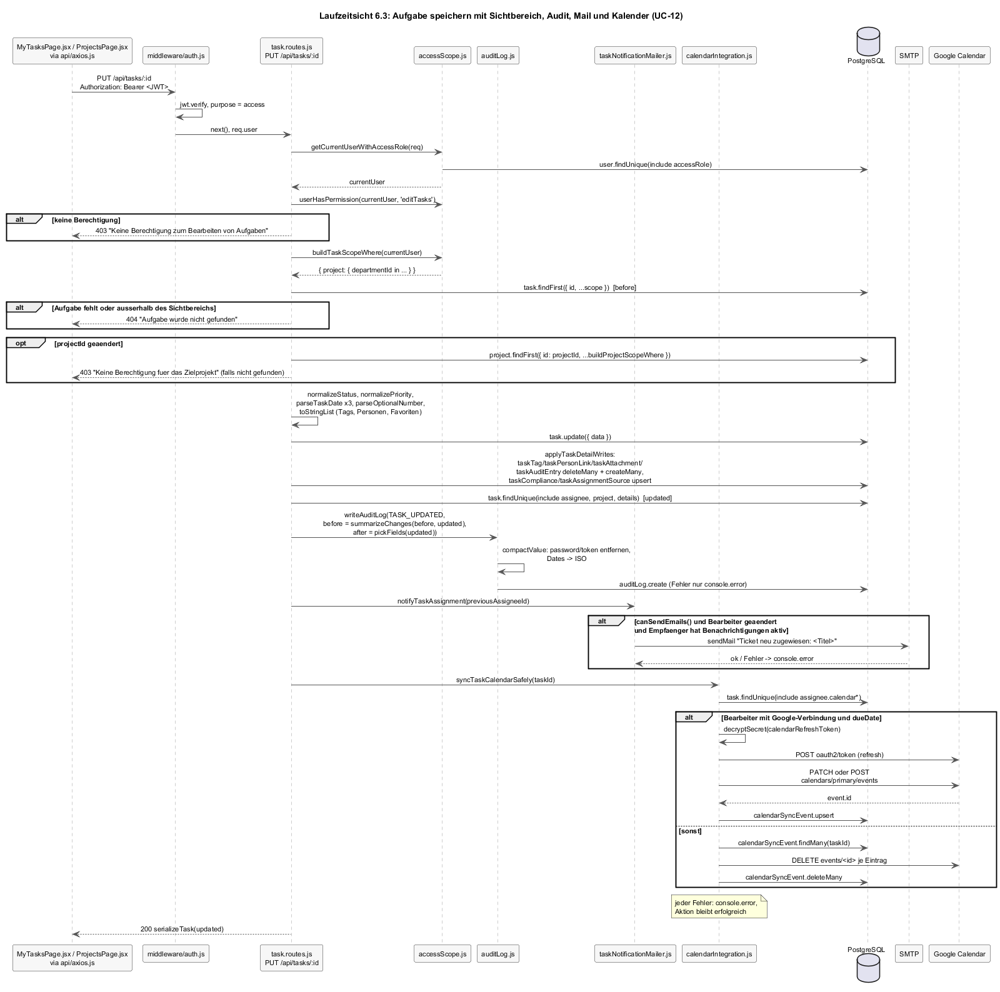
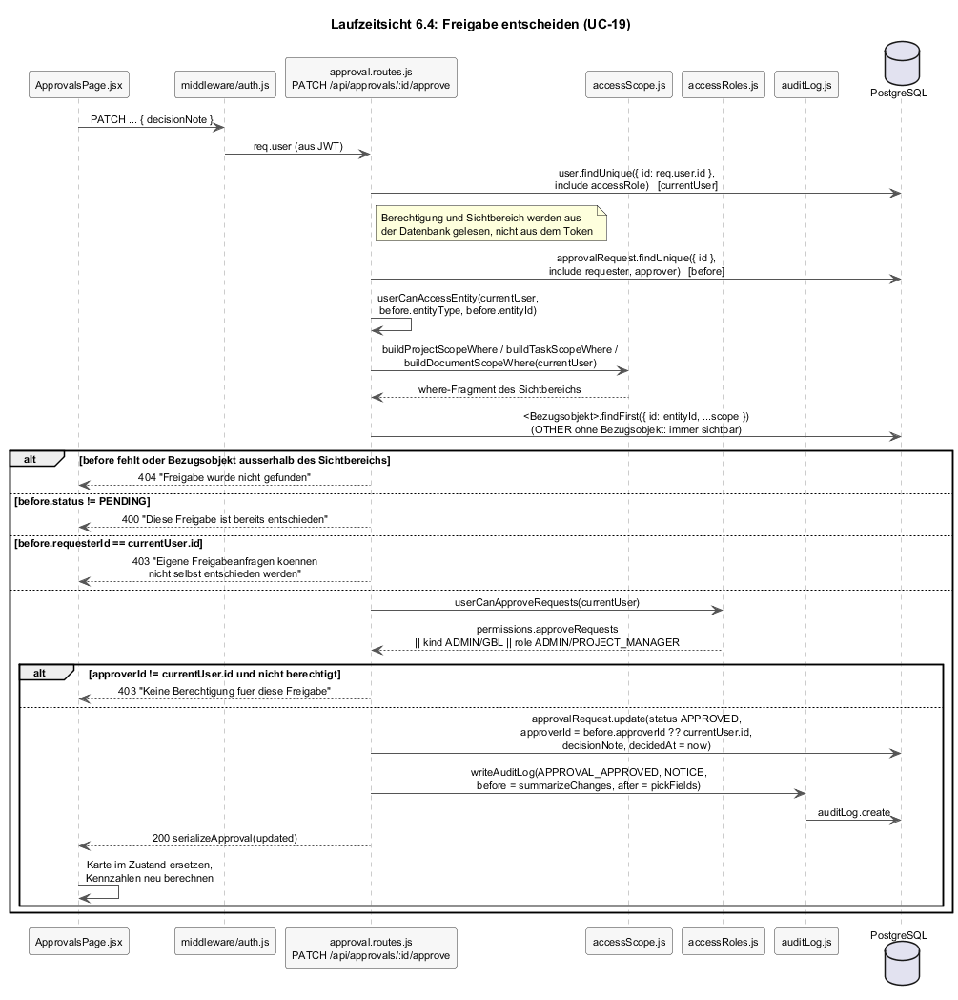

# 6 Laufzeitsicht

Die Laufzeitsicht zeigt, wie die Bausteine aus [Kapitel 5](A05-bausteinsicht.md) in den Szenarien zusammenwirken, die eine Architekturentscheidung tragen. Auswahl nach Relevanz, nicht nach Vollständigkeit: Die vier Szenarien decken die drei Anmeldewege, die Kette aus Audit, Benachrichtigung und Kalenderabgleich und die serverseitige Prüfung von Berechtigung und Sichtbereich ab. Reine Lese- und Schreibfälle (Projekt anlegen, Kommentar schreiben, Farbstreifen speichern) folgen demselben Muster wie 6.3 ohne Nebenwirkungen und sind nicht gezeichnet.

Die fachliche Sicht derselben Abläufe steht in [F2](../spec/F2-anwendungsfaelle.md) mit eigenen Diagrammen; die Diagramme hier zeigen Module, Funktionen und Datenbankzugriffe.

| Szenario | Anwendungsfall | Warum architekturrelevant |
|----------|----------------|---------------------------|
| [6.1](#61-anmeldung-mit-passwort-und-zweitem-faktor) Anmeldung | UC-02 | Zwei Tokens mit unterschiedlichem Zweck statt Server-Session; Wiederholungsschutz beim TOTP ([ADR-004](A09-architekturentscheidungen.md#adr-004-zustandslose-anmeldung-mit-jwt-totp-und-openid-connect)). |
| [6.2](#62-sso-rückleitung) SSO-Rückleitung | UC-03 | Verschlüsselter `state`, PKCE, Einmalticket statt Token in der Adresse; Kontenabgleich. |
| [6.3](#63-aufgabe-speichern) Aufgabe speichern | UC-12 | Berechtigung und Sichtbereich vor dem Schreiben; die längste Nebenwirkungskette: Audit-Differenz, Mail, Kalender; alle drei dürfen scheitern, ohne die Aktion zu brechen (QZ-02, QZ-03). |
| [6.4](#64-freigabe-entscheiden) Freigabe entscheiden | UC-19 | Berechtigung und Sichtbereich aus der Datenbank statt aus dem Token; Zustandsprüfung vor der Änderung (QZ-01, QZ-02). |

Alle Serverschritte laufen innerhalb einer HTTP-Anfrage. Es gibt keine Warteschlange, keinen Hintergrundprozess und keine Wiederholung nach einem Fehler.

---

## 6.1 Anmeldung mit Passwort und zweitem Faktor

*Quelle: [`diagrams/a06-anmeldung.plantuml`](diagrams/a06-anmeldung.plantuml).*

Bemerkenswert:

- **Zwei Tokens, ein Schlüssel.** Beide Tokens signiert `jsonwebtoken` mit `JWT_SECRET`; sie unterscheiden sich im Feld `purpose`. `middleware/auth.js` lehnt alles ab, was nicht `access` ist; `POST /login/2fa` nimmt nur `two_factor_login`. Ein abgefangenes Challenge-Token öffnet damit keine Maske.
- **Der Zwischenzustand liegt beim Browser.** Der Server merkt sich zwischen Passwort und Code nichts; das Challenge-Token trägt `userId` und läuft nach fünf Minuten ab. Das ist die Konsequenz des zustandslosen Servers ([Kapitel 4](A04-loesungsstrategie.md)).
- **Wiederholungsschutz nur beim Anmelden.** `verifySecondFactor(user, code, { enforceReplay: true })` vergleicht den Zeitschritt des Codes mit `twoFactorLastUsedStep` und speichert den neuen Schritt. Beim Abschalten des zweiten Faktors wird ohne diese Prüfung verifiziert, weil dort zusätzlich das Passwort verlangt wird.
- **Einheitliche Login-Fehlermeldung.** Unbekannte E-Mail und falsches Passwort liefern nach außen „E-Mail oder Passwort falsch"; beide werden als `LOGIN_FAILED` protokolliert, intern aber mit unterschiedlicher Zusammenfassung.
- **Kein Lockout.** Es gibt keinen Zähler und keine Sperre; die Schwäche ist in N1 vermerkt.

## 6.2 SSO-Rückleitung

*Quelle: [`diagrams/a06-sso-rueckleitung.plantuml`](diagrams/a06-sso-rueckleitung.plantuml).*

Bemerkenswert:

- **Der `state` ist die Session.** `createAuthorizationUrl` verschlüsselt Nonce, PKCE-Verifier und Rücksprungziel mit AES-256-GCM (Schlüssel aus `JWT_SECRET` abgeleitet, Kennzeichen `sso-state`) und hängt das Ergebnis als `state` an die Umleitung. Der Server speichert nichts; die Rückleitung bringt alles mit, was zur Prüfung nötig ist, inklusive Ablaufzeit.
- **Prüfkette des ID-Tokens.** Signatur gegen die JWKS des Providers (nur `SSO_ALLOWED_ALGS`, Vorgabe RS256), Aussteller gegen die Discovery, Zielgruppe gegen `SSO_CLIENT_ID`, Nonce gegen den `state`, Ablauf gegen die Uhr. Discovery und JWKS werden im Prozess zwischengespeichert; ein Serverneustart lädt sie neu.
- **Rückleitung ohne Token.** Der Browser erhält einen Einmalcode (`SsoLoginTicket`, SHA-256-Hash in der Datenbank, 90 Sekunden, `usedAt` bei Einlösung) und tauscht ihn per `POST` gegen das Zugriffstoken. Das Zugriffstoken steht so nie in einer Adresse.
- **Kontenabgleich in einer Funktion.** `findOrCreateSsoUser` entscheidet zwischen Verknüpfen, Abweisen und Anlegen ([AF-11](../spec/F3-anwendungsfunktionen.md#af-11--sso-konto-abgleichen)); die Zugriffsrolle bestimmt `resolveAccessRole` aus den Gruppen. Ein Fehler in dieser Kette endet mit `SSO_LOGIN_FAILED` im Audit-Log und einer Umleitung zur Anmeldemaske mit der Meldung, nie mit einem halb angelegten Konto, weil `user.create` der letzte Schritt ist.

## 6.3 Aufgabe speichern

*Quelle: [`diagrams/a06-aufgabe-speichern.plantuml`](diagrams/a06-aufgabe-speichern.plantuml).*

Bemerkenswert:

- **Erst Anwender, dann Berechtigung, dann Sichtbereich.** Der Handler lädt den Anwender mit Zugriffsrolle (`getCurrentUserWithAccessRole`), prüft `editTasks` (403) und sucht die Aufgabe mit `findFirst({ id, ...buildTaskScopeWhere })`; eine Aufgabe in einer fremden Abteilung ist eine 404. Wechselt die Aufgabe das Projekt, wird auch das Zielprojekt gegen den Sichtbereich geprüft. Das ist die Umsetzung von [QZ-02](A01-einfuehrung-und-ziele.md#12-qualitätsziele) und [8.3](A08-querschnittliche-konzepte.md#83-berechtigungen).
- **Vorher lesen, dann schreiben, dann nachlesen.** Der Handler liest die Aufgabe vor dem Update (`before`), schreibt die Kernfelder, ersetzt die Detailentitäten (`applyTaskDetailWrites`: `deleteMany` und `createMany` für Tags, Personen, Anhänge, Audit-Spur; `upsert` für Compliance und Ersteller) und liest sie mit Bearbeiter und Projekt erneut (`getTaskNotificationContext`). Die Differenz für das Audit-Log entsteht aus `before` und `updated` über `summarizeChanges`; Mail und Kalender brauchen den Bearbeiter mit seinen Einstellungen.
- **Drei Nebenwirkungen, drei Schutzschichten.** Audit: `writeAuditLog` fängt seinen eigenen Fehler und gibt `null` zurück. Mail: `notifyTaskAssignment` prüft `canSendEmails()` und den Bearbeiterwechsel, fängt Versandfehler. Kalender: `syncTaskCalendarSafely` fängt alles. Keine der drei kann die 200-Antwort verhindern. Das ist die Umsetzung von [QZ-03](A01-einfuehrung-und-ziele.md#12-qualitätsziele) und [NFR-12d-01](../spec/N1-nichtfunktional.md).
- **Reihenfolge ist Laufzeit.** Die Nebenwirkungen laufen nacheinander und synchron; ein langsamer SMTP-Server verlängert die Antwortzeit der Aufgabe. Für einen Geschäftsbereich ist das akzeptiert ([NFR-12a-01](../spec/N1-nichtfunktional.md)); bei mehr Last wäre eine Warteschlange der erste Umbau.
- **Antwort in Maskenform.** `serializeTask` liefert die Aufgabe mit Detailentitäten und Anzeigewerten (`progress`, `hoch`), sodass die Maske die Antwort direkt in ihren Zustand übernimmt.

## 6.4 Freigabe entscheiden

*Quelle: [`diagrams/a06-freigabe.plantuml`](diagrams/a06-freigabe.plantuml).*

Bemerkenswert:

- **Berechtigung aus der Datenbank.** `getCurrentUser` lädt den Anwender mit Zugriffsrolle bei jeder Entscheidung neu. Das JWT enthält zwar `role` und `accessRoleId`, wird für die Prüfung aber nicht benutzt. Eine Rollenänderung durch einen Administrator wirkt deshalb sofort, ohne dass der Betroffene sich neu anmeldet.
- **Sichtbereich vor Zustand.** Die Anfrage wird mit `buildApprovalScopeWhere` gesucht; liegt ihr Bezugsobjekt außerhalb des Sichtbereichs, antwortet der Server 404, bevor Zustand oder Berechtigung geprüft werden. Innerhalb des Sichtbereichs folgt: Existenz, dann Zustand, dann Berechtigung. Ein berechtigter Anwender erfährt so, dass die Anfrage existiert und entschieden ist; für ein internes Werkzeug ist das gewollt, damit die Meldung im Cockpit stimmt.
- **Nachträgliche Genehmigerzuordnung.** War `approverId` leer (AF-03 fand niemanden), wird der Entscheider eingetragen. Der Audit-Eintrag zeigt das als Änderung von `approverId` von `null` auf die Kennung.
- **Genehmigen und Ablehnen sind eine Funktion.** `decideApproval(req, res, status)` bedient beide Handler; nur Zielstatus, Aktion und Kritikalität des Audit-Eintrags unterscheiden sich. Abbrechen ist ein eigener Handler, weil der Berechtigtenkreis größer ist (Anfragender).
