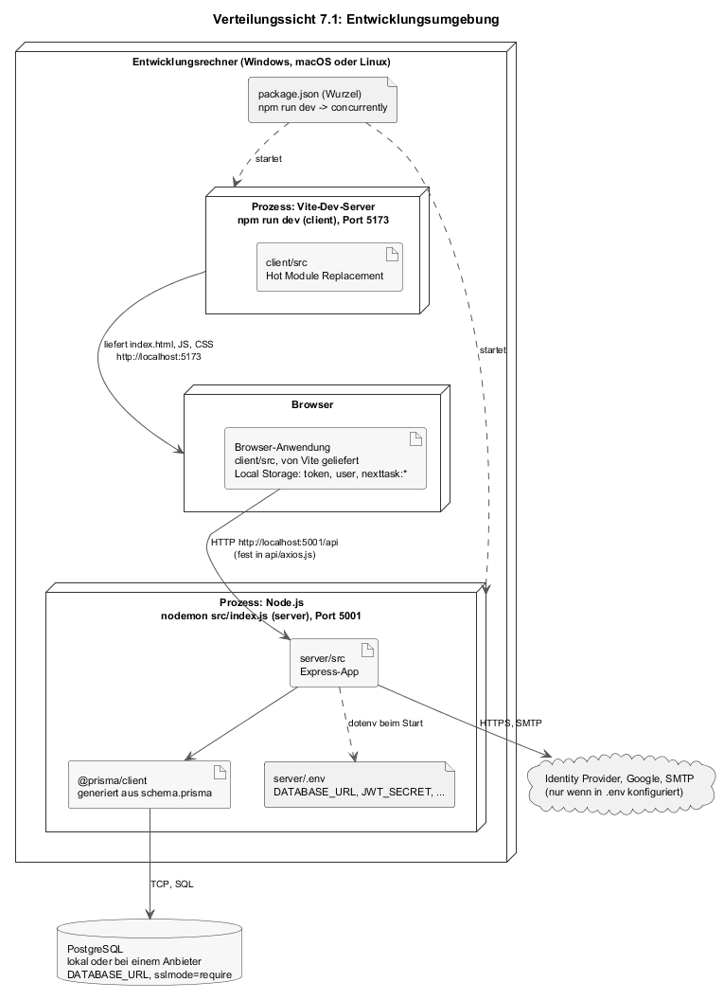
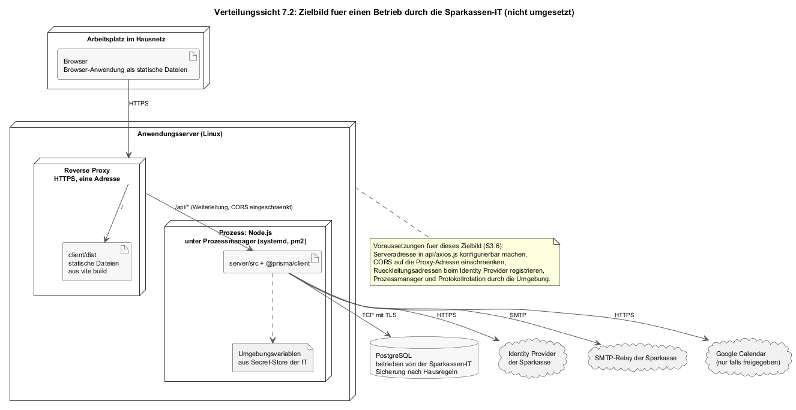

# 7 Verteilungssicht

Die Verteilungssicht ordnet die Bausteine aus [Kapitel 5](A05-bausteinsicht.md) den Rechnern und Prozessen zu, auf denen sie laufen. Es gibt eine umgesetzte Umgebung, die Entwicklungsumgebung, und ein Zielbild für einen Betrieb durch die Sparkassen-IT, das im Projekt nicht umgesetzt ist (CON-05, ORG-03). Beides ist getrennt beschrieben, damit klar bleibt, was existiert.

Die Inbetriebnahme aus Sicht des Anwenders (Voraussetzungen, Konfiguration, Schritte) steht in [S3](../spec/S3-inbetriebnahme.md); dieses Kapitel bindet sie an Prozesse, Ports und Dateien.

---

## 7.1 Entwicklungsumgebung

*Quelle: [`diagrams/a07-entwicklung.plantuml`](diagrams/a07-entwicklung.plantuml).*

**Motivation.** [QZ-05](A01-einfuehrung-und-ziele.md#12-qualitätsziele): Ein neues Teammitglied soll mit Node.js, npm und einer Datenbankadresse arbeiten können. Keine Container, keine lokale Datenbankinstallation, keine Build-Schritte vor dem ersten Start.

**Knoten und Kanäle**

| Element | Realisierung |
|---------|--------------|
| **Entwicklungsrechner** | Beliebiges Betriebssystem mit Node.js (aktuelle LTS, keine Version festgelegt) und npm. Alles außer der Datenbank läuft hier. |
| **Prozess Vite** | `npm run dev` in `client/` startet den Vite-Entwicklungsserver auf Port 5173. Er liefert `index.html` und die Module aus `client/src` mit Hot Module Replacement; ein Bauartefakt entsteht nicht. |
| **Prozess Node.js** | `npm run dev` in `server/` startet `nodemon src/index.js`; Neustart bei jeder Dateiänderung. Express lauscht auf `PORT` aus `.env` (5001). `dotenv` lädt `.env` beim Start; danach ist die Konfiguration im Prozess. |
| **Gemeinsamer Start** | `npm run dev` im Wurzelverzeichnis ruft über `concurrently` beide Skripte. `npm start` startet den Server ohne nodemon, die Browser-Anwendung weiterhin über Vite. |
| **Browser** | Lädt die Anwendung von 5173 und ruft die Schnittstelle auf 5001 auf. Zwei Ursprünge, deshalb CORS; der Server erlaubt alle Ursprünge. |
| **PostgreSQL** | Nicht Teil des Repositories. `DATABASE_URL` zeigt auf eine lokale Installation oder einen Anbieter; die Vorlage in `.env.example` sieht `sslmode=require` vor, was auf einen entfernten Anbieter deutet. Schema über `npx prisma migrate deploy`, Client über `npx prisma generate` (Ausgabe unter `server/generated/prisma`, nicht versioniert). |
| **Nachbarsysteme** | Nur erreichbar, wenn die zugehörigen Werte in `.env` gesetzt sind; sonst verhalten sich die Module so, als gäbe es sie nicht ([S1](../spec/S1-nachbarsysteme.md)). |

**Zuordnung der Bausteine.** Browser-Anwendung: Quelle im Vite-Prozess, Ausführung im Browser. API-Server mit allen Routen- und Hilfsmodulen: Node-Prozess. Persistenzschicht: Schema und Client im Node-Prozess, Daten in PostgreSQL. Local Storage des Browsers hält Sitzung, Einstellungen und die in [8.9](A08-querschnittliche-konzepte.md#89-zustand-im-browser) beschriebenen Fachdaten.

**Was fehlt.** Keine Unit-Tests (nur der Playwright-Rauchtest `npm run test:e2e` gegen die laufende Entwicklungsumgebung mit geladenem Seed), keine CI (kein `.github/`-Verzeichnis), kein Docker, kein Prozessmanager, keine Protokollrotation. Der Server schreibt mit `console.log` und `console.error` auf die Konsole des Terminals. Für ein Studienprojekt mit sechs Personen und einer Entwicklungsumgebung ist das die kleinste lauffähige Verteilung; für einen Betrieb außerhalb der Entwicklung gilt 7.2.

---

## 7.2 Zielbild für einen Betrieb durch die Sparkassen-IT

*Quelle: [`diagrams/a07-zielbild.plantuml`](diagrams/a07-zielbild.plantuml).*

**Status: nicht umgesetzt.** Das Zielbild zeigt, wie die drei Teile aus Kapitel 5 in einer Standardumgebung der Sparkassen-IT liegen würden, und welche Änderungen am Code dafür nötig wären. Es dient der Übergabe (Stakeholder Sparkassen-IT, [Kapitel 1.3](A01-einfuehrung-und-ziele.md#13-stakeholder)).

| Element | Realisierung | Änderung gegenüber 7.1 |
|---------|--------------|-------------------------|
| **Browser-Anwendung** | `vite build` in `client/` erzeugt statische Dateien unter `client/dist`; ein Reverse Proxy (nginx oder der Standard der IT) liefert sie unter einer HTTPS-Adresse aus. | Serveradresse in `client/src/api/axios.js` muss vor dem Bauen auf die Proxy-Adresse zeigen (TECH-10); besser: aus einer Umgebungsvariable des Builds lesen. |
| **API-Server** | Ein Node-Prozess unter einem Prozessmanager (systemd oder pm2) hinter demselben Proxy unter `/api`. Damit haben Browser-Anwendung und Schnittstelle einen Ursprung. | CORS auf die eigene Adresse einschränken oder entfernen; `console`-Ausgaben in eine Protokolldatei leiten; `PORT` frei wählbar. |
| **PostgreSQL** | Von der IT betriebene Instanz mit TLS, Sicherung und Zugriffsbeschränkung. | Keine; `DATABASE_URL` mit `sslmode=require` ist vorgesehen. |
| **Geheimnisse** | `JWT_SECRET`, `TWO_FACTOR_SECRET_KEY`, Client-Secrets, SMTP-Passwort aus dem Secret-Store der IT als Umgebungsvariablen. | Keine; der Server liest ausschließlich Umgebungsvariablen (CONV-08). |
| **Identity Provider** | Das SSO der Sparkasse; Rückleitungsadresse `https://<host>/api/auth/sso/callback` registriert; Client-ID und -Secret hinterlegt ([S1.3](../spec/S1-nachbarsysteme.md#s13-nb-02--identity-provider-der-sparkasse-openid-connect)). | Keine am Code; nur Konfiguration. |
| **SMTP** | Relay der Sparkasse. | Keine. |
| **Google Calendar** | Nur, wenn die IT den Zugriff auf Google-Konten freigibt; sonst bleibt die Anbindung abgeschaltet. | Keine. |

**Was der Migrationsschritt bleibt.** `npx prisma migrate deploy` läuft weiterhin von Hand vor dem Start eines neuen Standes (ORG-06); der Server prüft beim Start nicht, ob das Schema aktuell ist. Ein Betriebshandbuch müsste diese Reihenfolge festhalten: Sicherung, Migration, Neustart.

**Was bewusst nicht Teil des Zielbilds ist.** Mehrere Serverinstanzen (kein Bedarf bei AS-06), Container-Orchestrierung, Überwachung, Hochverfügbarkeit. Der Server ist zustandslos ([Kapitel 4](A04-loesungsstrategie.md)) und könnte mehrfach laufen; die Discovery- und JWKS-Caches in `sso.js` sind dann je Prozess, was unproblematisch ist.
