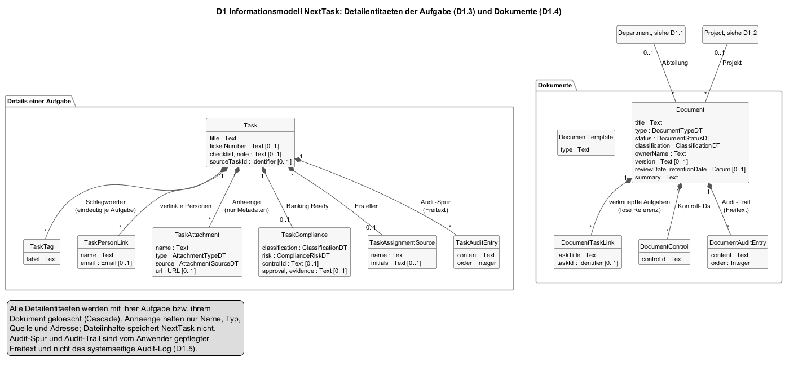

# 8 Querschnittliche Konzepte

Konzepte, die mehrere Bausteine betreffen. Die Regeln sind implementierungsfrei in [N2](../spec/N2-querschnittskonzepte.md) festgelegt (QK-01 bis QK-08); dieses Kapitel beschreibt je Konzept, **wie es im Code umgesetzt ist**: Module, Funktionen, Konfigurationsschlüssel, Datenbankfelder, und wo die Umsetzung von der Regel abweicht. Abschnitt 8.1 hat kein Gegenstück in N2; er ist ein reines Architekturkonzept (Abbildung des Datenmodells auf die Datenbank).

| § | Konzept | Regel in N2 |
|---|---------|-------------|
| [8.1](#81-domänenmodell-und-persistenz) | Domänenmodell und Persistenz | [D1](../spec/D1-datenmodell.md), [D2](../spec/D2-datentypen.md) |
| [8.2](#82-authentifizierung-und-sitzung) | Authentifizierung und Sitzung | [QK-01](../spec/N2-querschnittskonzepte.md#qk-01-authentifizierung-und-sitzung) |
| [8.3](#83-berechtigungen) | Berechtigungen | [QK-02](../spec/N2-querschnittskonzepte.md#qk-02-berechtigungen) |
| [8.4](#84-audit-logging) | Audit-Logging | [QK-03](../spec/N2-querschnittskonzepte.md#qk-03-audit-logging) |
| [8.5](#85-fehlerbehandlung) | Fehlerbehandlung | [QK-04](../spec/N2-querschnittskonzepte.md#qk-04-fehlerbehandlung-und-meldungen) |
| [8.6](#86-validierung-und-normalisierung) | Validierung und Normalisierung | [QK-05](../spec/N2-querschnittskonzepte.md#qk-05-validierung-und-normalisierung) |
| [8.7](#87-benachrichtigungen-und-kalenderabgleich) | Benachrichtigungen und Kalenderabgleich | [QK-06](../spec/N2-querschnittskonzepte.md#qk-06-benachrichtigungen) |
| [8.8](#88-geheimnisse) | Geheimnisse | [QK-07](../spec/N2-querschnittskonzepte.md#qk-07-geheimnisse) |
| [8.9](#89-zustand-im-browser) | Zustand im Browser | [QK-08](../spec/N2-querschnittskonzepte.md#qk-08-daten-im-browser) |
| [8.10](#810-oberfläche) | Oberfläche | [B1.4](../spec/B1-dialogspezifikation.md#b14-übergreifende-dialogmuster) |

---

## 8.1 Domänenmodell und Persistenz

Das Informationsmodell aus [D1](../spec/D1-datenmodell.md) ist eins zu eins als Prisma-Schema umgesetzt: 29 `model`-Blöcke in `server/prisma/schema.prisma` (14 bis zum 13. September, seitdem 15 weitere für Abteilungen, Schnittstellen, Freigabezeile, Detailangaben der Aufgabe und Dokumente), sechs `enum`-Blöcke. Das Schema ist die einzige Quelle für Tabellen, Spalten, Beziehungen und Löschregeln; die Datenbank wird ausschließlich über Migrationen verändert.




*Quelle: [`../spec/diagrams/d1-informationsmodell.plantuml`](../spec/diagrams/d1-informationsmodell.plantuml) und [`../spec/diagrams/d1-detailentitaeten.plantuml`](../spec/diagrams/d1-detailentitaeten.plantuml). Die Entitätsnamen sind die Modellnamen im Schema; Tabellennamen entsprechen ihnen (Prisma-Vorgabe ohne `@@map`).*

**Abbildungsregeln**

| D1/D2 | Umsetzung im Schema |
|-------|---------------------|
| `Identifier` | `String @id @default(cuid())` an jedem Modell. |
| Aufzählungen mit festem Wertebereich (`PriorityDT`, `TaskStatusDT`, `UserRoleDT`, `AccessRoleKindDT`, `ApprovalStatusDT`, `ApprovalEntityTypeDT`) | Prisma-`enum`, in PostgreSQL als Enum-Typ. Ein ungültiger Wert scheitert an der Datenbank; die Routen normalisieren vorher ([8.6](#86-validierung-und-normalisierung)). |
| Aufzählungen ohne Prüfung (`AmpelDT`, `MilestoneStatusDT`, `RiskClassDT`, `RiskTrendDT`, `ApprovalLevelDT`, `SeverityDT`, `MatchFieldDT`, `AuthProviderDT`, `CalendarProviderDT`) | `String`, teils mit `@default`. Prüfung nur in den Routen (`SeverityDT` beim Lesen, `MatchFieldDT` beim Schreiben) oder gar nicht (R-06). |
| `PermissionSetDT` | `Json` an `AccessRole.permissions`; `normalizePermissions` in `accessRoles.js` ergänzt fehlende Schlüssel beim Lesen und Schreiben. |
| Listen (`businessAreas`, `departmentIds`, `keyInterfaces`, `twoFactorRecoveryCodes`, `favoriteBy`) | `String[]` (PostgreSQL-Array) mit `@default([])`; `favoriteReturnIndexBy` als `Json`. |
| Detailentitäten der Aufgabe und des Dokuments (D1.3, D1.4) | Eigene Modelle mit `onDelete: Cascade` zur Aufgabe bzw. zum Dokument; beim Speichern durch `deleteMany` und `createMany` ersetzt (`applyTaskDetailWrites`), Compliance und Ersteller per `upsert`. |
| Abteilung (D1.1) | `Department` mit `@unique` auf `name`; `DepartmentMember` mit `@@unique([departmentId, userId])`; `Project.departmentId` als Fremdschlüssel, über den der Sichtbereich läuft ([8.3](#83-berechtigungen)). |
| Audit-Differenz und Zusatzdaten | `Json?` an `AuditLog.before`, `after`, `metadata`. |
| `EncryptedSecretDT` | `String?` mit Präfix `v1:`; Ver- und Entschlüsselung nur in `twoFactor.js` ([8.8](#88-geheimnisse)). |
| Eindeutigkeiten aus D1.6 | `@unique` an `User.email`, `AccessRole.code`, `Project.key`, `SsoLoginTicket.tokenHash`; `@@unique([ssoProvider, ssoSubject])`, `@@unique([provider, userId, taskId])`, `@@unique([departmentId, userId])` an `DepartmentMember`, `@unique` an `Department.name` und `DocumentTemplate.title`. |
| Löschregeln aus D1.6 | `onDelete: Cascade` an Task→Project, Comment→Task, Milestone/Risk/Interface/Approval/BudgetLine/StatusReport→Project, DepartmentMember→Department und →User, allen Task-Detailentitäten→Task, allen Document-Detailentitäten→Document, TaskMarker→User, CalendarSyncEvent→Task und →User, ApprovalRequest.requester→User, SsoLoginTicket→User (23 Stellen). `onDelete: SetNull` an StatusReport.author, ApprovalRequest.approver, AuditLog.user, Project.department, Department.lead, Document.department und .project, Task.parentTask (8 Stellen). Ohne Regel (Standard: Löschen verhindern): Task.assignee, Comment.author, Project.owner, User.accessRole. |
| Lose Referenz | `Task.markerId String?` ohne `@relation`, bewusst, damit ein gelöschter Farbstreifen keine Aufgabe blockiert. |
| Zeitstempel | `createdAt DateTime @default(now())`, `updatedAt DateTime @updatedAt`; `Comment` und `AuditLog` ohne `updatedAt`. |

**Indizes.** Ausschließlich an Tabellen mit Listen- oder Filterzugriff: `AuditLog` (createdAt, userId+createdAt, entityType+entityId, action, severity), `ApprovalRequest` (entityType+entityId, status+requestedAt, requesterId+requestedAt, approverId+requestedAt), `ProjectMilestone`/`ProjectBudgetLine` (projectId+order), `ProjectRisk` (projectId+active), `ProjectStatusReport` (projectId+reportDate, authorId+createdAt), `TaskMarker` (userId+order), `CalendarSyncEvent` (taskId+provider, userId+provider), `SsoLoginTicket` (expiresAt, userId+createdAt). `Task` hat keinen Index über `status`/`order` hinaus dem Primärschlüssel; die Kalenderabfrage filtert über Datum und Bearbeiter ohne Index. Bei AS-06 unkritisch.

**Migrationen.** 16 Verzeichnisse unter `server/prisma/migrations/`, benannt mit Zeitstempel und Zweck. Sie zeigen die Reihenfolge, in der das System gewachsen ist: `init` und `update_task_status_enum` (April 2026: Benutzer, Projekt, Aufgabe, Kommentar), `add_calendar_planning_fields` (Mai), dann im August in zwei Wochen `add_access_roles`, `add_task_markers`, `add_task_marker_id`, `add_audit_logs`, `add_user_email_notifications`, `add_project_reporting`, `add_two_factor_auth`, `add_sso_support`, `add_calendar_connections`, `add_approval_workflow`, `add_task_approval_level`; dann `persist_display_content` (13. September: 15 Tabellen für Abteilungen, Schnittstellen, Freigabezeile, Aufgabendetails, Dokumente) und `add_task_favorites` (23. September). Jede Migration ist reines SQL, von Prisma erzeugt, mit `prisma migrate deploy` angewendet ([S3](../spec/S3-inbetriebnahme.md)); `migration_lock.toml` bindet auf PostgreSQL.

**Zugriff.** `index.js` erzeugt einen `PrismaClient` mit `PrismaPg`-Adapter (Verbindung über `DATABASE_URL`) und hängt ihn als `req.prisma` an jede Anfrage. Hilfsmodule erhalten den Client als Parameter (`ensureDefaultAccessRoles(prisma)`, `syncTaskCalendarEvent(prisma, taskId)`). Transaktionen an drei Stellen: `project.routes.js` beim Ersetzen der Berichtsbasis (`$transaction(async …)`: erst `deleteMany`, dann `update` mit `create`), `task.routes.js` beim Sortieren des Backlogs (`$transaction` über alle `update`-Aufrufe, AF-12) und `taskMarker.routes.js` beim Ersetzen der Farbstreifen (`$transaction([...])`). Das Ersetzen der Detailentitäten einer Aufgabe läuft dagegen ohne Transaktion; ein Fehler zwischen `deleteMany` und `createMany` hinterlässt eine Aufgabe ohne Tags. Alle anderen Handler sind einzelne Prisma-Aufrufe ohne Transaktion; ein Fehler zwischen `task.update` und `auditLog.create` hinterlässt eine Änderung ohne Eintrag ([NFR-15d-01](../spec/N1-nichtfunktional.md), Stand).

## 8.2 Authentifizierung und Sitzung

**Serverseite.** `middleware/auth.js`:

```js
const decoded = jwt.verify(token, process.env.JWT_SECRET);
if (!decoded.id || (decoded.purpose && decoded.purpose !== 'access')) return 401;
req.user = decoded;
```

Das Zugriffstoken (`createToken` in `auth.routes.js`) trägt `id`, `email`, `name`, `role`, `department`, `accessRoleId`, `purpose: 'access'`; Laufzeit `7d`; Verfahren HS256 mit `JWT_SECRET`. Es wird nach Registrierung, Passwort-Anmeldung, 2FA-Bestätigung, SSO-Ticket-Einlösung und Profiländerung ausgestellt (letzteres, damit Name und Abteilung im Token aktuell bleiben). Der Server hält keine Sitzungsliste; Abmelden ist ein reiner Browservorgang, ein Widerruf ist nur über Wechsel von `JWT_SECRET` möglich (R-02).

Öffentliche Handler ohne Middleware: `register`, `login`, `login/2fa`, `sso/config`, `sso/login`, `sso/callback`, `sso/exchange`, `calendar-integration/callback`. Die Kalender-Rückleitung identifiziert den Anwender über den signierten `state` (`verifyCalendarConnectState`, ein JWT mit `userId` und `returnTo`), nicht über das Zugriffstoken, weil Google den Browser ohne Kopfzeilen zurückleitet.

**Browserseite.** `api/axios.js` setzt den Kopf aus `localStorage.token` und reagiert auf 401 mit `localStorage.removeItem('token'|'user')` und `window.location.href = '/login'`. `context/AuthContext.jsx` liest `user` aus dem Local Storage, bietet `login(token, user)` (schreibt beides, löscht `nexttask:task-marker-settings`), `logout()` und `updateUser()`. `isAuthenticated` ist `Boolean(user && localStorage.getItem('token'))`; die Wächter in `App.jsx` prüfen nur das, nicht die Gültigkeit des Tokens; die entscheidet der Server bei der ersten Anfrage.

**Abweichung.** `req.user.isGuest` wird an über zwanzig Stellen geprüft, aber von keinem Anmeldeweg gesetzt; `guestUser.js` ist toter Code (NG-08).

## 8.3 Berechtigungen

Zwei Hilfsmodule setzen [AF-01](../spec/F3-anwendungsfunktionen.md#af-01--berechtigung-prüfen) und [AF-02](../spec/F3-anwendungsfunktionen.md#af-02--sichtbereich-und-sichtbare-aufgaben-bestimmen) um. `accessRoles.js` bündelt die beiden Berechtigungen mit fester Ableitung:

```js
userCanManageRoles(user)     // permissions.manageRoles || kind ADMIN || role ADMIN
userCanApproveRequests(user) // permissions.approveRequests || kind ADMIN || kind GBL || role ADMIN || role PROJECT_MANAGER
```

`accessScope.js` (seit 13. September) trägt die übrigen Schalter und den Sichtbereich:

```js
getCurrentUserWithAccessRole(req)   // user.findUnique({ id: req.user.id }, include accessRole)
userHasPermission(user, 'editTasks') // kind ADMIN || role ADMIN || permissions[name] === true
getDepartmentScope(user)            // { all } | { businessAreas } | { departmentIds } | { none }
buildProjectScopeWhere(user)        // Prisma-where: department.businessArea in … | departmentId in … | { id: '' } bei none
buildTaskScopeWhere(user)           // { project: buildProjectScopeWhere(user) }
buildDocumentScopeWhere(user)       // Abteilung im Bereich oder Projekt sichtbar
buildApprovalScopeWhere(prisma, user) // asynchron: sichtbare Projekt-, Aufgaben-, Berichts- und Dokumentkennungen
```

Jeder fachliche Handler beginnt gleich: Anwender mit Zugriffsrolle laden (404 „Benutzer wurde nicht gefunden", falls das Konto verschwunden ist), Berechtigung prüfen (403 mit deutscher Meldung), dann das Zielobjekt mit `findFirst({ where: { id, ...scope } })` suchen. Ein Objekt außerhalb des Sichtbereichs ist damit vom nicht vorhandenen nicht zu unterscheiden (404). Das JWT wird für keine dieser Prüfungen befragt; eine Rollenänderung wirkt mit der nächsten Anfrage. `requireRoleManager` (Middleware in `role.routes.js`) und `requireAuditAccess` (in `auditLog.routes.js`) folgen demselben Muster als Middleware.

Der Sichtbereich hängt an der Abteilung des Projekts (`Project.departmentId`), nicht mehr an Textfeldern: Für Rollenart `MEMBER` zählen die `departmentIds` der Rolle, für `GBL` die `businessAreas`, verglichen mit `Department.businessArea` oder `Project.businessArea`; `ADMIN` sieht alles, ein Konto ohne Zugriffsrolle nichts ([D1.6](../spec/D1-datenmodell.md#d16-organisationsstruktur)). Zuweisung und Eigentum erweitern den Sichtbereich nicht.

Die grobe Rolle wird bei Zuordnung abgeleitet (`role.routes.js`: `role.kind === 'ADMIN' ? 'ADMIN' : kind === 'GBL' ? 'PROJECT_MANAGER' : 'DEVELOPER'`) und bei SSO aus den Gruppen (`sso.js`, `resolveAccessRole`).

**Browserseite.** `data/bankOrganization.js` exportiert `canManageRoles(user)` und `getEffectiveRoleForUser(user)` auf Basis einer festen Standardkonfiguration im Speicher (kein Local Storage mehr). Sie steuern Seitenleiste und Wächter `RequireAuditAccess`; sie sind eine Anzeigeentscheidung, keine Sicherheitsgrenze. Die Masken sehen ohnehin nur, was der Server liefert.

**Abweichungen von QK-02.** (1) `viewDepartments` wird auf dem Server nirgends gelesen; der Sichtbereich gilt unabhängig davon. (2) `organization.routes.js` (Abteilung anlegen) und `document.routes.js` schreiben keine Audit-Einträge. (3) `role.routes.js` weist beim Löschen einer Rolle die Rolle mit Code `A` als Ersatz zu (R-04). (4) Das Seed-Skript legt ein Admin-Konto mit bekanntem Passwort an (R-07).

## 8.4 Audit-Logging

Kein Trigger, keine Middleware: Jeder ändernde Handler ruft `writeAuditLog(req, entry)` explizit auf, nach dem erfolgreichen Prisma-Aufruf und vor den Nebenwirkungen. 39 Aktionen ([QK-03](../spec/N2-querschnittskonzepte.md#qk-03-audit-logging) listet sie): 37 stehen als feste Namen in den Handlern, `APPROVAL_APPROVED` und `APPROVAL_REJECTED` bildet `decideApproval` aus dem Zielstatus.

`auditLog.js`:

- `getActor(user, fallback)` nimmt `entry.user`, sonst `req.currentUser`, sonst `req.user`; Name, E-Mail, Rollenname (`accessRole.name` vor `accessRole.code` vor `role`) werden als Text kopiert, damit der Eintrag Umbenennungen und Löschungen überlebt.
- `getRequestDetails(req)` liest die erste Adresse aus `X-Forwarded-For`, sonst `req.ip`, und den `User-Agent`.
- `pickFields(record, fields)` und `summarizeChanges(before, after)` erzeugen die Differenz; `compactValue` wandelt `Date` in ISO-Text und entfernt rekursiv Schlüssel `password` und `token`.
- Längen werden mit `slice` gekappt (80/80/120/160/300/40), damit ein überlanger Titel den Eintrag nicht scheitern lässt.
- `try/catch` um `prisma.auditLog.create`; im Fehlerfall `console.error` und `return null`.

Jedes Routenmodul definiert seinen Feldsatz (`auditTaskFields`, `auditApprovalFields`, `auditRoleFields`, `auditUserFields`), damit nur fachliche Felder in `before`/`after` stehen. Lesen: `auditLog.routes.js` mit Filtern, Suche über sieben Felder (`contains`, `mode: 'insensitive'`), `take` zwischen 10 und 250, `groupBy severity` für die Kennzahlen.

**Abweichung.** Die Aktion wird nicht atomar mit dem Eintrag gespeichert (keine Transaktion, [8.1](#81-domänenmodell-und-persistenz)). Ein Datenbankausfall zwischen beiden erzeugt eine unprotokollierte Änderung; der Fehler steht dann im Konsolenprotokoll.

## 8.5 Fehlerbehandlung

**Server.** Einheitliches Muster in jedem Handler:

```js
try { ... res.json(...) } catch (error) { res.status(500).json({ message: 'Fehler beim …', error: error.message }); }
```

Fachliche Ablehnungen antworten vor dem `catch` mit `400` (Eingabe), `401` (nur Middleware), `403` (Berechtigung), `404` (nicht gefunden oder fremd), jeweils mit deutschem `message`. Die Texte stehen in den Handlern; es gibt keine zentrale Meldungsliste. `error.message` bei 500 kann technische Details (Prisma-Fehlertext) an den Browser geben; für ein internes Werkzeug akzeptiert, für einen Betrieb außerhalb der Entwicklung zu ändern.

**Nachbarsysteme.** Fehler beim Versand und beim Kalenderabgleich werden in `task.routes.js` (`notifyTaskAssignment`, `notifyCommentMentions`, `syncTaskCalendarSafely`) gefangen und mit `console.error` vermerkt; die Antwort bleibt 200/201. Beim manuellen Vollabgleich (`calendar-integration/sync`) wird der Fehler dagegen als 400 gemeldet und in `User.calendarSyncError` gespeichert, weil der Anwender die Aktion ausdrücklich angestoßen hat. SSO-Fehler enden in einer Umleitung mit `?error=`-Parameter zur Anmeldemaske (`buildFrontendRedirectUrl`), Kalender-Rückleitungen mit `?calendar_status=error&calendar_message=`.

**Browser.** Masken zeigen `error.response?.data?.message` oder einen festen Text in einer roten Zeile. Dashboard, Kalender, Board und Projekte fangen Fehler beim Laden still (leere Anzeige) und beim Anlegen ohne Meldung; der Anwender sieht dann nur, dass nichts erscheint ([B1.5](../spec/B1-dialogspezifikation.md#b15-stand-der-anbindung) Nr. 1).

## 8.6 Validierung und Normalisierung

Keine Validierungsbibliothek (kein zod, joi, express-validator). Jedes Routenmodul bringt kleine Hilfsfunktionen mit:

| Modul | Funktionen | Regel |
|-------|------------|-------|
| `auth.routes.js`, `role.routes.js` | `isBlank(value)` | Pflichtfeld: Zeichenkette mit Inhalt nach `trim`. |
| `task.routes.js` | `normalizeStatus` (Tabelle `statusMap` nach [D2.3](../spec/D2-datentypen.md#d23-taskstatusdt)), `normalizePriority` (auch `hoch`/`mittel`/`niedrig`), `parseOptionalNumber` (Komma → Punkt), `parseTaskDate`, `toStringList`, `normalizeFavoriteReturnIndexBy`, `buildTaskDetailWrites` (Tags, Personen, Anhänge, Compliance, Ersteller, Audit-Spur) | [AF-04](../spec/F3-anwendungsfunktionen.md#af-04--status-priorität-und-eingaben-normalisieren) |
| `project.routes.js` | `normalizeString`, `optionalString`, `optionalDate`, `optionalNumber`, `toStringArray` (Liste oder Text mit Komma/Zeilenumbruch), `buildMilestoneCreates`/`buildRiskCreates`/`buildInterfaceCreates`/`buildBudgetLineCreates` (Zeilen ohne Titel entfallen) |
| `organization.routes.js` | Name Pflicht; Kürzel und Geschäftsbereich in Großschreibung; Leitung Vorgabe: anlegender Anwender | [UC-27](../spec/F2-anwendungsfaelle.md#uc-27--abteilung-anlegen) | [AF-04](../spec/F3-anwendungsfunktionen.md#af-04--status-priorität-und-eingaben-normalisieren), [UC-07](../spec/F2-anwendungsfaelle.md#uc-07--projekt-anlegen) |
| `approval.routes.js` | `normalizeEntityType` (unbekannt → `OTHER`), `normalizeStatus` (unbekannt → leer, also kein Filter) | [D2.8](../spec/D2-datentypen.md#d28-approvalentitytypedt) |
| `role.routes.js` | `toRoleData` (Kurzcode und Geschäftsbereiche in Großschreibung, `M` → `MEMBER`, `manageRoles` bei Admin erzwungen), `normalizeList` | [UC-21](../spec/F2-anwendungsfaelle.md#uc-21--rollen-pflegen) |
| `taskMarker.routes.js` | `normalizeMarker` (Längen 80/180/120, Farbe `#rrggbb` sonst `#3b82f6`, `matchField` aus Menge), `slice(0, 60)` | [AF-10](../spec/F3-anwendungsfunktionen.md#af-10--farbstreifen-zuordnen) |
| `auditLog.routes.js` | `allowedSeverities`, `limit` in [10, 250] | [NFR-12e-01](../spec/N1-nichtfunktional.md) |
| `utils/date.js` | `parseDate(value, emptyValue)` | ungültig → leer, nie Fehler |

E-Mail-Adressen: `trim().toLowerCase()` an jeder Stelle, an der sie gespeichert oder gesucht werden. Die Datenbank prüft zusätzlich Enums und Eindeutigkeiten; ein Verstoß dort wird zum 500 mit Prisma-Text, weil es keinen Fehlerzweig für `P2002` (Eindeutigkeit) gibt, außer den expliziten `findUnique`-Prüfungen vor `create` bei E-Mail und Kurzcode.

Im Browser prüfen die Masken nur Pflichtfelder (Schaltfläche gesperrt) und, in `SettingsPage`, Passwortlänge und -übereinstimmung.

## 8.7 Benachrichtigungen und Kalenderabgleich

**E-Mail** (`taskNotificationMailer.js`). `canSendEmails()` = `EMAIL_NOTIFICATIONS_ENABLED === 'true'` und alle fünf SMTP-Werte gesetzt. Der `nodemailer`-Transport wird beim ersten Versand erzeugt und im Modul gehalten. `getNotificationRecipient(user)` liefert `null`, wenn `emailNotificationsEnabled` nicht `true` ist oder keine Adresse existiert. Drei Erzeuger (`sendTaskAssignmentEmail`, `sendTaskMentionEmail`, `sendNotificationTestEmail`) rendern über `renderEmailShell` eine HTML-Vorlage mit Textalternative, deutschen Statustexten (`statusLabels`, `priorityLabels`) und einem Link `APP_BASE_URL/my-tasks?taskId=…`. `extractMentionedUsers(content, users)` sucht `(^|\s)@<Name>(?=\s|$)` ohne Groß-/Kleinschreibung; Namen mit Leerzeichen werden als Ganzes gefunden, weil das Muster den vollständigen `user.name` einsetzt.

**Kalender** (`calendarIntegration.js`). OAuth: `buildGoogleCalendarAuthorizationUrl` mit `access_type=offline`, `prompt=consent`, Scopes `email`, `profile`, `calendar.events`; `state` ist ein JWT (`userId`, `returnTo`) mit `JWT_SECRET`. Nach der Rückleitung: `exchangeGoogleAuthorizationCode`, `getGoogleUserProfile`, `encryptCalendarRefreshToken` (delegiert an `twoFactor.encryptSecret`). Zugriffstokens werden je Vorgang aus dem Refresh-Token erneuert, nie gespeichert. `syncTaskCalendarEvent(prisma, taskId)` entscheidet nach [AF-08](../spec/F3-anwendungsfunktionen.md#af-08--kalenderabgleich): Bedingung `assignee.calendarProvider === 'GOOGLE' && calendarRefreshToken && calendarSyncEnabled && task.dueDate`; dann `PATCH` (vorhandener `CalendarSyncEvent`) oder `POST` auf `calendars/primary/events` mit ganztägigem Datum (`formatGoogleAllDayDate`) und `summary = task.title`, `upsert` in `CalendarSyncEvent` über den eindeutigen Schlüssel; sonst `DELETE` je vorhandenem Eintrag. `syncUserCalendarTasks` iteriert über alle zugewiesenen Aufgaben mit Frist und räumt verwaiste Einträge ab.

**Gemeinsames Muster.** Beide Module prüfen ihre Konfiguration selbst, beide werden aus den Routen über dünne Wrapper aufgerufen, die Fehler fangen; beide laufen synchron in der Anfrage. Die Entscheidung gegen eine Warteschlange ist in [Kapitel 4](A04-loesungsstrategie.md) und im README der Spezifikation (B2) begründet.

## 8.8 Geheimnisse

| Geheimnis | Ablage | Umsetzung |
|-----------|--------|-----------|
| `JWT_SECRET`, `TWO_FACTOR_SECRET_KEY`, `SSO_CLIENT_SECRET`, `GOOGLE_CALENDAR_CLIENT_SECRET`, `SMTP_PASS`, `DATABASE_URL` | `server/.env`, gelesen über `dotenv` beim Start; nie versioniert (`server/.gitignore`) | `process.env.*` in den Modulen; keine Kopie in der Datenbank. |
| Passwörter | `User.password` | `bcrypt.hash(password, 10)` in `auth.routes.js` und `role.routes.js`; `bcrypt.compare` bei Anmeldung, Passwortänderung, 2FA-Abschaltung. SSO-Konten erhalten `bcrypt.hash('sso:' + 32 Zufallsbytes)`. |
| TOTP-Geheimnis | `User.twoFactorSecret` | `twoFactor.encryptSecret`: AES-256-GCM, 12-Byte-IV, Schlüssel `sha256(TWO_FACTOR_SECRET_KEY ∥ Rückfall JWT_SECRET)`, Format `v1:<iv>:<tag>:<ciphertext>` (hex). `decryptSecret` akzeptiert alte Klartextwerte ohne Präfix; Bestand vor der Verschlüsselung würde weiter funktionieren. |
| Google-Refresh-Token | `User.calendarRefreshToken` | dieselben Funktionen über `encryptCalendarRefreshToken`. |
| Wiederherstellungscodes | `User.twoFactorRecoveryCodes` | `createRecoveryCodes`: zehn Codes aus je 5 Zufallsbytes (hex, 10 Zeichen); `hashRecoveryCodes` mit bcrypt; `verifyRecoveryCode` vergleicht gegen alle und entfernt den Treffer. |
| SSO-Einmalticket | `SsoLoginTicket.tokenHash` | `sha256(code)`; Code 32 Zufallsbytes base64url; `expiresAt` +90 s; `usedAt` bei Einlösung. |
| SSO-`state` | Umleitungsadresse | AES-256-GCM mit Schlüssel `sha256(JWT_SECRET + ':sso-state')`; enthält `nonce`, `codeVerifier`, `returnTo` und einen Zeitstempel; Prüfung auf 10 Minuten. |
| Kalender-`state` | Umleitungsadresse | JWT mit `JWT_SECRET`, zehn Minuten, `userId` und `returnTo`. |
| Zugriffstoken | Local Storage des Browsers | Für Skripte lesbar; kein `HttpOnly`. Folge von [ADR-004](A09-architekturentscheidungen.md#adr-004-zustandslose-anmeldung-mit-jwt-totp-und-openid-connect). |

Der Klartext des TOTP-Geheimnisses verlässt den Server genau einmal: in der Antwort von `POST /me/2fa/setup` als `secret` und als `otpauth://`-Adresse im QR-Code. Die Wiederherstellungscodes einmal in der Antwort von `/confirm`. `toPublicUser` gibt keines der Geheimnisfelder heraus; `compactValue` im Audit entfernt `password` und `token`, nicht aber `twoFactorSecret`; die Feldsätze der Routen enthalten dieses Feld nie, deshalb entsteht trotzdem kein Leck.

## 8.9 Zustand im Browser

Was der Browser über die Sitzung hinaus speichert, und wie es mit dem Server zusammenhängt:

| Schlüssel | Geschrieben von | Verhältnis zum Server |
|-----------|-----------------|------------------------|
| `token`, `user` | `AuthContext.login`, `SettingsPage` (neues Token nach Profiländerung) | Abbild; Server ist maßgeblich. |
| `nexttask:appearance` | `utils/appearance.js` | Nur Browser. `applyAppearanceSettings` setzt `data-theme`, `data-density`, `data-motion`, Schriftskala am `<html>`. |
| `nexttask:dismissed-notifications` | `AppShell` | Nur Browser; bezieht sich auf drei feste Beispielmeldungen. |
| `nexttask:task-marker-settings` | `utils/taskMarkers.js` | Kopie der Serverdaten; bei Anmeldung gelöscht; Rückfall, wenn `GET /api/task-markers` scheitert. |

Mehr gibt es nicht. Die Schlüssel `nexttask:projects`, `nexttask:my-tasks`, `nexttask:local-approvals`, `nexttask:bank-access-config` und `nexttask-calendar-schedule-overrides` aus der Fassung vom 13. September sind mit den Umbauten vom 13. und 23. September entfallen: `ProjectsPage`, `MyTasksPage`, `DashboardPage` und `ReportsPage` laden `GET /api/organization`, `CalendarPage` `GET /api/calendar/tasks`, `DocumentsPage` `GET /api/documents`; Änderungen gehen an `POST /api/projects`, `PUT /api/projects/:id/reporting`, `POST /api/organization/departments`, `POST /api/tasks`, `PUT /api/tasks/:id`, `PATCH /api/tasks/project/:id/order`, `POST /api/tasks/:id/comments`, `POST /api/approvals`. Die Konstante `projectStorageKey` in `data/projectFixtures.js` existiert noch, wird aber nicht mehr benutzt. Die Spaltenreihenfolge des Boards liegt nur im React-Zustand der Maske.

**Ereignisse zwischen Masken.** Weil es keinen gemeinsamen Zustand gibt, senden Masken `window.dispatchEvent(new CustomEvent('nexttask:…'))`, wenn sich Rollen, Darstellung oder Farbstreifen ändern; `AppShell` und geöffnete Masken hören darauf.

**Bewertung.** Der Umbau, den die erste Fassung dieses Kapitels als „begrenzt" beschrieb, ist vollzogen; die Beispieldaten sind zum Seed-Skript geworden (`server/prisma/seed.js`). Was bleibt, ist die fehlende Rückmeldung bei Fehlern in den anlegenden Masken (B1.5 Nr. 1) und die doppelte Ladung der Organisationsübersicht bei jedem Maskenwechsel; ein gemeinsamer Cache wäre der nächste Schritt, wenn die Datenmenge wächst.

## 8.10 Oberfläche

- **Rahmen.** Jede Maske rendert `<AppShell title=… subtitle=… searchSuggestions=… createMenuItems=…>` um ihren Inhalt. Die Seitenleiste ist in `AppShell` fest definiert (`navItems`), der Audit-Log-Eintrag wird über `canManageRoles(user)` ein- oder ausgeblendet.
- **Gestaltung.** Tailwind-Klassen direkt in den Komponenten; keine eigene Komponentenbibliothek. Darstellungsvarianten über Datenattribute am `<html>` (`data-theme="dark"`, `data-density="compact"`, `data-motion="reduced"`), gesetzt in `main.jsx` beim Start und bei Änderung in `SettingsPage`. Kennfarbe Sparkassen-Rot `#e30613` in `AppShell`.
- **Anzeigetexte.** Enum-Werte werden über Konstanten übersetzt: `data/calendarConstants.js` (Kalender), `utils/task.js` (Board), `RoleManagementPage` und `AuditLogPage` (eigene Tabellen). Die Doppelung ist in [D2.3](../spec/D2-datentypen.md#d23-taskstatusdt) dokumentiert.
- **Tiefe Verweise.** `useSearchParams` in Board, Kalender, Backlog (`taskId`) und Einstellungen (`section`, `calendar_status`); Parameter werden nach Verarbeitung aus der Adresse entfernt.
- **Ziehen und Ablegen.** `@dnd-kit` im Backlog (Zeilen), natives HTML5-Drag im Board (Spalten) und Kalender (Karten auf Tage). Drei Mechanismen für drei Masken; eine Vereinheitlichung auf `@dnd-kit` wäre die naheliegende Bereinigung.
- **PDF.** Für den Statusbericht (DR-01) baut `utils/reportExport.js` eine vollständige HTML-Seite mit eingebettetem CSS (`@page { size: A4 }`, drei `section.report-page`), lädt sie in ein verstecktes `<iframe>`, rastert jede Sektion mit `html2canvas` und fügt die Bilder mit `jsPDF` (A4, `addPage` ab der zweiten Seite) zusammen ([ADR-005](A09-architekturentscheidungen.md#adr-005-statusbericht-als-pdf-im-browser-erzeugen)). Der Abteilungsbericht (DR-02) wird dagegen direkt mit den Zeichenfunktionen von jsPDF aufgebaut (`drawDepartmentReportHeader`, `drawTableRow`, Seitenumbruch ab 280 mm mit wiederholtem Kopf); Text bleibt Text. Die CSV-Variante entsteht aus denselben Zeilen mit Semikolon als Trenner und wird über einen `Blob` heruntergeladen.
