# B1 — Dialogspezifikation

Masken von NextTask nach Siedersleben (Kapitel 4.7): Was jede Maske dem Anwender bietet, welche Felder und Aktionen sie hat und wie die Masken zusammenhängen. Gestaltung (Farben, Schrift, Abstände) ist nicht Teil von B1; sie ist in der Browser-Anwendung einheitlich festgelegt (Sparkassen-Rot als Kennfarbe, helle und dunkle Darstellung, zwei Dichten).

Jede Maske realisiert einen oder mehrere Anwendungsfälle aus [F2](F2-anwendungsfaelle.md). Die Kennungen `DLG-xx` sind stabil. Bildschirmfotos liegen unter [`screenshots/`](screenshots/).

---

## B1.1 Dialogindex

| ID | Maske | Adresse | Realisiert | Zugang |
|----|-------|---------|------------|--------|
| [DLG-01](#dlg-01--anmeldung) | Anmeldung | `/login` | UC-02, UC-03 | ohne Sitzung |
| [DLG-02](#dlg-02--registrierung) | Registrierung | `/register` | UC-01 | ohne Sitzung |
| [DLG-03](#dlg-03--dashboard) | Dashboard | `/` | UC-17 | Sitzung |
| [DLG-04](#dlg-04--projekte-und-backlog) | Projekte und Backlog | `/projects`, `/projects/:id` | UC-07, UC-08, UC-09 (lokal), UC-12, UC-18 | Sitzung |
| [DLG-05](#dlg-05--meine-aufgaben) | Meine Aufgaben (Board) | `/my-tasks` | UC-11, UC-12, UC-13, UC-15, UC-17, UC-18 | Sitzung |
| [DLG-06](#dlg-06--kalender) | Kalender | `/calendar` | UC-11, UC-14, UC-17 | Sitzung |
| [DLG-07](#dlg-07--reports) | Reports | `/reports` | UC-10 | Sitzung |
| [DLG-08](#dlg-08--freigaben) | Freigaben | `/approvals` | UC-19 | Sitzung |
| [DLG-09](#dlg-09--audit-log) | Audit-Log | `/audit-log` | UC-23 | Berechtigung „Rollen verwalten" |
| [DLG-10](#dlg-10--dokumente) | Dokumente | `/documents` | — (Vorschau) | Sitzung |
| [DLG-11](#dlg-11--rollenverwaltung) | Rollenverwaltung | `/roles` | UC-21, UC-22 | Berechtigung „Rollen verwalten" |
| [DLG-12](#dlg-12--einstellungen) | Einstellungen | `/settings` | UC-04, UC-05, UC-24, UC-25 | Sitzung |

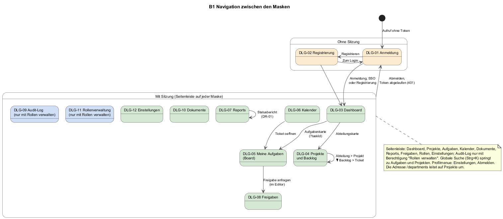

Ohne Sitzung sind nur Anmeldung und Registrierung erreichbar; jede andere Adresse leitet zur Anmeldung und merkt sich das Ziel. Mit Sitzung trägt jede Maske den gemeinsamen Anwendungsrahmen (B1.4.1) mit der Seitenleiste, über die alle Masken direkt erreichbar sind; das Diagramm zeigt deshalb nur die Übergänge, die aus einer Maske heraus in eine andere führen. Die Adresse `/departments` leitet auf die Projekte um; die dort früher vorgesehene Abteilungssicht ist im Code vorhanden, aber nicht erreichbar.

---

## B1.2 Schablone

Jede Maske hat eine Zusammenfassung, eine Feldtabelle (GUI Statik) und eine Aktionsliste (GUI Dynamik).

| Zeile | Bedeutung |
|-------|-----------|
| **Zweck** | Was der Anwender auf der Maske erreicht. |
| **Bereiche** | Logische Bereiche der Maske, unabhängig vom Pixel-Layout. |
| **Zustände** | Leer, Laden, Fehler, Erfolg; was die Maske dann zeigt. |
| **Datenquelle** | Ob die Maske Serverdaten, Daten aus dem Browser oder Beispieldaten zeigt (Details in B1.5). |

**GUI Statik** listet jedes Feld mit Art (`Anzeige`, `Eingabe (Pflicht)`, `Eingabe (optional)`), Zuordnung zu einem Attribut aus [D1](D1-datenmodell.md) oder `—`, und Vorgabe.

**GUI Dynamik** listet jede Aktion mit Auslöser, Vorbedingung und Wirkung (Zielmaske oder Anwendungsfall-Schritt).

---

## B1.3 Masken

### DLG-01 — Anmeldung

| | |
|--|--|
| **Zweck** | Anmeldung mit E-Mail und Passwort, mit Einmalcode als zweitem Schritt, oder per SSO (UC-02, UC-03). |
| **Bereiche** | Zentrierte Karte in zwei Zuständen: *Anmeldung* (E-Mail, Passwort, Schaltflächen) und *Zweiter Faktor* (E-Mail als Anzeige, Code). |
| **Zustände** | Laden: Schaltflächen gesperrt, Text „Prüfe …". Fehler: rote Zeile mit Servermeldung oder „Login fehlgeschlagen" bzw. „SSO-Anmeldung fehlgeschlagen". Rückkehr vom SSO: „SSO-Anmeldung wird abgeschlossen …". |
| **Datenquelle** | Server. Die SSO-Schaltfläche erscheint nur, wenn der Server SSO als konfiguriert meldet. |

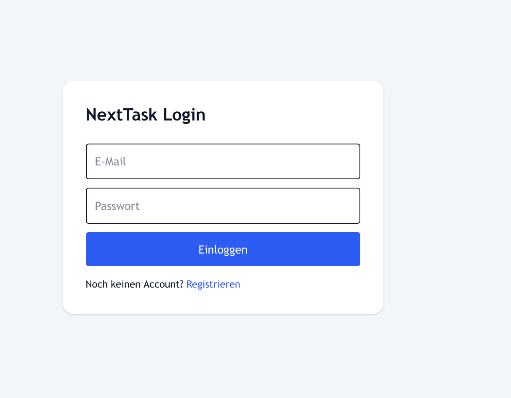

**GUI Statik**

| Feld | Art | Zuordnung | Vorgabe |
|------|-----|-----------|---------|
| E-Mail | Eingabe (Pflicht) | `User.email` | leer |
| Passwort | Eingabe (Pflicht) | — (gegen Hash geprüft) | leer |
| Authenticator-Code (Zustand *Zweiter Faktor*) | Eingabe (Pflicht) | — (gegen TOTP oder Wiederherstellungscode geprüft, AF-06) | leer; numerische Tastatur, Autovervollständigung für Einmalcodes |
| E-Mail des Kontos (Zustand *Zweiter Faktor*) | Anzeige | `User.email` | aus Schritt 1 |

**GUI Dynamik**

- **Einloggen** — Vorbedingung: beide Felder gefüllt, sonst „Bitte E-Mail und Passwort eingeben". Wirkung: UC-02 Schritt 3; bei aktivem zweiten Faktor Wechsel in Zustand *Zweiter Faktor*, sonst DLG-03 bzw. die ursprünglich aufgerufene Maske.
- **Code bestätigen** — Vorbedingung: Code gefüllt. Wirkung: UC-02 Schritt 7; bei Erfolg DLG-03.
- **Zurück** (Zustand *Zweiter Faktor*) — Wirkung: zurück zu *Anmeldung*; Challenge-Token wird verworfen.
- **Mit <Name> anmelden** — nur bei konfiguriertem SSO. Wirkung: UC-03 Schritt 2 (Umleitung). Die Rückkehr mit Ticketcode löst automatisch Schritt 8 aus.
- **Registrieren** — Wirkung: DLG-02.

### DLG-02 — Registrierung

| | |
|--|--|
| **Zweck** | Selbstregistrierung mit sofortiger Anmeldung (UC-01). |
| **Bereiche** | Ein Formular. |
| **Zustände** | Fehler: rote Zeile („Registrierung fehlgeschlagen" oder Servermeldung). Kein Ladezustand. |
| **Datenquelle** | Server. |

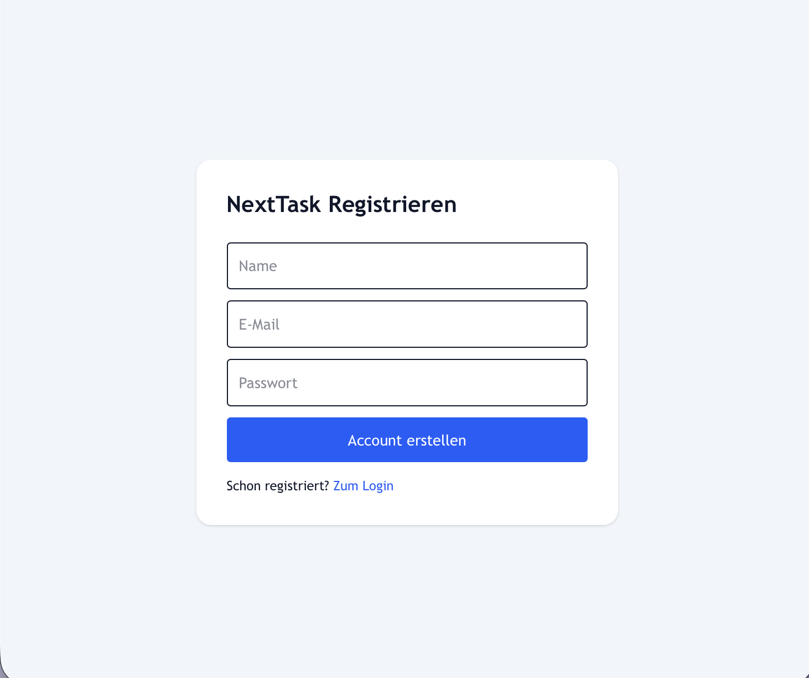

**GUI Statik**

| Feld | Art | Zuordnung | Vorgabe |
|------|-----|-----------|---------|
| Name | Eingabe (Pflicht) | `User.name` | leer |
| E-Mail | Eingabe (Pflicht) | `User.email` | leer |
| Passwort | Eingabe (Pflicht) | — (Hash) | leer; keine Mindestlänge, keine Wiederholung |

**GUI Dynamik**

- **Account erstellen** — Vorbedingung: alle Felder gefüllt. Wirkung: UC-01; bei Erfolg DLG-03.
- **Zum Login** — Wirkung: DLG-01.

### DLG-03 — Dashboard

| | |
|--|--|
| **Zweck** | Persönlicher Einstieg: Auslastung, Statusverteilung, Aufgaben im Fokus, Abteilungen, Fristen (UC-17). |
| **Bereiche** | Reiterleiste „Arbeitsbereiche" mit *Übersicht* (Auslastungsring mit Umschalter Stunden/Tage, Balken „Aufgabenstatus" und „Fristen"), *Heute im Fokus* (bis vier Aufgaben), *Aufmerksamkeit* (Aufgaben in Review oder blockiert, bis vier), *Abteilungen* (Karten mit Leitung, Projekten, offenen Aufgaben), *Fristen* (Aufgaben der nächsten sieben Tage, bis fünf). Zähler an den Reitern. |
| **Zustände** | Leerhinweise je Reiter, z. B. „Keine Fokus-Aufgaben für den aktuellen Suchbegriff gefunden." Kein Ladezustand; Serverfehler werden still übergangen. |
| **Datenquelle** | Aufgaben vom Server (AF-02). Abteilungs- und Projektkacheln aus Beispieldaten im Browser. Liefert der Server keine Aufgaben, zeigt das Dashboard für einen bestimmten Beispielnutzer Demo-Aufgaben, sonst ein leeres Board (B1.5). |

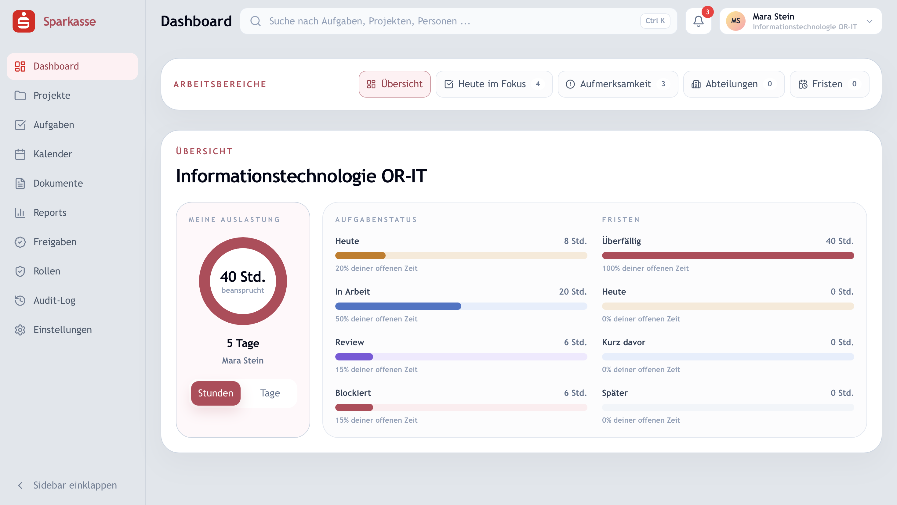

**GUI Statik**

| Feld | Art | Zuordnung | Vorgabe |
|------|-----|-----------|---------|
| Abteilung (Auswahl) | Eingabe (optional) | Filter auf `Task.department` | „Alle Abteilungen"; nur sichtbar für Rollenart GBL |
| Stunden / Tage | Eingabe (optional) | Umrechnung `Task.estimatedHours` (8 h = 1 Tag) | Stunden |
| Kennzahlen, Balken, Listen | Anzeige | `Task.status`, `Task.dueDate`, `Task.estimatedHours`, `Task.assignee` | — |

**GUI Dynamik**

- **Aufgabenkarte** — Wirkung: DLG-05 mit geöffneter Aufgabe (`?taskId`).
- **Abteilungskarte** — Wirkung: DLG-04.
- **Reiter wechseln, Filter setzen** — Wirkung: Anzeige wird gefiltert; kein Serveraufruf.

### DLG-04 — Projekte und Backlog

| | |
|--|--|
| **Zweck** | Abteilungen und Projekte überblicken, Projekt mit Berichtsbasis anlegen und bearbeiten, Backlog eines Projekts pflegen, Ticketdetails bearbeiten, Freigabe anfragen (UC-07 bis UC-09 lokal, UC-12, UC-18). |
| **Bereiche** | Zustand *Projekte*: Abteilungskarten (Projekte, Personen, Leitung, gebundene Zeit) und Projektkarten (Status, Fälligkeit, Eigentümer, Aufwand, optional GBL, PT, EUR). Zustand *Backlog*: Kopf „Backlog: <Projekt>", Panel „Berichtsbasis", Kacheln „Zeitbindung" je Person, Backlog-Tabelle (Schlüssel, Aufgabe, Erstellt, Status, Priorität, Aufwand, Verantwortlich) mit Favoritenstern und Ziehgriff. Dialoge: *Neue Abteilung*, *Neues Projekt / Projekt bearbeiten* (sechs Reiter), *Ticketdetails*, *Filter*. |
| **Zustände** | Leer: „Noch keine Projekte in diesem Bereich", „Noch keine Aufgaben im Backlog". Hinweis „Sortieren ist pausiert, solange Suche oder Filter aktiv sind." Erfolg: „Freigabe wurde im Cockpit angefragt." bzw. „Freigabe wurde lokal vorgemerkt und wird synchronisiert." |
| **Datenquelle** | Abteilungen, Projekte, Berichtsbasis und Backlog aus Beispieldaten, Änderungen im Browser gespeichert (R-01). Ticketdetails einer Serveraufgabe (über `?taskId` geladen) werden auf dem Server gespeichert; Freigaben gehen an den Server. |

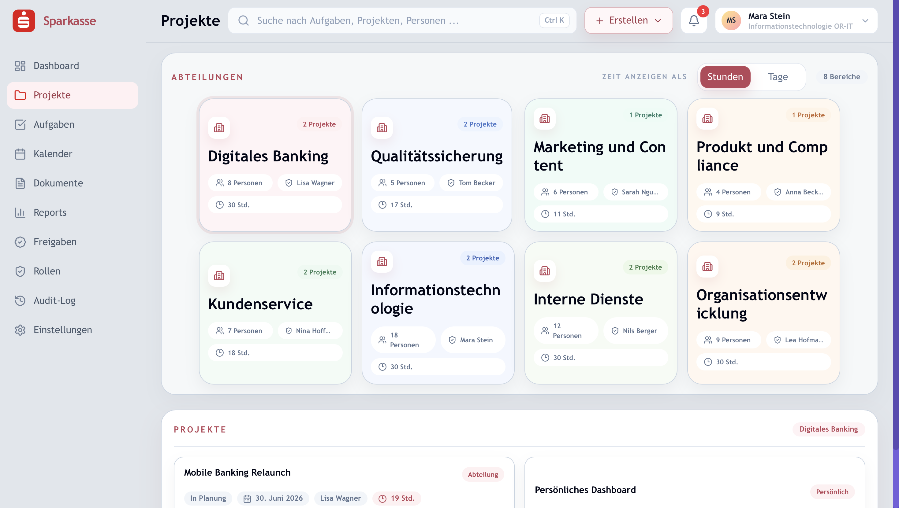

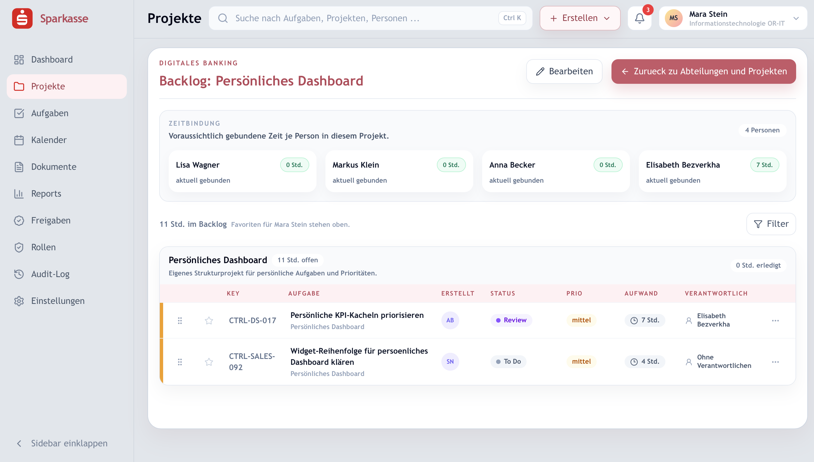

**GUI Statik — Dialog Neues Projekt / Projekt bearbeiten**

| Reiter | Felder | Art | Zuordnung |
|--------|--------|-----|-----------|
| Projektbasis | Projektname; Abteilung (Auswahl); Projektart {Persönlich, Abteilung}; Projektleitung; Stellvertretung; Verantwortlicher/GBL; Beginn Plan; Ende Plan; Beschreibung | Name und Abteilung Pflicht, Rest optional | `Project.name`, `businessArea`, `owner`, `deputyLead`, `projectSponsor`, `plannedStart`, `plannedEnd`, `description` |
| Status | Projektziel; Fortschritt 0–100 %; Ampeln Gesamt, Ziel, Termine, Ressourcen, Budget {Gruen, Gelb, Rot}; Qualität der Zusammenarbeit; Erläuterungen/Maßnahmen; Nächste Schritte; Berichtsversion | optional | `Project.projectGoal`, `ProjectStatusReport.progress`, `goalStatus` …, `collaborationQuality`, `progressNote`, `nextSteps`, `versionLabel` |
| Meilensteine | Zeilen: Titel; Plan-Termin; Neuer Termin; Status ([D2.12](D2-datentypen.md#d212-werte-der-berichtsbasis)); Fortschritt; Statusnotiz | Titel Pflicht je Zeile | `ProjectMilestone` |
| Risiken | Zeilen: Kürzel; Bezeichnung; Tragweite; Wahrscheinlichkeit; Risikoklasse; Tendenz; Beschreibung; Maßnahme | Bezeichnung Pflicht je Zeile | `ProjectRisk` |
| Budget & Ressourcen | Planaufwand PT; Ist-Aufwand PT; Differenz (berechnet); Planbudget EUR; Budgetzeilen Kategorie, Plan, Ist mit berechneter Differenz und Ist-% | optional | `Project.plannedEffortPt`, `plannedBudget`, `ProjectStatusReport.actualEffortPt`, `ProjectBudgetLine` |
| Schnittstellen & Freigabe | Zeilen: Name; Status {Offen, In Klärung, Abgestimmt, Blockiert}; Kommentar. Projektverantwortlicher; GBL-Freigabe; Projektleiter-Freigabe; Freigabedatum | optional | `Project.keyInterfaces`; Unterschriftszeile in DR-01 |

**GUI Statik — Dialog Ticketdetails**

| Feld | Art | Zuordnung |
|------|-----|-----------|
| Titel | Eingabe (Pflicht) | `Task.title` |
| Projekt (Auswahl) | Eingabe | `Task.project` |
| Status {To Do, In Arbeit, Review, Erledigt} | Eingabe | `Task.status` (AF-04) |
| Priorität {niedrig, mittel, hoch} | Eingabe | `Task.priority` |
| Fälligkeit | Eingabe (optional) | `Task.dueDate` |
| Aufwand in Stunden / in Tagen (Schritt 0,25) | Eingabe (optional) | `Task.estimatedHours` |
| Zuständige Person (Auswahl mit gebundener Zeit, „Ohne Verantwortlichen") | Eingabe (optional) | `Task.assignee` |
| Farbstreifen (Auswahl oder „Automatisch nach Regel") | Eingabe (optional) | `Task.markerId` (AF-10) |
| Beschreibung, Tags, verlinkte Mitarbeitende, Ersteller | Eingabe (optional) | `Task.description`; Rest nur im Browser |
| Dateien (Typ, Quelle, Upload) | Eingabe (optional) | nur im Browser (NG-01) |
| Kommentare mit @-Erwähnung | Eingabe (optional) | `Comment` (derzeit nur im Browser) |
| Banking Ready: Datenklassifizierung {Intern, Vertraulich, Reguliert}; Risiko {Niedrig, Mittel, Hoch}; Kontroll-ID; Freigabeprozess; Evidenzhinweis; Audit-Spur | Eingabe / Anzeige | `Task.approvalLevel` (Freigabeprozess); Rest nur im Browser |

**GUI Dynamik**

- **Abteilungskarte, Projektkarte** — Wirkung: Filter auf die Abteilung bzw. Wechsel in Zustand *Backlog*.
- **Zurück zu Abteilungen und Projekten** — Wirkung: Zustand *Projekte*.
- **Neue Abteilung, Neues Projekt** (Erstellen-Menü) — Wirkung: Dialog; Speichern legt im Browser an (R-01).
- **Projekt bearbeiten** — Wirkung: Dialog mit sechs Reitern; Speichern im Browser.
- **Zeile ziehen** — Vorbedingung: keine Suche, kein Filter aktiv. Wirkung: Reihenfolge im Backlog (im Browser).
- **Favoritenstern** — Wirkung: Aufgabe für den Anwender oben einsortiert (im Browser).
- **Ticket öffnen, Änderungen speichern** — Vorbedingung: Titel gefüllt. Wirkung: UC-12; bei Serveraufgabe Speichern auf dem Server.
- **Freigabe anfragen** (im Ticketdialog) — Wirkung: UC-18 mit Typ Aufgabe; zusätzlich Vormerkung im Browser.
- **Filter** (Ohne Verantwortlichen, Personen, Ersteller, Status, Priorität) mit *Speichern*/*Verwerfen* — Wirkung: Anzeige gefiltert.

### DLG-05 — Meine Aufgaben

| | |
|--|--|
| **Zweck** | Persönliches Kanban-Board mit Kennzahlen, Kontrollpunkten, Leistungsüberblick und vollständigem Ticket-Editor (UC-11, UC-12, UC-13, UC-15, UC-17, UC-18). |
| **Bereiche** | Kennzahlenleiste (Meine offenen Aufgaben, Heute fällig, Warten auf Review, Blockiert; Freigaben und Kontrollen; Leistungsüberblick in %). Filterleiste (Aufgabenbereich, Status, Person, Zurücksetzen). Board mit fünf Spalten: **Heute, In Arbeit, Review, Blockiert, Erledigt** ([D2.3](D2-datentypen.md#d23-taskstatusdt)). Ticket-Editor mit acht Reitern: Info, Beschreibung, Dateien, Kommentare, Organisation, Verknüpfte Tickets, Banking Ready, Audit-Spur. |
| **Zustände** | Leer: „Keine Aufgaben gefunden" mit Hinweis je Filter. Serverfehler werden still übergangen; die lokale Änderung bleibt. |
| **Datenquelle** | Board aus Beispielaufgaben, im Browser gespeichert. Aufgaben vom Server werden über `?taskId` nachgeladen und beim Speichern an den Server geschickt. Kontrollpunkte, Teamprofile und Leistungswerte sind Beispieldaten (B1.5). |

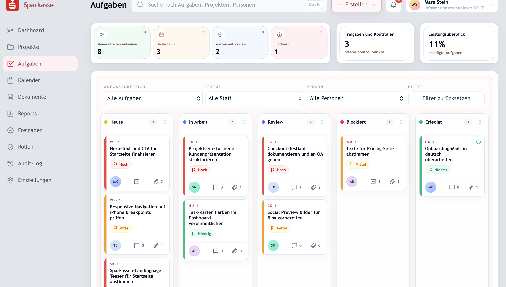

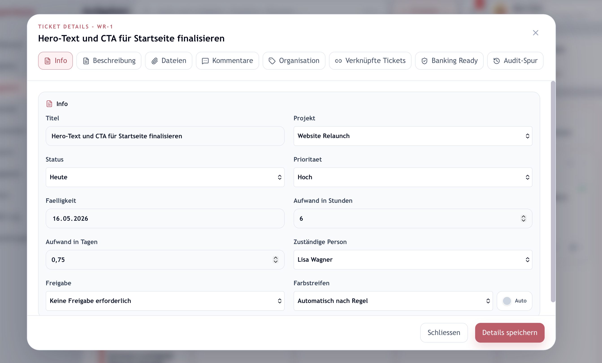

**GUI Statik — Ticket-Editor** (ergänzend zu DLG-04)

| Feld | Art | Zuordnung |
|------|-----|-----------|
| Titel | Eingabe (Pflicht) | `Task.title` |
| Projekt; Status (fünf Spalten); Priorität {Hoch, Mittel, Niedrig}; Fälligkeit; Aufwand Stunden/Tage; Zuständige Person; Farbstreifen; Beschreibung | Eingabe | wie DLG-04 |
| Freigabe {Keine Freigabe erforderlich, Freigabe durch Abteilungsleiter, Freigabe durch GBL} | Eingabe (optional) | `Task.approvalLevel` ([D2.9](D2-datentypen.md#d29-approvalleveldt)) |
| Anhänge (Typ {Excel, Word, PDF, Link}, Quelle {SharePoint, OneDrive, DMS, Audit-Ablage}); Tags; verlinkte Personen; übergeordnetes Ticket; Untertickets; Datenklassifizierung; Risiko; Evidenzhinweis | Eingabe (optional) | nur im Browser |
| Audit-Spur | Anzeige | nur im Browser, Beispieldaten |

**GUI Dynamik**

- **Neue Aufgabe** (Erstellen-Menü) — Wirkung: UC-11 im Browser; Serveraufruf nur für Projekte des Servers.
- **Karte öffnen, Details speichern** — Vorbedingung: Titel gefüllt. Wirkung: UC-12; Serveraufgabe wird gespeichert. Ist die Freigabe neu auf eine Stufe außer „Keine" gesetzt und existiert keine Anfrage, folgt UC-18.
- **Spalte ziehen** — Wirkung: Reihenfolge der Spalten (im Browser). Karten selbst sind nicht ziehbar; ein Statuswechsel läuft über den Editor.
- **Scope, Status, Person, Filter zurücksetzen** — Wirkung: Anzeige gefiltert.
- **Eltern-/Unterticket** — Wirkung: Editor wechselt zur verknüpften Aufgabe.

### DLG-06 — Kalender

| | |
|--|--|
| **Zweck** | Fristen im Monats- oder Wochenraster sehen, Aufgaben durch Ziehen umterminieren, Aufgabe anlegen (UC-11, UC-14, UC-17). |
| **Bereiche** | Werkzeugleiste (Heute, vor/zurück, Titel mit Zeitraum, Umschalter Monat/Woche, Filter ein/aus). Filterleiste. Raster. Seitenpanel mit Details der gewählten Aufgabe. Tagesagenda als Dialog. Dialog *Neue Aufgabe*. |
| **Zustände** | Leer: „Keine Aufgaben für diesen Tag geplant." Überfällige Aufgaben rot mit Kennzeichen „Überfällig". Serverfehler: Rückfall auf Beispieldaten ohne Meldung. |
| **Datenquelle** | Aufgaben des sichtbaren Zeitraums vom Server (AF-02), ergänzt um Beispielaufgaben. Verschiebungen an Serveraufgaben werden gespeichert (UC-14); nicht speicherbare Verschiebungen werden im Browser gemerkt. |

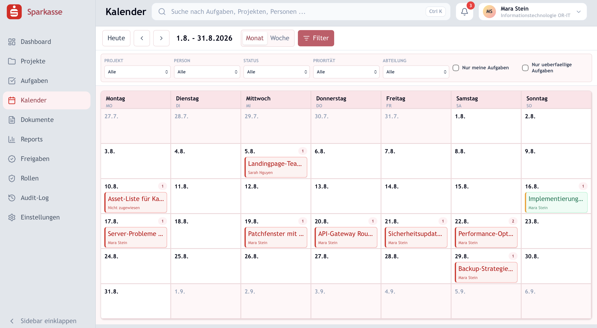

**GUI Statik**

| Feld | Art | Zuordnung | Vorgabe |
|------|-----|-----------|---------|
| Projekt, Person, Status, Priorität, Abteilung (Auswahl) | Eingabe (optional) | Filter aus AF-02 | „Alle" |
| Nur meine Aufgaben; Nur überfällige Aufgaben | Eingabe (optional) | Filter `mineOnly`, `overdueOnly` | aus |
| Dialog *Neue Aufgabe*: Titel; Beschreibung; Projekt; Verantwortlich; Deadline | Titel Pflicht | `Task.title`, `description`, `project`, `assignee`, `dueDate`; Status `OPEN`, Priorität `MEDIUM` | leer |
| Raster, Seitenpanel | Anzeige | `Task` mit Projekt und Bearbeiter | — |

**GUI Dynamik**

- **Heute, vor, zurück, Monat/Woche** — Wirkung: Zeitraum wechselt; Aufgaben werden für den Zeitraum geladen.
- **Karte auf einen Tag ziehen** — Wirkung: UC-14; Frist wird auf den Zieltag gesetzt.
- **Karte anklicken** — Wirkung: Seitenpanel; „Ticket öffnen" führt zu DLG-05.
- **Tag anklicken** — Wirkung: Tagesagenda.
- **Neue Aufgabe** — Vorbedingung: Titel gefüllt. Wirkung: UC-11.
- Aufruf mit `?taskId` — Wirkung: Wochenansicht am Fälligkeitstag der Aufgabe, Panel geöffnet.

### DLG-07 — Reports

| | |
|--|--|
| **Zweck** | Kennzahlen je Abteilung und Projekt, Statusbericht als Vorschau und PDF (UC-10). |
| **Bereiche** | Reiter *Abteilungsbericht* (Filter, vier Kennzahlkacheln, Team-Auslastung), *Projektbericht* (Statusbericht-Panel, Projektzeitachse mit Meilensteinen, Kacheln Laufzeit/Nächster Meilenstein/Aktive Tickets/Im Review), *Aufgabenstatus* (Ringdiagramm), *Projektfortschritt* (Projektkarten mit Ampel und Detailpanel). Vorschau des Statusberichts als Dialog. |
| **Zustände** | „Kein Projekt fuer einen Statusbericht verfuegbar.", „Bitte zuerst ein Projekt auswaehlen", „Keine Einträge gepflegt." Kein Lade- oder Fehlerzustand. |
| **Datenquelle** | Ausschließlich Beispieldaten und die im Browser gespeicherten Projekte. Kein Serveraufruf. Team-Auslastung und Fortschritt sind Näherungswerte aus Gewichtungen je Status (B1.5). |

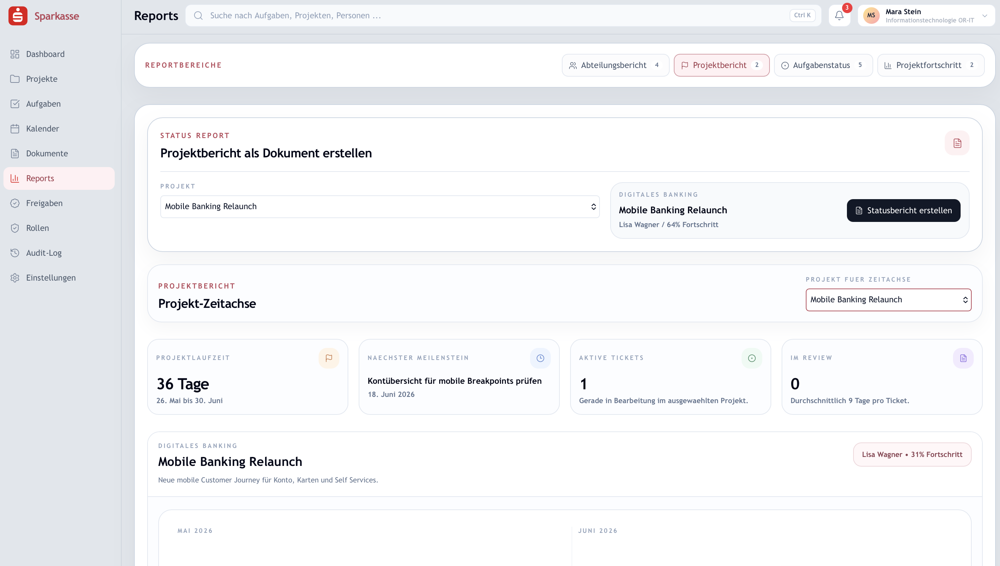

**GUI Statik**

| Feld | Art | Zuordnung | Vorgabe |
|------|-----|-----------|---------|
| Zeitraum {Diese Woche, Dieser Monat, Dieses Jahr}; Abteilung; Projekt; Exportformat {PDF, Excel} | Eingabe (optional) | Filter im Browser | Dieser Monat, Alle |
| Projekt für Statusbericht; Projekt für Zeitachse | Eingabe | Auswahl aus Projekten | erstes Projekt |
| Kennzahlen, Diagramme, Zeitachse | Anzeige | Berichtsbasis ([D1.2](D1-datenmodell.md#d12-projekte-und-berichtswesen)) | — |

**GUI Dynamik**

- **Statusbericht erstellen** — Vorbedingung: Projekt gewählt. Wirkung: Vorschau [DR-01](B3-druckausgaben.md#dr-01--projektstatusbericht).
- **PDF herunterladen** (in der Vorschau) — Wirkung: UC-10 Schritt 4.
- **Als PDF/Excel exportieren** (Abteilungsbericht) — ohne Wirkung; die Schaltfläche ist nicht angebunden (B1.5).

### DLG-08 — Freigaben

| | |
|--|--|
| **Zweck** | Freigaben-Cockpit: Anfragen sichten, genehmigen, ablehnen (UC-19). |
| **Bereiche** | Kopf „Genehmigungsworkflow", drei Kennzahlkacheln (Offen, Genehmigt, Abgelehnt), Karten je Anfrage mit Status- und Typkennzeichen, Anfragender, Genehmiger, Nachweis, Entscheidungsblock. Dialog *Freigabe anfragen* (vorhanden, aber nicht aufrufbar, B1.5). |
| **Zustände** | Laden: „Freigaben werden geladen …". Leer: „Keine Freigaben gefunden – Passe Filter oder Suche an oder starte eine neue Anfrage." Fehler: Rückfall auf die im Browser vorgemerkten Anfragen. |
| **Datenquelle** | Server (AF-03 bestimmt den Sichtbereich), zusammengeführt mit lokal vorgemerkten Anfragen. Entscheidungen zu Serveranfragen gehen an den Server; Entscheidungen zu lokalen Anfragen bleiben im Browser. |

**GUI Statik**

| Feld | Art | Zuordnung | Vorgabe |
|------|-----|-----------|---------|
| Suche | Eingabe (optional) | Filter über Titel, Beschreibung, Bezeichnung, Nachweis, Namen | leer; 250 ms verzögert |
| Entscheidungsvermerk | Eingabe (optional) | `ApprovalRequest.decisionNote` | leer |
| Karte: Titel, Typ, Status, Bezugsobjekt, Beschreibung, Nachweis, Anfragender, Genehmiger, Zeitpunkte | Anzeige | `ApprovalRequest` | — |
| Dialog *Freigabe anfragen*: Typ ([D2.8](D2-datentypen.md#d28-approvalentitytypedt)); Bezugsobjekt oder Bezug (Text); Titel; Beschreibung; Genehmiger („Automatisch bestimmen"); Evidenzhinweis | Titel Pflicht | `ApprovalRequest` | — |

**GUI Dynamik**

- **Genehmigen, Ablehnen** — Vorbedingung: Anfrage offen; Anwender ist Genehmiger, hat „Freigaben entscheiden" oder die Anfrage ist lokal. Wirkung: UC-19 Schritt 3.
- **Suchen** — Wirkung: Liste wird vom Server neu geladen.

### DLG-09 — Audit-Log

| | |
|--|--|
| **Zweck** | Revisionssicht auf alle protokollierten Ereignisse (UC-23). |
| **Bereiche** | Kennzahlen (Einträge, Prüffälle = `WARNING` + `CRITICAL`, Akteure), Filterblock, Ereignisliste mit aufklappbaren Änderungsdetails (Vorher/Delta und Nachher als JSON), Akteur, IP-Adresse, Zeitstempel. |
| **Zustände** | „Audit-Log wird geladen …"; leer: „Keine Audit-Einträge gefunden"; Fehler: gelber Hinweis; ohne Berechtigung: Sperrseite „Audit-Log ist gesperrt – Dein aktueller Account hat keinen Zugriff auf diesen Bereich." |
| **Datenquelle** | Server. Keine Beispieldaten, kein Export. |

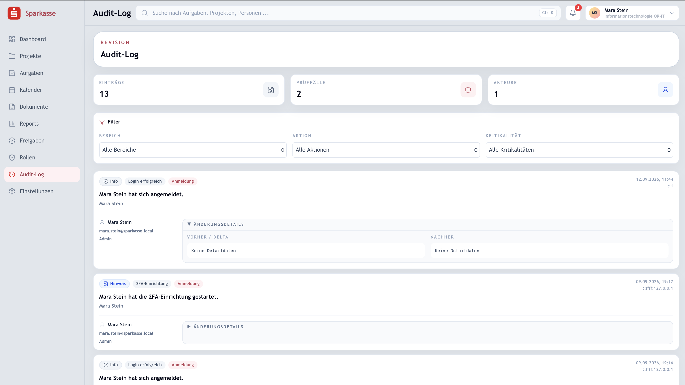

**GUI Statik**

| Feld | Art | Zuordnung | Vorgabe |
|------|-----|-----------|---------|
| Bereich {Alle Bereiche, Anmeldung, Benutzer, Rolle, Projekt, Aufgabe, Kommentar, Freigabe, Aufgabenfarben} | Eingabe (optional) | `AuditLog.entityType` | Alle |
| Aktion (rund 33 Werte, z. B. „Login erfolgreich", „2FA aktiviert", „Freigabe genehmigt", „Aufgabe verschoben") | Eingabe (optional) | `AuditLog.action` | Alle |
| Kritikalität {Info, Hinweis, Prüfpflichtig, Kritisch} | Eingabe (optional) | `AuditLog.severity` ([D2.10](D2-datentypen.md#d210-severitydt)) | Alle |
| Suche | Eingabe (optional) | Zusammenfassung, Akteur, Objekt, Aktion | leer |
| Eintrag | Anzeige | `AuditLog` | jüngste 150 |

**GUI Dynamik**

- **Filter, Suche** — Wirkung: Liste wird vom Server neu geladen (250 ms verzögert).
- **Eintrag aufklappen** — Wirkung: Änderungsdetails sichtbar.

### DLG-10 — Dokumente

| | |
|--|--|
| **Zweck** | Vorschau einer Dokumentenbibliothek mit Wissensbereichen, Vorlagen und Kontrollnachweisen. Kein Anwendungsfall; die Maske zeigt, wie eine Dokumentenablage aussehen könnte (NG-01). |
| **Bereiche** | Filterzeile, drei Sektionskacheln (Dokumentenbibliothek, Wissensbereiche, Vorlagen & Nachweise), Trefferliste mit Kennzeichen (Status, Klassifizierung, Typ), Detaildialog mit Metadaten, verknüpften Aufgaben, Audit-Trail, Kontroll-IDs. |
| **Zustände** | Kein Lade-, Fehler- oder Leerzustand. |
| **Datenquelle** | Sechs fest hinterlegte Beispieldokumente. Kein Serveraufruf, kein Upload, kein Download. |

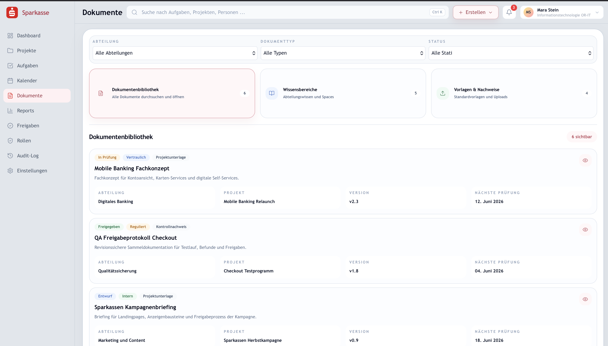

**GUI Statik.** Abteilung (Auswahl), Dokumenttyp {Alle Typen, Richtlinie, Kontrollnachweis, Projektunterlage, Vorlage, Prozessdokument}, Status (nur „Alle Stati"). Anzeige: Titel, Status {Entwurf, In Prüfung, Freigegeben, Abgelaufen}, Klassifizierung {Intern, Vertraulich, Reguliert, Streng vertraulich}, Abteilung, Projekt, Version, Nächste Prüfung, Aufbewahrung, Kontroll-ID.

**GUI Dynamik.** Dokument anklicken öffnet den Detaildialog. Die Einträge des Erstellen-Menüs (Neue Seite, Neues Dokument, Neue Vorlage, Upload Nachweis) sind ohne Wirkung.

### DLG-11 — Rollenverwaltung

| | |
|--|--|
| **Zweck** | Zugriffsrollen pflegen und Benutzer zuordnen oder anlegen (UC-21, UC-22). |
| **Bereiche** | Reiter *Rollen bearbeiten & hinzufügen* (Rollenliste links, Editor rechts) und *Zuweisungen* (Tabelle Benutzer/Abteilung/Rolle, Formular *Echten Benutzer erstellen*). Ohne Berechtigung: Sperrseite „Rollenverwaltung ist gesperrt". |
| **Zustände** | Erfolg: „Rolle wurde in der Datenbank gespeichert.", „Rolle wurde gelöscht.", „Rollenzuweisung wurde in der Datenbank gespeichert.", „Benutzer wurde in der Datenbank erstellt." Fehler: Servermeldung. Die Erfolgsmeldung wird derzeit gesetzt, aber nicht angezeigt (B1.5). |
| **Datenquelle** | Server; Startzustand und Rückfall aus einer Standardkonfiguration im Browser. |

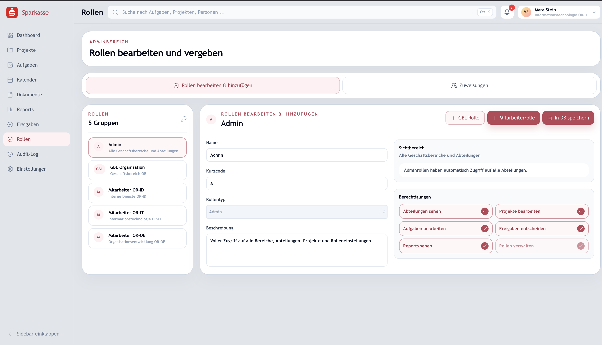

**GUI Statik — Rolle**

| Feld | Art | Zuordnung | Vorgabe |
|------|-----|-----------|---------|
| Name | Eingabe (Pflicht) | `AccessRole.name` | „Unbenannte Rolle" |
| Kurzcode | Eingabe (Pflicht) | `AccessRole.code` | leer; Großschreibung |
| Rollentyp {Admin, Geschäftsbereichsleiter, Mitarbeiter} | Eingabe | `AccessRole.kind` | Mitarbeiter; bei Systemrollen gesperrt |
| Beschreibung | Eingabe (optional) | `AccessRole.description` | leer |
| Geschäftsbereiche (Kommaliste, nur GBL) | Eingabe | `AccessRole.businessAreas` | „OR" |
| Abteilungen (Schalter OR-IT, OR-ID, OR-OE, nur Mitarbeiter) | Eingabe | `AccessRole.departmentIds` | keine |
| Sechs Berechtigungsschalter | Eingabe | `AccessRole.permissions` ([D2.6](D2-datentypen.md#d26-permissionsetdt)) | Vorgabe; bei Admin „Rollen verwalten" erzwungen |

**GUI Statik — Benutzer**

| Feld | Art | Zuordnung | Vorgabe |
|------|-----|-----------|---------|
| Name; E-Mail; Startpasswort | Eingabe (Pflicht) | `User.name`, `email`, Hash | Startpasswort vorbelegt |
| Abteilung (Auswahl „Name Code") | Eingabe | `User.department` | erste Abteilung |
| Access-Rolle (Auswahl) | Eingabe | `User.accessRole` | Mitarbeiter OR-IT |
| Tabelle Zuweisungen: Benutzer, Abteilung, Rolle | Eingabe je Zeile | `User.accessRole`, `User.department` | aktueller Stand |

**GUI Dynamik**

- **Rolle wählen, Neue Rolle, Speichern** — Vorbedingung: Name und Kurzcode gefüllt. Wirkung: UC-21.
- **Löschen** — Vorbedingung: keine Systemrolle. Wirkung: UC-21, Alternative Löschen.
- **Zuordnung ändern** — Wirkung: UC-22 Zuordnen.
- **Benutzer erstellen** — Vorbedingung: Name, E-Mail, Passwort gefüllt. Wirkung: UC-22 Anlegen.
- **Neu laden** — Wirkung: Rollen und Benutzer vom Server laden.

### DLG-12 — Einstellungen

| | |
|--|--|
| **Zweck** | Darstellung, Farbstreifen, Profil mit Benachrichtigungen und Kalender, Sicherheit mit Passwort und zweitem Faktor (UC-04, UC-05, UC-24, UC-25). |
| **Bereiche** | Aufklappbare Abschnitte *Darstellung*, *Aufgabenfarben (Farbstreifen)*, *Profil* (mit E-Mail-Benachrichtigungen und Kalender-Integration), *Sicherheit* (Passwort, Zwei-Faktor). Statuskennzeichen: „Server bereit"/„Server noch nicht verbunden" (Mail), „Verbunden"/„Bereit zum Verbinden"/„Server noch nicht konfiguriert" (Kalender), „Aktiv"/„Inaktiv" (zweiter Faktor). |
| **Zustände** | „Profil wird geladen …", „Aufgabenfarben werden geladen …". Erfolg grün: „Profil wurde gespeichert.", „Testmail wurde versendet.", „Passwort wurde geändert.", „2FA wurde aktiviert." u. a. Fehler rot; Kalender-Hinweise gelb. |
| **Datenquelle** | Profil, zweiter Faktor, Kalender, Farbstreifen vom Server. Darstellung nur im Browser. |

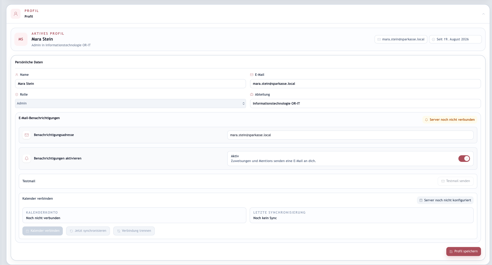

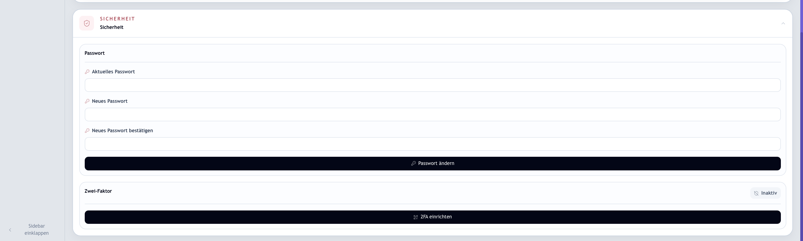

**GUI Statik**

| Abschnitt | Felder | Art | Zuordnung |
|-----------|--------|-----|-----------|
| Darstellung | Darkmode {Hell, Dunkel}; Layout-Dichte {Komfortabel, Kompakt}; Datumsformat; Schriftgröße 90–125 %; Sidebar geöffnet/eingeklappt; Animationen reduziert; Startansicht | Eingabe (optional) | nur im Browser; Startansicht ohne Wirkung (B1.5) |
| Aufgabenfarben | je Streifen: Farbe (Farbrad, 16 Schnellfarben); Name; Bedeutung; Zuordnung ([D2.13](D2-datentypen.md#d213-matchfielddt)); Wert (bei Priorität Auswahl {Hoch, Mittel, Niedrig}, sonst Text) | Eingabe | `TaskMarker` |
| Profil | Name (Pflicht); E-Mail (Pflicht); Rolle (gesperrt); Abteilung (Pflicht); Benachrichtigungsadresse; Benachrichtigungen aktivieren | Eingabe | `User.name`, `email`, `role`, `department`, `notificationEmail`, `emailNotificationsEnabled` |
| Kalender | Verbundenes Konto, letzter Abgleich, Fehler | Anzeige | `User.calendarEmail`, `calendarLastSyncedAt`, `calendarSyncError` |
| Sicherheit | Aktuelles Passwort; Neues Passwort (mindestens 8 Zeichen); Bestätigung (muss übereinstimmen) | Eingabe (Pflicht beim Ändern) | Hash |
| Zwei-Faktor | QR-Code und Geheimnis (Anzeige); Authenticator-Code (Pflicht); Wiederherstellungscodes (einmalige Anzeige); zum Deaktivieren Passwort und Code | Eingabe / Anzeige | `User.twoFactor…` |

**GUI Dynamik**

- **Darstellung ändern** — Wirkung: sofort, im Browser gespeichert.
- **Streifen hinzufügen, ändern, löschen, speichern** — Vorbedingung: mindestens ein Streifen bleibt. Wirkung: UC-24.
- **Profil speichern** — Vorbedingung: Pflichtfelder. Wirkung: UC-05.
- **Testmail senden** — Vorbedingung: Benachrichtigungen aktiviert, Versand auf dem Server bereit. Wirkung: UC-05 Alternative.
- **Kalender verbinden, Jetzt synchronisieren, Verbindung trennen** — Wirkung: UC-25.
- **Passwort ändern** — Vorbedingung: alle drei Felder, Mindestlänge, Übereinstimmung. Wirkung: UC-05 Alternative.
- **2FA einrichten, Code bestätigen, 2FA deaktivieren** — Wirkung: UC-04.
- Aufruf mit `?section=profile` — Wirkung: Profilabschnitt geöffnet und angesprungen. Rückkehr von Google mit `?calendar_status` — Wirkung: Meldung, Parameter werden entfernt.

---

## B1.4 Übergreifende Dialogmuster

### B1.4.1 Anwendungsrahmen

Jede Maske mit Sitzung liegt im gemeinsamen Rahmen: Seitenleiste mit Marke und den Einträgen Dashboard, Projekte, Aufgaben, Kalender, Dokumente, Reports, Freigaben, Rollen, Audit-Log (nur mit „Rollen verwalten"), Einstellungen; Kopfzeile mit globaler Suche (Strg+K bzw. Cmd+K, Vorschläge zu Aufgaben und Projekten), Erstellen-Menü (Einträge je Maske), Benachrichtigungen und Profilmenü (Einstellungen, Abmelden). Die Benachrichtigungen im Rahmen sind drei feste Beispielmeldungen, keine Serverdaten (B1.5). Die Seitenleiste kann eingeklappt werden.

### B1.4.2 Umleitung ohne Sitzung

Ein Aufruf einer geschützten Adresse ohne Token führt zu DLG-01; nach der Anmeldung geht es zur ursprünglichen Adresse. Antwortet der Server mit 401, werden Token und Profil im Browser gelöscht und DLG-01 angezeigt.

### B1.4.3 Sperrseiten

Masken mit Berechtigungsprüfung (DLG-09, DLG-11) zeigen ohne Berechtigung eine Sperrseite mit Hinweis auf die fehlende Rolle. Der Server prüft unabhängig davon (AF-01).

### B1.4.4 Rückmeldungen

Erfolg: grüne Zeile mit Text im Präteritum („… wurde gespeichert."). Fehler: rote Zeile mit der Meldung des Servers oder einem allgemeinen Text. Warnungen (z. B. Kalenderabgleich): gelb. Speichern-Schaltflächen sind während des Serveraufrufs gesperrt und tragen einen Ladetext.

### B1.4.5 Leerzustände

Jede Liste hat einen Leerhinweis mit konkretem Bezug (Filter, Zeitraum, Suche) und, wo möglich, dem nächsten Schritt.

### B1.4.6 Formularprüfung

Pflichtfelder werden im Browser geprüft (Schaltfläche gesperrt oder Meldung), Regeln mit Serverbezug (Eindeutigkeit der E-Mail, Passwortprüfung) vom Server. Die Meldungen sind die aus F2.

### B1.4.7 Tiefe Verweise

Aufgaben werden über `?taskId=…` in Board, Kalender und Backlog geöffnet; Dashboard und globale Suche nutzen das. Einstellungen werden über `?section=…` angesprungen.

---

## B1.5 Stand der Anbindung

Diese Tabelle hält fest, welche Maske welche Daten woher bezieht. Sie ist die Grundlage für R-01 in [P1](P1-ziele-rahmenbedingungen.md) und für die Spalte „Stand" in [F2](F2-anwendungsfaelle.md).

| Maske | Serverdaten | Nur im Browser gespeichert | Beispieldaten |
|-------|-------------|-----------------------------|---------------|
| DLG-01, DLG-02 | Anmeldung, Registrierung, SSO | Token, Profil | — |
| DLG-03 | Aufgaben (AF-02) | — | Abteilungs- und Projektkacheln; Demo-Aufgaben für einen Beispielnutzer |
| DLG-04 | Ticketdetails einer Serveraufgabe, Freigaben | Abteilungen, Projekte, Berichtsbasis, Backlog, Favoriten, Anhänge, Kommentare | Startbestand an Abteilungen, Projekten, Backlog |
| DLG-05 | Ticketdetails einer Serveraufgabe, Freigaben | Board, Spaltenreihenfolge, Anhänge, Kommentare, Verknüpfungen | Startbestand des Boards, Kontrollpunkte, Teamprofile, Leistungswerte, Audit-Spur mit festem Datum |
| DLG-06 | Aufgaben, Terminieren, Anlegen | Nicht speicherbare Verschiebungen | Beispielaufgaben, Personen, Abteilungen als Ergänzung |
| DLG-07 | — | Projekte (aus DLG-04) | alles übrige; Auslastung und Fortschritt sind Näherungen |
| DLG-08 | Freigaben, Entscheidungen | Vorgemerkte Anfragen und deren Entscheidungen | — |
| DLG-09 | alles | — | — |
| DLG-10 | — | — | alles |
| DLG-11 | Rollen, Benutzer, Zuordnungen | Rückfall-Konfiguration | Standardrollen und Demo-Nutzer als Startzustand |
| DLG-12 | Profil, zweiter Faktor, Kalender, Farbstreifen | Darstellung, Kopie der Farbstreifen | — |

**Bekannte Abweichungen** (Stand September 2026, zur Bearbeitung durch das Entwicklungsteam):

1. DLG-12: Das Laden der Farbstreifen bricht mit einem Programmfehler ab (nicht vorhandene Funktion zum Zurücksetzen der Fehlermeldung); die Anzeige bleibt bei „Aufgabenfarben werden geladen …", und die Serverwerte werden nicht übernommen.
2. DLG-08: Der Dialog *Freigabe anfragen* ist umgesetzt, aber von keiner Schaltfläche erreichbar; Anfragen entstehen nur über die Ticket-Editoren.
3. DLG-07: Die Schaltfläche *Als PDF/Excel exportieren* im Abteilungsbericht hat keine Funktion.
4. DLG-10: Die Einträge des Erstellen-Menüs haben keine Funktion.
5. DLG-11: Erfolgsmeldungen werden gesetzt, aber nicht angezeigt.
6. DLG-12: Die Einstellung *Startansicht* wird gespeichert, aber nirgends ausgewertet.
7. Rahmen: Die Benachrichtigungen sind drei feste Beispielmeldungen.
8. Die Abteilungssicht (`/departments`) ist im Code vorhanden, aber auf die Projekte umgeleitet.
9. Aufgaben löschen (UC-16) und Freigaben abbrechen (UC-20) haben keine Schaltfläche.

---

## B1.6 Querverweise

| Baustein | Bezug zu B1 |
|----------|-------------|
| [F2](F2-anwendungsfaelle.md) | Maske je Anwendungsfall; Meldungstexte in den Ausnahmeszenarien. |
| [D1](D1-datenmodell.md), [D2](D2-datentypen.md) | Zuordnung der Felder; Anzeigetexte der Aufzählungen. |
| [B3](B3-druckausgaben.md) | Statusbericht aus DLG-07. |
| [N1](N1-nichtfunktional.md) | Bedienbarkeit, Sprache, Antwortzeit. |
| [N2](N2-querschnittskonzepte.md) | Sitzung und Umleitung, Berechtigungen, lokale Daten im Browser. |
