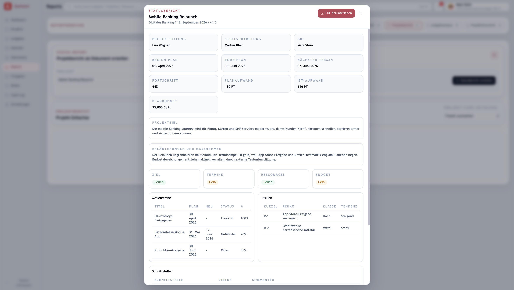

# B3 — Druckausgaben

Druckausgaben nach Siedersleben (Kapitel 4.7): Dokumente, die NextTask für den Ausdruck oder die Weitergabe erzeugt. NextTask hat eine Druckausgabe, den Projektstatusbericht. Listen und Kennzahlen der Masken sind keine Druckausgaben; sie sind in [B1](B1-dialogspezifikation.md) beschrieben.

| ID | Druckausgabe | Erzeugt in | Format |
|----|--------------|------------|--------|
| [DR-01](#dr-01--projektstatusbericht) | Projektstatusbericht | DLG-07 Reports ([UC-10](F2-anwendungsfaelle.md#uc-10--statusbericht-als-pdf-ausgeben)) | PDF, DIN A4 hoch, drei Seiten |

---

## DR-01 — Projektstatusbericht

**Zweck.** Der Bericht der Projektleitung an die Geschäftsbereichsleitung zum Stichtag (GP-01 A6). Das Layout folgt dem Statusbericht-Formular der Sparkasse: Kopf mit Marke, Stammdaten, Ampeln, Erläuterungen, Meilensteine, Ressourcen, Risiken mit Risikograph, Budget, Unterschriften.

**Erzeugung.** Die Browser-Anwendung baut den Bericht als HTML-Seite auf, rendert jede der drei Seiten in ein Bild und fügt die Bilder zu einem PDF zusammen. Der Server ist nicht beteiligt; es entsteht kein Datensatz und kein Audit-Eintrag. Dateiname: `statusbericht-<Projektname>.pdf`.

**Datenquelle.** Das in DLG-07 gewählte Projekt mit Berichtsbasis, so wie es im Browser vorliegt (B1.5). Die Felder entsprechen [D1.2](D1-datenmodell.md#d12-projekte-und-berichtswesen); die Zuordnung steht je Abschnitt unten.

### Kopf und Fuß (auf jeder Seite)

| Element | Inhalt |
|---------|--------|
| Titel | „Statusbericht", darunter der Projektname |
| Marke | Sparkassen-Logo mit Institutsname (derzeit fest „Sparkasse Oberhessen"; nicht konfigurierbar) |
| Fußzeile | „Seite x von 3" |

### Seite 1

| Abschnitt | Inhalt | Zuordnung |
|-----------|--------|-----------|
| **Allgemeine Projektinformation** | Statusbericht zum; Nächster Termin; Zuletzt bearbeitet am, von; Beginn (Plan); Ende (Plan); Projektleiter; Stellvertreter; Berichtszeitraum | `ProjectStatusReport.reportDate`, `nextMeetingDate`, `reportingPeriod`; `Project.plannedStart`, `plannedEnd`, `owner`, `deputyLead` |
| **Aktueller Status** | Fünf Zeilen mit Wert und Ampelsymbol: Projektfortschritt in %; Prognose Zielerreichung; Termineinhaltung; Ressourceneinhaltung; Budgeteinhaltung. Anzeigetexte der Ampel: Positiv, Beobachten, Kritisch ([D2.11](D2-datentypen.md#d211-ampeldt)) | `ProjectStatusReport.progress`, `goalStatus`, `scheduleStatus`, `resourceStatus`, `budgetStatus` |
| **Erläuterungen und Maßnahmen** | Acht Zeilen: Projektfortschritt; Prognose Zielerreichung; Termineinhaltung; Ressourceneinhaltung; Budgeteinhaltung; Veränderungen in den Risiken; Veränderungen in den Schnittstellen; Qualität der Zusammenarbeit | `progressNote`, `Project.projectGoal`, `collaborationQuality`; die übrigen fünf Zeilen siehe Hinweis unten |
| **Übersicht Meilensteine und nächste Schritte** | Tabellenkopf: Meilenstein; Plan-Termin; Neuer Termin; Status; Fortschritt; Statusnotiz | `ProjectMilestone` |

### Seite 2

| Abschnitt | Inhalt | Zuordnung |
|-----------|--------|-----------|
| **Meilensteine** (Fortsetzung) | Eine Zeile je Meilenstein in der Reihenfolge der Berichtsbasis | `ProjectMilestone.title`, `planDate`, `newDate`, `status`, `progress`, `statusNote` |
| **Nächste Schritte** | Freitext | `ProjectStatusReport.nextSteps` |
| **Übersicht Ressourcen und Budget — Ressourcen** | Plan-Aufwand; Ist-Aufwand; Differenz (Plan − Ist), jeweils in PT | `Project.plannedEffortPt`, `ProjectStatusReport.actualEffortPt`, berechnet |
| **Risikotabelle** | Spalten: Kürzel; Bezeichnung; Tragweite; Wahrscheinlichkeit; Risikoklasse als gepflegter Text mit Farbsymbol (A oder „hoch" rot, B oder „mittel" gelb, sonst grün; leer wird als „C-Risiko" gedruckt); Tendenz. Letzte Zeile „Gesamt-Klassifizierung" mit der Klasse des ersten Risikos oder „Keine" | `ProjectRisk.code`, `title`, `impact`, `probability`, `riskClass`, `trend` (nur aktive Risiken) |

### Seite 3

| Abschnitt | Inhalt | Zuordnung |
|-----------|--------|-----------|
| **Risikograph** | Quadratisches Raster, Achsen „Bedeutung/Tragweite" (waagerecht) und „Wahrscheinlichkeit des Eintritts" (senkrecht); drei Farbflächen für die Klassen A (rot, oben rechts), B (gelb, Diagonale), C (grün, unten links); je Risiko eine Markierung mit Kürzel an der Position (Tragweite, Wahrscheinlichkeit). Legende der Risikoklassen | `ProjectRisk.impact`, `probability`, `code` |
| **Legende: Risiken** | Kürzel und Bezeichnung je Risiko | `ProjectRisk.code`, `title` |
| **Budget** | Spalten: Kosten-Kategorie; Plan [EUR]; Ist [EUR]; Differenz [EUR]; Ist [% von Plan]; eine Zeile je Budgetposition | `ProjectBudgetLine.category`, `plannedAmount`, `actualAmount`, berechnet |
| **Unterschriften** | Drei Linien: Projektverantwortlicher; GBL; Projektleiter, jeweils mit Namen aus dem Reiter *Schnittstellen & Freigabe* in DLG-04, ersatzweise Projektverantwortlicher und Eigentümer des Projekts | `Project.projectSponsor`, `owner` |

### Regeln

- Zahlen werden mit Tausendertrennzeichen und Einheit (PT, EUR) formatiert; fehlende Werte erscheinen als Strich.
- Die Farbfläche, in der ein Risiko im Graph liegt, ergibt sich aus Tragweite × Wahrscheinlichkeit; die Klasse in der Tabelle ist der gepflegte Text aus der Berichtsbasis ([D2.12](D2-datentypen.md#d212-werte-der-berichtsbasis)). Beide sollten übereinstimmen; das System prüft das nicht.
- Leere Listen ergeben leere Tabellen mit Kopfzeile; der Bericht bleibt dreiseitig.

### Hinweis zur Datenherkunft der Erläuterungen

Fünf der acht Erläuterungszeilen auf Seite 1 werden nicht aus den Notizfeldern des Statusberichts gefüllt, sondern aus dem Ampelwert oder dem Vorhandensein von Einträgen als fester Satz erzeugt (etwa „Die Termine liegen im Plan." bei grüner Terminampel, „Die aufgeführten Risiken werden im Projekt verfolgt." bei vorhandenen Risiken). Die Felder `scheduleNote`, `resourceNote`, `budgetNote`, `riskChanges` und `interfaceChanges` aus [D1.2](D1-datenmodell.md#d12-projekte-und-berichtswesen) fließen derzeit nicht in das PDF ein. Das ist eine offene Abweichung zwischen Datenmodell und Druckausgabe; fachlich sollen die gepflegten Texte erscheinen.

---

## Querverweise

| Baustein | Bezug zu B3 |
|----------|-------------|
| [F1](F1-geschaeftsprozesse.md) | GP-01, Tätigkeit A6. |
| [F2](F2-anwendungsfaelle.md) | UC-09 liefert die Bewertung, UC-10 erzeugt die Ausgabe. |
| [D1](D1-datenmodell.md), [D2](D2-datentypen.md) | Felder und Wertebereiche des Berichts. |
| [B1](B1-dialogspezifikation.md) | DLG-07 (Aufruf), DLG-04 (Pflege der Berichtsbasis). |
| [P1](P1-ziele-rahmenbedingungen.md) | G-04, SC-05, R-01. |
