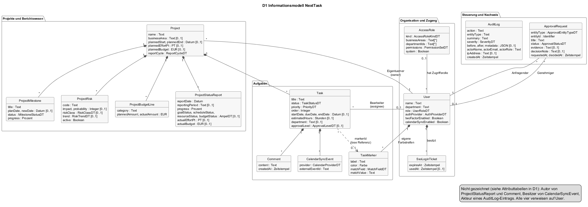

# D1 — Datenmodell

Informationsmodell von NextTask nach Siedersleben (Kapitel 4.6): die Entitäten, ihre Attribute und Beziehungen, unabhängig von der physischen Speicherung. Grundlage ist das Datenmodell des Servers; alle 14 Entitäten liegen in der Datenbank von NextTask. Daten, die nur im Browser gehalten werden (siehe R-01 in [P1](P1-ziele-rahmenbedingungen.md)), sind kein Teil dieses Modells.

Attributtypen, die nicht selbsterklärend sind, stehen in [D2](D2-datentypen.md) und enden auf `DT`. Einfache Typen (`Text`, `Integer`, `Boolean`, `Datum`, `Zeitstempel`, `Email`, `JSON`) werden ohne eigene Definition verwendet; `PT`, `EUR`, `Stunden`, `Prozent`, `Farbe` und `Identifier` sind in [D2.1](D2-datentypen.md#d21-typkatalog) kurz erklärt. Jede Entität hat einen technischen Schlüssel `id` vom Typ `Identifier` und, sofern nicht anders vermerkt, die Zeitstempel `createdAt` und `updatedAt`; beide werden in den Tabellen nicht wiederholt.

Das Diagramm zeigt die Entitäten in vier Gruppen, die den Abschnitten D1.1 bis D1.4 entsprechen. Vier Beziehungen zu `User` (Autor eines Statusberichts, Autor eines Kommentars, Besitzer eines Kalenderabgleichs, Akteur eines Audit-Eintrags) sind nicht gezeichnet, weil sie das Bild unleserlich machen; sie stehen in den Attributtabellen.

---

## D1.1 Organisation und Zugang

### User

Ein Anwender von NextTask. Konten entstehen durch Registrierung (UC-01), durch einen Administrator (UC-22) oder automatisch bei der ersten SSO-Anmeldung (UC-03).

| Attribut | Typ | Bemerkung |
|----------|-----|-----------|
| `name` | Text | Anzeigename; wird für Erwähnungen in Kommentaren verwendet (AF-09). |
| `email` | Email | Anmeldename, eindeutig, wird in Kleinschreibung gespeichert. |
| `password` | Text | Passwort-Hash. Bei SSO-Konten ein zufälliger Wert, mit dem keine Anmeldung möglich ist. |
| `department` | Text | Abteilung als Freitext, Vorgabe `Development`; bei SSO-Konten der konfigurierte Standard. Siehe D1.5. |
| `role` | UserRoleDT | Grobe Rolle, abgeleitet aus der Rollenart der Zugriffsrolle bei jeder Zuordnung (UC-22). |
| `accessRole` | → AccessRole [0..1] | Zugriffsrolle mit Sichtbereich und Berechtigungen. |
| `authProvider` | AuthProviderDT | Wie sich das Konto anmeldet. |
| `ssoProvider`, `ssoSubject`, `ssoEmail`, `ssoLastLoginAt` | Text, Text, Email, Zeitstempel [0..1] | Verknüpfung mit dem SSO-Profil. `(ssoProvider, ssoSubject)` ist eindeutig. |
| `twoFactorEnabled` | Boolean | Zweiter Faktor aktiv. |
| `twoFactorSecret` | EncryptedSecretDT [0..1] | Geteiltes Geheimnis mit der Authenticator-App, verschlüsselt gespeichert. |
| `twoFactorConfirmedAt` | Zeitstempel [0..1] | Zeitpunkt der bestätigten Einrichtung. |
| `twoFactorLastUsedStep` | Integer [0..1] | Zeitschritt des zuletzt akzeptierten Einmalcodes; verhindert Wiederverwendung (AF-06). |
| `twoFactorRecoveryCodes` | Text [*] | Hashes der noch unverbrauchten Wiederherstellungscodes. |
| `notificationEmail` | Email [0..1] | Empfängeradresse für Benachrichtigungen; Vorgabe ist `email`. |
| `emailNotificationsEnabled` | Boolean | Anwender möchte Benachrichtigungen erhalten. |
| `calendarProvider` | CalendarProviderDT [0..1] | Verbundener Kalenderdienst. |
| `calendarEmail` | Email [0..1] | Konto beim Kalenderdienst. |
| `calendarRefreshToken` | EncryptedSecretDT [0..1] | Dauerzugriff auf den Kalender, verschlüsselt. |
| `calendarSyncEnabled`, `calendarConnectedAt`, `calendarLastSyncedAt`, `calendarSyncError` | Boolean, Zeitstempel, Zeitstempel, Text | Zustand der Kalenderverbindung; `calendarSyncError` hält die letzte Fehlermeldung. |

### AccessRole

Eine Zugriffsrolle: Sie legt fest, welchen Ausschnitt der Organisation ein Anwender sieht und was er darf. Fünf Rollen sind Systemrollen und werden beim ersten Start angelegt (S3); weitere Rollen legen Administratoren an (UC-21).

| Attribut | Typ | Bemerkung |
|----------|-----|-----------|
| `name` | Text | Anzeigename, z. B. „GBL Organisation". |
| `code` | Text | Kurzcode, eindeutig, Großschreibung, z. B. `GBL-OR`, `M-OR-IT`. |
| `kind` | AccessRoleKindDT | Rollenart: Admin, Geschäftsbereichsleitung oder Mitarbeiter. Bei Systemrollen unveränderlich. |
| `description` | Text | Beschreibung. |
| `businessAreas` | Text [*] | Sichtbare Geschäftsbereiche; nur bei Rollenart `GBL` gefüllt, z. B. `OR`. |
| `departmentIds` | Text [*] | Sichtbare Abteilungen; nur bei Rollenart `MEMBER` gefüllt, z. B. `or-it`. |
| `permissions` | PermissionSetDT | Sechs Berechtigungen. Bei Rollenart `ADMIN` ist „Rollen verwalten" immer gesetzt. |
| `system` | Boolean | Systemrolle: kann nicht gelöscht werden, Rollenart nicht änderbar. |

### SsoLoginTicket

Ein Einmalticket, das die SSO-Anmeldung vom Rückweg über den Browser entkoppelt: Der Server stellt es nach erfolgreicher Prüfung beim Identity Provider aus, der Browser tauscht es innerhalb kurzer Zeit gegen ein Zugriffstoken (UC-03, S1).

| Attribut | Typ | Bemerkung |
|----------|-----|-----------|
| `tokenHash` | Text | Hash des Ticketcodes, eindeutig. Der Code selbst wird nicht gespeichert. |
| `user` | → User | Anwender, für den das Ticket gilt. |
| `expiresAt` | Zeitstempel | 90 Sekunden nach Ausstellung. |
| `usedAt` | Zeitstempel [0..1] | Gesetzt, sobald das Ticket eingelöst wurde. Ein Ticket ist nur einmal einlösbar. |

---

## D1.2 Projekte und Berichtswesen

### Project

Ein Projekt eines Anwenders. Der Eigentümer legt es an und pflegt die Berichtsbasis. Die Attribute ab `businessArea` bilden den Kopf des Statusberichts (B3).

| Attribut | Typ | Bemerkung |
|----------|-----|-----------|
| `name` | Text | Pflicht. |
| `key` | Text | Projektschlüssel, eindeutig; wird aus dem Namen erzeugt, wenn keiner angegeben ist (AF-05). |
| `description` | Text [0..1] | |
| `color` | Farbe [0..1] | Kennfarbe in Listen und Kalender. |
| `owner` | → User | Eigentümer (Projektleitung). |
| `deadline` | Datum [0..1] | Fälligkeit; entspricht `plannedEnd`, wenn nicht gesondert gesetzt. |
| `businessArea` | Text [0..1] | Geschäftsbereich, z. B. `OR`. |
| `projectGoal` | Text [0..1] | Projektziel für den Berichtskopf. |
| `plannedStart`, `plannedEnd` | Datum [0..1] | Geplanter Zeitraum. |
| `deputyLead` | Text [0..1] | Stellvertretende Projektleitung (Name als Text). |
| `projectSponsor` | Text [0..1] | Projektverantwortlicher, in der Regel die GBL (Name als Text). |
| `plannedEffortPt` | PT [0..1] | Planaufwand in Personentagen. |
| `plannedBudget` | EUR [0..1] | Planbudget. |
| `keyInterfaces` | Text [*] | Wesentliche Schnittstellen zu anderen Projekten oder Bereichen. |
| `collaborationQuality` | Text [0..1] | Einschätzung der Zusammenarbeit. |
| `reportCycle` | ReportCycleDT | Berichtszyklus, Vorgabe monatlich. |

### ProjectMilestone

Ein Meilenstein eines Projekts. Die Reihenfolge ist Teil der Berichtsbasis.

| Attribut | Typ | Bemerkung |
|----------|-----|-----------|
| `title` | Text | Pflicht. |
| `planDate` | Datum [0..1] | Ursprünglich geplanter Termin. |
| `newDate` | Datum [0..1] | Verschobener Termin, falls abweichend. |
| `status` | MilestoneStatusDT | |
| `progress` | Prozent | Fertigstellungsgrad, Vorgabe 0. |
| `statusNote` | Text [0..1] | |
| `order` | Integer | Position in der Liste. |

### ProjectRisk

Ein Risiko eines Projekts. Tragweite und Eintrittswahrscheinlichkeit ergeben die Position im Risikograph des Statusberichts (B3).

| Attribut | Typ | Bemerkung |
|----------|-----|-----------|
| `code` | Text | Kürzel, z. B. `R-1`; wird fortlaufend vergeben, wenn keines angegeben ist. |
| `title` | Text | Pflicht. |
| `description` | Text [0..1] | |
| `impact` | Integer [0..1] | Tragweite. |
| `probability` | Integer [0..1] | Eintrittswahrscheinlichkeit. |
| `riskClass` | RiskClassDT [0..1] | Klassifizierung A, B oder C. |
| `trend` | RiskTrendDT [0..1] | Entwicklung seit dem letzten Bericht. |
| `active` | Boolean | Nur aktive Risiken erscheinen im Bericht. |

### ProjectBudgetLine

Eine Budgetposition eines Projekts mit Plan- und Ist-Wert.

| Attribut | Typ | Bemerkung |
|----------|-----|-----------|
| `category` | Text | Pflicht, z. B. „Externe Dienstleister". |
| `plannedAmount` | EUR | Vorgabe 0. |
| `actualAmount` | EUR | Vorgabe 0. |
| `order` | Integer | Position in der Liste. |

### ProjectStatusReport

Ein Statusbericht zu einem Projekt zu einem Stichtag. Die Berichtsbasis (Meilensteine, Risiken, Budgetpositionen) wird nicht kopiert, sondern zum Zeitpunkt der Ausgabe aus dem Projekt gelesen; der Bericht hält die Bewertung des Stichtags.

| Attribut | Typ | Bemerkung |
|----------|-----|-----------|
| `project` | → Project | |
| `author` | → User [0..1] | Verfasser; bleibt leer, wenn das Konto später gelöscht wurde. |
| `reportDate` | Datum | Stichtag, Vorgabe Erstellungszeitpunkt. |
| `nextMeetingDate` | Datum [0..1] | Nächster Termin des Lenkungskreises. |
| `reportingPeriod` | Text [0..1] | Berichtszeitraum, z. B. „08/2026". |
| `progress` | Prozent | Projektfortschritt. |
| `goalStatus`, `scheduleStatus`, `resourceStatus`, `budgetStatus` | AmpelDT [0..1] | Ampeln für Zielerreichung, Termine, Ressourcen, Budget. |
| `progressNote`, `goalNote`, `scheduleNote`, `resourceNote`, `budgetNote` | Text [0..1] | Erläuterungen zu den Ampeln. |
| `riskChanges`, `interfaceChanges` | Text [0..1] | Änderungen seit dem letzten Bericht. |
| `collaborationQuality`, `nextSteps` | Text [0..1] | |
| `actualEffortPt` | PT [0..1] | Ist-Aufwand zum Stichtag. |
| `actualBudget` | EUR [0..1] | Ist-Budget zum Stichtag. |
| `versionLabel` | Text [0..1] | Berichtsversion, z. B. „V2". |

---

## D1.3 Aufgaben

### Task

Eine Aufgabe in einem Projekt. Sie ist die zentrale Arbeitseinheit; Board, Kalender und Dashboard sind Sichten auf dieselben Aufgaben.

| Attribut | Typ | Bemerkung |
|----------|-----|-----------|
| `title` | Text | Pflicht. |
| `description` | Text [0..1] | |
| `project` | → Project | Pflicht. Mit dem Projekt werden Aufgaben gelöscht. |
| `assignee` | → User [0..1] | Bearbeiter. Änderungen lösen Benachrichtigung und Kalenderabgleich aus (AF-08, AF-09). |
| `status` | TaskStatusDT | Vorgabe `OPEN`. |
| `priority` | PriorityDT | Vorgabe `MEDIUM`. |
| `order` | Integer | Position innerhalb der Statusspalte; neue Aufgaben werden ans Ende gesetzt. |
| `startDate`, `dueDate`, `endDate` | Datum [0..1] | Geplanter Beginn, Frist, Ende. Die Frist wird in den Kalender übertragen. |
| `estimatedHours` | Stunden [0..1] | Geschätzter Aufwand. |
| `department` | Text [0..1] | Abteilung, der die Aufgabe zugeordnet ist; steuert die Sichtbarkeit (AF-02). |
| `markerId` | Identifier [0..1] | Verweis auf einen Farbstreifen (`TaskMarker`) des Anwenders. Lose Referenz ohne Fremdschlüssel: Wird der Farbstreifen gelöscht, bleibt der Wert stehen und wird ignoriert. |
| `approvalLevel` | ApprovalLevelDT [0..1] | Erforderliche Freigabestufe. |

### Comment

Ein Kommentar zu einer Aufgabe. Erwähnungen mit `@Name` lösen eine Benachrichtigung aus (AF-09).

| Attribut | Typ | Bemerkung |
|----------|-----|-----------|
| `task` | → Task | |
| `author` | → User | |
| `content` | Text | |
| `createdAt` | Zeitstempel | Kommentare werden nicht bearbeitet oder gelöscht. Kein `updatedAt`. |

### TaskMarker

Ein persönlicher Farbstreifen: Ein Anwender legt Regeln fest, nach denen Aufgaben im Board farbig markiert werden. Beim ersten Zugriff werden fünf Standardstreifen angelegt (Priorität hoch/mittel/niedrig, Review, Blockiert). Höchstens 60 je Anwender.

| Attribut | Typ | Bemerkung |
|----------|-----|-----------|
| `user` | → User | Besitzer; Farbstreifen sind nicht geteilt. |
| `label` | Text | Bis 80 Zeichen. |
| `description` | Text | Bis 180 Zeichen. |
| `color` | Farbe | |
| `matchField` | MatchFieldDT | Woran der Streifen erkannt wird; leer bedeutet manuelle Zuordnung über `Task.markerId`. |
| `matchValue` | Text | Vergleichswert, bis 120 Zeichen. |
| `order` | Integer | Reihenfolge in den Einstellungen. |

### CalendarSyncEvent

Die Verbindung zwischen einer Aufgabe und dem Termin, der dafür im Kalender eines Anwenders angelegt wurde. Existiert nur, solange die Aufgabe dem Anwender zugewiesen ist und eine Frist hat (AF-08).

| Attribut | Typ | Bemerkung |
|----------|-----|-----------|
| `task` | → Task | |
| `user` | → User | Besitzer des Kalenders. |
| `provider` | CalendarProviderDT | |
| `externalCalendarId`, `externalEventId` | Text | Kennungen beim Kalenderdienst. `(provider, user, task)` ist eindeutig. |

---

## D1.4 Steuerung und Nachweis

### ApprovalRequest

Eine Freigabeanfrage. Sie bezieht sich auf ein Objekt in NextTask oder auf ein freies Anliegen und wird von einer anderen Person entschieden. Zustände und Übergänge in [D2.7](D2-datentypen.md#d27-approvalstatusdt).

| Attribut | Typ | Bemerkung |
|----------|-----|-----------|
| `entityType` | ApprovalEntityTypeDT | Art des Bezugsobjekts. |
| `entityId` | Identifier | Bezugsobjekt; bei Dokumenten und freien Anliegen ein generierter Wert. |
| `entityLabel` | Text | Anzeigename des Bezugsobjekts zum Zeitpunkt der Anfrage. |
| `title` | Text | Pflicht; Vorgabe „Freigabe: <Bezugsobjekt>". |
| `description` | Text [0..1] | |
| `evidence` | Text [0..1] | Nachweis oder Verweis auf Unterlagen. |
| `requester` | → User | Anfragender. |
| `approver` | → User [0..1] | Genehmiger; wird nach AF-03 bestimmt. Leer, wenn niemand bestimmt werden konnte; dann entscheidet, wer die Berechtigung „Freigaben entscheiden" hat. |
| `status` | ApprovalStatusDT | Vorgabe `PENDING`. |
| `decisionNote` | Text [0..1] | Vermerk zur Entscheidung. |
| `requestedAt`, `decidedAt` | Zeitstempel | `decidedAt` wird mit der Entscheidung gesetzt. |

### AuditLog

Ein Eintrag im Audit-Log. Einträge werden nur angefügt, nie geändert oder gelöscht. Vollständige Liste der protokollierten Aktionen in [N2](N2-querschnittskonzepte.md).

| Attribut | Typ | Bemerkung |
|----------|-----|-----------|
| `action` | Text | Aktionscode, z. B. `APPROVAL_APPROVED`, `TASK_MOVED`, `LOGIN_FAILED`. |
| `entityType`, `entityId`, `entityLabel` | Text, Identifier [0..1], Text [0..1] | Betroffenes Objekt. |
| `summary` | Text | Satz in deutscher Sprache, der die Aktion beschreibt. |
| `severity` | SeverityDT | Kritikalität. |
| `before` | JSON [0..1] | Geänderte Felder mit altem und neuem Wert (AF-07). |
| `after` | JSON [0..1] | Zustand nach der Aktion. |
| `metadata` | JSON [0..1] | Zusatzinformationen, z. B. Projekt-ID. |
| `user` | → User [0..1] | Akteur. Wird bei Löschung des Kontos auf leer gesetzt; Name, E-Mail und Rolle bleiben als Text erhalten. |
| `actorName`, `actorEmail`, `actorRole` | Text | Akteur zum Zeitpunkt der Aktion, unabhängig von späteren Änderungen am Konto. |
| `ipAddress`, `userAgent` | Text [0..1] | Herkunft der Anfrage. |
| `createdAt` | Zeitstempel | Kein `updatedAt`. |

---

## D1.5 Organisationsstruktur

Geschäftsbereiche und Abteilungen sind **keine Entitäten**. Sie erscheinen als Text an drei Stellen:

| Stelle | Form | Beispiel |
|--------|------|----------|
| `AccessRole.businessAreas` | Kürzel des Geschäftsbereichs, Großschreibung | `OR` |
| `AccessRole.departmentIds` | Kennung der Abteilung, Kleinschreibung | `or-it` |
| `User.department`, `Task.department` | Anzeigename der Abteilung | `Informationstechnologie OR-IT` |

Die Liste der Abteilungen des Geschäftsbereichs OR (OR-IT, OR-ID, OR-OE mit Leitung und Beschreibung) ist in der Browser-Anwendung hinterlegt und wird nicht vom Server verwaltet. Ein neuer Geschäftsbereich oder eine neue Abteilung erfordert daher eine Änderung an der Anwendung, nicht nur Konfiguration. Diese Entscheidung ist für einen Geschäftsbereich mit drei Abteilungen ausreichend und bewusst einfach gehalten; die Sichtbarkeitsprüfung in AF-02 vergleicht `Task.department` mit `User.department` als Text.

---

## D1.6 Invarianten und Löschregeln

**Eindeutigkeit**

- `User.email`, `AccessRole.code`, `Project.key`, `SsoLoginTicket.tokenHash` sind eindeutig.
- `(User.ssoProvider, User.ssoSubject)` ist eindeutig: Ein SSO-Profil kann nur mit einem Konto verknüpft sein.
- `(CalendarSyncEvent.provider, user, task)` ist eindeutig: je Aufgabe ein Termin je Anwender und Dienst.

**Fachliche Regeln**

- Systemrollen (`AccessRole.system = true`) können nicht gelöscht werden; ihre Rollenart ist unveränderlich.
- Der Anfragende einer Freigabe wird nie als ihr Genehmiger eingetragen (AF-03).
- Eine Freigabe in einem Endzustand (`APPROVED`, `REJECTED`, `CANCELLED`) wird nicht mehr geändert.
- Ein Einmalcode des zweiten Faktors wird nur akzeptiert, wenn sein Zeitschritt größer ist als `twoFactorLastUsedStep` (AF-06).
- Ein Wiederherstellungscode wird nach Gebrauch aus `twoFactorRecoveryCodes` entfernt.
- Audit-Einträge werden nie geändert oder gelöscht.

**Löschregeln**

| Wird gelöscht | Folge |
|---------------|-------|
| `Project` | Alle Aufgaben, Meilensteine, Risiken, Budgetpositionen und Statusberichte des Projekts werden mit gelöscht. |
| `Task` | Kommentare und Kalenderabgleiche der Aufgabe werden mit gelöscht; der Termin im Kalender wird vorher entfernt (AF-08). |
| `User` | Farbstreifen, Kalenderabgleiche, SSO-Tickets und gestellte Freigabeanfragen werden mit gelöscht. Statusberichte, Freigaben als Genehmiger und Audit-Einträge bleiben erhalten; der Verweis wird geleert. |
| `AccessRole` (nicht Systemrolle) | Betroffene Benutzer erhalten die Systemrolle Admin (siehe R-04 in P1). |

Über die Oberfläche lassen sich nur selbst angelegte Rollen löschen (UC-21). Das Löschen von Aufgaben ist in der Schnittstelle vorgesehen (UC-16), in der Oberfläche aber nicht angebunden. Für Projekte und Benutzer gibt es keine Löschfunktion; die Regeln für sie gelten bei administrativen Eingriffen in der Datenbank.

---

## D1.7 Querverweise

| Baustein | Bezug zu D1 |
|----------|-------------|
| [D2](D2-datentypen.md) | Definition aller `…DT`-Typen und der Zustandsübergänge von `Task.status` und `ApprovalRequest.status`. |
| [F2](F2-anwendungsfaelle.md) | Jeder Anwendungsfall benennt, welche Entitäten er anlegt oder ändert. |
| [F3](F3-anwendungsfunktionen.md) | AF-02 (Sichtbarkeit), AF-03 (Genehmiger), AF-05 (Projektschlüssel), AF-06 (zweiter Faktor), AF-07 (Audit-Differenz), AF-08 (Kalender). |
| [B3](B3-druckausgaben.md) | Der Statusbericht liest `Project` und die Berichtsbasis. |
| [N2](N2-querschnittskonzepte.md) | Berechtigungskonzept auf Basis von `AccessRole`; Audit-Logging auf Basis von `AuditLog`. |
