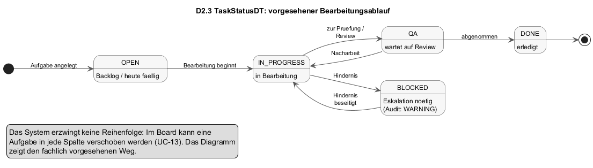
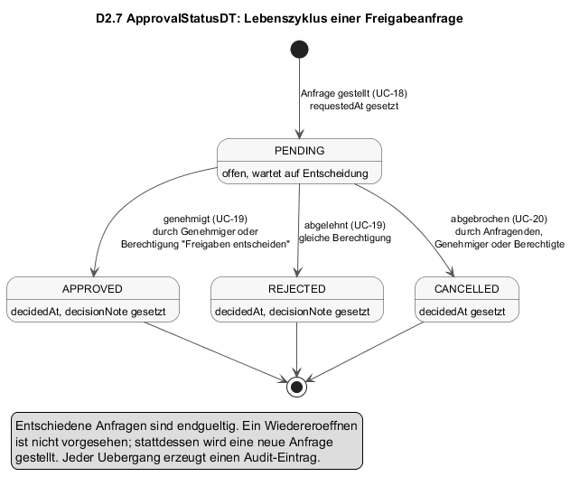

# D2 — Datentypenverzeichnis

Wertebereiche, Aufzählungen und Formate, die in [D1](D1-datenmodell.md) als Attributtypen verwendet werden. Aufzählungswerte behalten die Schreibweise des Datenmodells; daneben steht der Anzeigetext der Oberfläche. Wo der Server einen Wert nicht prüft, sondern als Text speichert, ist das vermerkt (siehe R-06 in [P1](P1-ziele-rahmenbedingungen.md)).

---

## D2.1 Typkatalog

| Typ | Art | Verwendet in | Abschnitt |
|-----|-----|--------------|-----------|
| Identifier | Format | alle Entitäten | D2.1 |
| PT, EUR, Stunden, Prozent, Farbe | Format | Project, Task, Berichtsbasis, TaskMarker | D2.1 |
| EncryptedSecretDT | Format | User | D2.1 |
| PriorityDT | Aufzählung | Task | D2.2 |
| TaskStatusDT | Aufzählung mit Zuständen | Task | D2.3 |
| UserRoleDT | Aufzählung | User | D2.4 |
| AccessRoleKindDT | Aufzählung | AccessRole | D2.5 |
| PermissionSetDT | Struktur | AccessRole | D2.6 |
| ApprovalStatusDT | Aufzählung mit Zuständen | ApprovalRequest | D2.7 |
| ApprovalEntityTypeDT | Aufzählung | ApprovalRequest | D2.8 |
| ApprovalLevelDT | Aufzählung (Text) | Task | D2.9 |
| SeverityDT | Aufzählung | AuditLog | D2.10 |
| AmpelDT | Aufzählung (Text) | ProjectStatusReport | D2.11 |
| MilestoneStatusDT, RiskClassDT, RiskTrendDT, ReportCycleDT | Aufzählung (Text) | Berichtsbasis | D2.12 |
| MatchFieldDT | Aufzählung | TaskMarker | D2.13 |
| AuthProviderDT, CalendarProviderDT | Aufzählung | User, CalendarSyncEvent | D2.14 |

**Formate**

- **Identifier**: technischer Schlüssel, vom System vergeben, 25 Zeichen, sortierbar nach Erzeugungszeitpunkt. Wird dem Anwender nie angezeigt; Anzeigeschlüssel sind `Project.key` und `AccessRole.code`.
- **PT**: Personentage, Dezimalzahl ≥ 0.
- **EUR**: Betrag in Euro, Dezimalzahl; die Oberfläche zeigt zwei Nachkommastellen.
- **Stunden**: Dezimalzahl ≥ 0 in Schritten von 0,25; die Oberfläche rechnet auf Tage zu 8 Stunden um.
- **Prozent**: Integer 0 bis 100.
- **Farbe**: `#rrggbb` in Hexadezimalschreibweise; ungültige Werte werden durch `#3b82f6` ersetzt.
- **EncryptedSecretDT**: Geheimnis in verschlüsselter Form `v1:<iv>:<tag>:<ciphertext>`, symmetrisch verschlüsselt mit einem Schlüssel, der aus dem Serverschlüssel abgeleitet wird. Der Klartext verlässt den Server nie ([N2](N2-querschnittskonzepte.md), Geheimnisse).

---

## D2.2 PriorityDT

Priorität einer Aufgabe. Vorgabe `MEDIUM`; unbekannte Werte werden auf `MEDIUM` gesetzt.

| Wert | Anzeige Kalender | Anzeige Board | Rang |
|------|------------------|---------------|------|
| `LOW` | Niedrig | Niedrig | 1 |
| `MEDIUM` | Normal | Mittel | 2 |
| `HIGH` | Hoch | Hoch | 3 |
| `URGENT` | Kritisch | — | 4 |

Board und Ticket-Editor bieten nur drei Stufen an (`hoch`, `mittel`, `niedrig`, in Kleinschreibung); `URGENT` ist nur über Kalender und Schnittstelle erreichbar. Farbstreifen mit `matchField = priority` vergleichen gegen die dreistufige Schreibweise (D2.13).

---

## D2.3 TaskStatusDT

Bearbeitungsstand einer Aufgabe. Vorgabe `OPEN`.

| Wert | Anzeige Kalender | Anzeige Board | Bedeutung |
|------|------------------|---------------|-----------|
| `OPEN` | Offen | Heute | Noch nicht begonnen. |
| `IN_PROGRESS` | In Bearbeitung | In Arbeit | Wird bearbeitet. |
| `QA` | QA | Review | Wartet auf Prüfung oder Abnahme. |
| `BLOCKED` | Blockiert | Blockiert | Kann nicht weiterbearbeitet werden; Eskalation nötig. |
| `DONE` | Erledigt | Erledigt | Abgeschlossen. |

Das Diagramm zeigt den fachlich vorgesehenen Weg. Das System erzwingt keine Reihenfolge: Im Board kann eine Aufgabe in jede Spalte gezogen werden (UC-13), auch von `DONE` zurück nach `OPEN`. Ein Wechsel nach `BLOCKED` wird im Audit-Log mit Kritikalität `WARNING` vermerkt, alle anderen Wechsel mit `INFO`.

**Übergangstabelle für ältere Bezeichner.** Die Schnittstelle nimmt neben den fünf Werten auch die Spaltennamen des Boards und ältere Statusbezeichner an und bildet sie ab. Unbekannte Werte werden `OPEN`.

| Eingang | Wird zu |
|---------|---------|
| `today`, `TODAY`, `LATER` | `OPEN` |
| `in-progress`, `THIS_WEEK` | `IN_PROGRESS` |
| `review` | `QA` |
| `blocked` | `BLOCKED` |
| `done` | `DONE` |

---

## D2.4 UserRoleDT

Grobe Rolle eines Anwenders. Sie wird bei jeder Rollenzuordnung (UC-22) aus der Rollenart der Zugriffsrolle abgeleitet und steuert die Sichtbarkeit von Aufgaben (AF-02): `ADMIN` und `PROJECT_MANAGER` sehen alle Aufgaben.

| Wert | Abgeleitet aus Rollenart | Bemerkung |
|------|--------------------------|-----------|
| `ADMIN` | `ADMIN` | |
| `PROJECT_MANAGER` | `GBL` | |
| `DEVELOPER` | `MEMBER` | Vorgabe bei Registrierung. |
| `QA`, `DESIGNER`, `MARKETING` | — | Nur über die Registrierungsschnittstelle setzbar; in der Oberfläche nicht auswählbar. Verhalten wie `DEVELOPER`. |

---

## D2.5 AccessRoleKindDT

Rollenart einer Zugriffsrolle. Legt fest, worüber sich der Sichtbereich definiert.

| Wert | Anzeige | Kurz | Sichtbereich | Bemerkung |
|------|---------|------|--------------|-----------|
| `ADMIN` | Admin | A | alles | „Rollen verwalten" ist immer gesetzt. |
| `GBL` | Geschäftsbereichsleiter | GBL | alle Abteilungen der Geschäftsbereiche in `businessAreas` | |
| `MEMBER` | Mitarbeiter | M | die Abteilungen in `departmentIds` | Vorgabe für neue Rollen. Die Eingabe `M` wird als `MEMBER` angenommen. |

---

## D2.6 PermissionSetDT

Sechs Berechtigungen einer Zugriffsrolle. Fehlende Einträge gelten als Vorgabe.

| Schlüssel | Anzeige | Vorgabe | Wirkung |
|-----------|---------|---------|---------|
| `viewDepartments` | Abteilungen sehen | ja | Abteilungssicht zugänglich. |
| `editProjects` | Projekte bearbeiten | nein | Projekte und Berichtsbasis pflegen. |
| `editTasks` | Aufgaben bearbeiten | ja | Aufgaben anlegen und ändern. |
| `approveRequests` | Freigaben entscheiden | nein | Freigaben genehmigen, ablehnen, abbrechen; Freigaben aller Anwender sehen. |
| `viewReports` | Reports sehen | nein | Berichtsmaske zugänglich. |
| `manageRoles` | Rollen verwalten | nein | Rollen und Benutzer pflegen, Audit-Log lesen. |

Der Server prüft `approveRequests` und `manageRoles` bei jeder Anfrage (AF-01). Die übrigen vier Berechtigungen werden derzeit nur von der Oberfläche ausgewertet; die Serverschnittstelle prüft sie nicht. Das ist in [N2](N2-querschnittskonzepte.md) als Einschränkung vermerkt.

Die fünf Systemrollen:

| Code | Name | Rollenart | Bereiche / Abteilungen | Berechtigungen |
|------|------|-----------|------------------------|----------------|
| `A` | Admin | `ADMIN` | alle | alle sechs |
| `GBL-OR` | GBL Organisation | `GBL` | `OR` | alle außer Rollen verwalten |
| `M-OR-IT` | Mitarbeiter OR-IT | `MEMBER` | `or-it` | Vorgabe |
| `M-OR-ID` | Mitarbeiter OR-ID | `MEMBER` | `or-id` | Vorgabe |
| `M-OR-OE` | Mitarbeiter OR-OE | `MEMBER` | `or-oe` | Vorgabe |

---

## D2.7 ApprovalStatusDT

Zustand einer Freigabeanfrage. Vorgabe `PENDING`.

| Wert | Anzeige | Bedeutung |
|------|---------|-----------|
| `PENDING` | Offen | Wartet auf Entscheidung. |
| `APPROVED` | Genehmigt | Endzustand. |
| `REJECTED` | Abgelehnt | Endzustand. |
| `CANCELLED` | Abgebrochen | Endzustand; vom Anfragenden oder Genehmiger zurückgezogen. |

Wer entscheiden darf, steht in AF-01 und AF-03: der eingetragene Genehmiger oder jeder mit der Berechtigung „Freigaben entscheiden". Abbrechen darf zusätzlich der Anfragende. Aus einem Endzustand gibt es keinen Übergang; eine Anfrage in einem Endzustand liefert bei jedem weiteren Entscheidungsversuch die Meldung „Diese Freigabe ist bereits entschieden".

---

## D2.8 ApprovalEntityTypeDT

Art des Bezugsobjekts einer Freigabe. Unbekannte Werte werden `OTHER`.

| Wert | Anzeige | Bezugsobjekt | Standard-Genehmiger (AF-03) |
|------|---------|--------------|-----------------------------|
| `TASK` | Aufgabe | eine Aufgabe | Eigentümer des Projekts der Aufgabe |
| `PROJECT` | Projekt | ein Projekt | Eigentümer des Projekts |
| `STATUS_REPORT` | Statusbericht | ein Statusbericht | Eigentümer des Projekts |
| `DOCUMENT` | Dokument | freier Text | keiner |
| `OTHER` | Sonstiges | freier Text | keiner |

Für `TASK`, `PROJECT` und `STATUS_REPORT` muss das Bezugsobjekt existieren; sonst wird die Anfrage abgewiesen.

---

## D2.9 ApprovalLevelDT

Erforderliche Freigabestufe einer Aufgabe, gesetzt im Ticket-Editor. Wird als Text gespeichert; der Server prüft die Werte nicht.

| Wert | Anzeige |
|------|---------|
| `none` (oder leer) | Keine Freigabe erforderlich |
| `department` | Freigabe durch Abteilungsleiter |
| `gbl` | Freigabe durch GBL |

Wird eine Stufe außer `none` gesetzt, erzeugt die Oberfläche eine Freigabeanfrage vom Typ `TASK` (UC-12, UC-18).

---

## D2.10 SeverityDT

Kritikalität eines Audit-Eintrags. Vorgabe `INFO`.

| Wert | Anzeige | Verwendung |
|------|---------|------------|
| `INFO` | Info | Erfolgreiche Anmeldung, Verschieben, Kommentar, Abbruch einer Freigabe. |
| `NOTICE` | Hinweis | Anlegen und Ändern fachlicher Objekte, Genehmigung, Start einer 2FA-Einrichtung. |
| `WARNING` | Prüfpflichtig | Fehlgeschlagene Anmeldung, Ablehnung, Löschen einer Aufgabe, Änderungen an Rollen, Benutzern, Passwort und zweitem Faktor, Wechsel nach `BLOCKED`. |
| `CRITICAL` | Kritisch | Löschen einer Rolle. |

Die Audit-Maske zählt `WARNING` und `CRITICAL` als „Prüffälle".

---

## D2.11 AmpelDT

Bewertung im Statusbericht für Zielerreichung, Termine, Ressourcen und Budget. Wird als Text gespeichert.

| Wert | Anzeige im Bericht | Bedeutung |
|------|--------------------|-----------|
| `Gruen` | Positiv | Im Plan. |
| `Gelb` | Beobachten | Abweichung, noch beherrschbar. |
| `Rot` | Kritisch | Abweichung, Gegenmaßnahmen nötig. |

---

## D2.12 Werte der Berichtsbasis

Werden als Text gespeichert; die Oberfläche gibt sie als Auswahllisten vor.

| Typ | Werte | Bemerkung |
|-----|-------|-----------|
| MilestoneStatusDT | `Offen`, `In Arbeit`, `Erreicht`, `Gefährdet`, `Verschoben` | Der Server setzt `OPEN` als Vorgabe, wenn kein Wert übergeben wird. |
| RiskClassDT | `A`, `B`, `C` | A ist die höchste Klasse. Im Risikograph aus Tragweite × Wahrscheinlichkeit abgeleitet (B3). |
| RiskTrendDT | `Steigend`, `Stabil`, `Fallend`, `Neu` | Entwicklung seit dem letzten Bericht. |
| ReportCycleDT | `MONTHLY` | Einziger definierter Wert; Vorgabe. |

---

## D2.13 MatchFieldDT

Merkmal, an dem ein Farbstreifen eine Aufgabe erkennt. Unbekannte Werte werden leer.

| Wert | Anzeige | Vergleich mit `matchValue` |
|------|---------|----------------------------|
| leer | Keine Zuordnung | nur manuell über `Task.markerId` |
| `priority` | Priorität | `hoch`, `mittel`, `niedrig` |
| `status` | Status | Spaltenname des Boards (`today`, `in-progress`, `review`, `blocked`, `done`) |
| `project` | Projekt | Projektname |
| `tag` | Tag | Schlagwort der Aufgabe |

Bei mehreren passenden Streifen gilt die Reihenfolge in den Einstellungen (`order`); ein manuell gesetzter `markerId` geht vor.

---

## D2.14 AuthProviderDT und CalendarProviderDT

**AuthProviderDT**: Wie sich ein Konto anmeldet.

| Wert | Bedeutung |
|------|-----------|
| `LOCAL` | E-Mail und Passwort (Vorgabe). |
| `SSO` | Nur über den Identity Provider; das Passwort ist ein Zufallswert. |
| `LOCAL_SSO` | Lokal angelegt, später mit einem SSO-Profil verknüpft; beide Wege möglich. |

**CalendarProviderDT**: Verbundener Kalenderdienst. Einziger Wert ist `GOOGLE`.

---

## D2.15 Querverweise

| Baustein | Bezug zu D2 |
|----------|-------------|
| [D1](D1-datenmodell.md) | Verwendung der Typen als Attribute. |
| [F2](F2-anwendungsfaelle.md) | UC-13 (Statuswechsel), UC-18 bis UC-20 (Freigabezustände), UC-24 (Farbstreifen). |
| [F3](F3-anwendungsfunktionen.md) | AF-01 (Berechtigungen aus PermissionSetDT), AF-04 (Statusnormalisierung), AF-10 (Farbstreifen). |
| [B1](B1-dialogspezifikation.md) | Anzeigetexte der Aufzählungen in den Masken. |
| [B3](B3-druckausgaben.md) | AmpelDT, RiskClassDT im Statusbericht. |
| [N2](N2-querschnittskonzepte.md) | SeverityDT im Audit-Logging; Einschränkung bei der serverseitigen Prüfung von Berechtigungen. |
