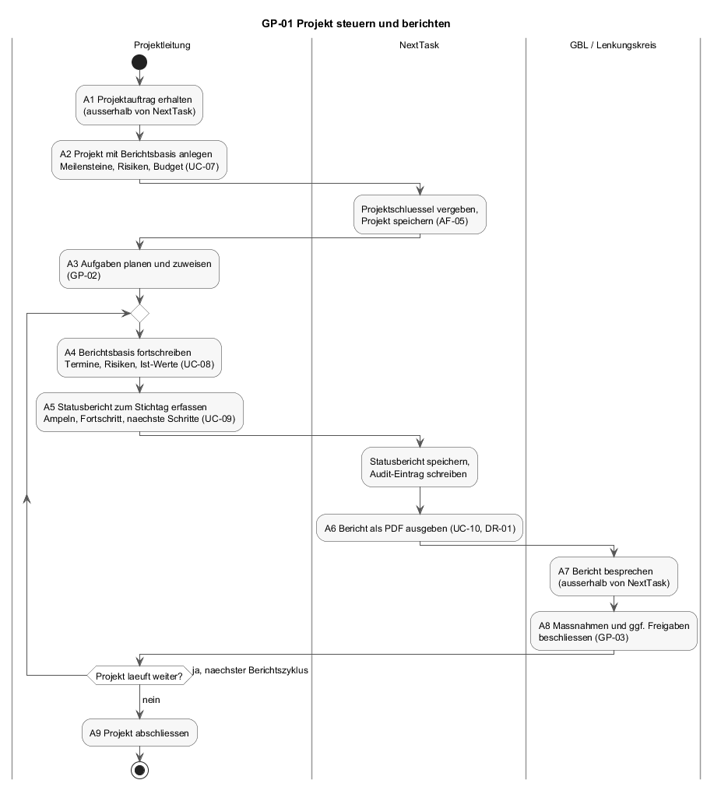
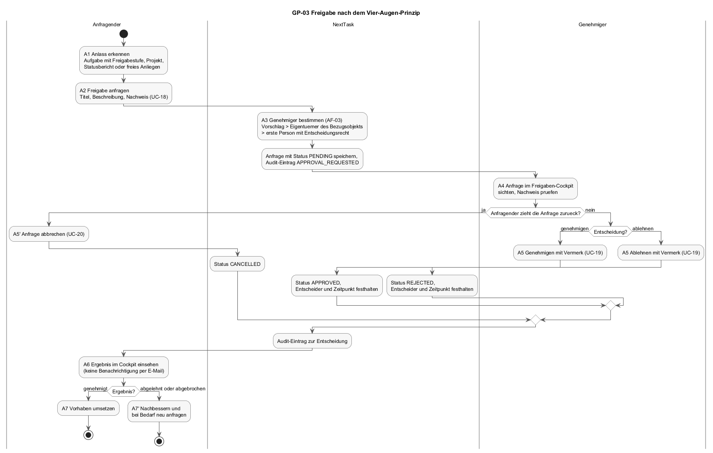

# F1 — Geschäftsprozesse

Fachliche Abläufe, an denen NextTask beteiligt ist, nach Siedersleben (Kapitel 4.3): Ein Geschäftsprozess ist eine zeitlich und logisch geordnete Folge von Tätigkeiten, beschrieben unabhängig von einem IT-System. Die Prozesse beginnen vor der ersten Eingabe in NextTask und enden nach der letzten Ausgabe. NextTask unterstützt einzelne Tätigkeiten; die Tätigkeiten, die mit Unterstützung von NextTask ablaufen, sind in [F2](F2-anwendungsfaelle.md) als Anwendungsfälle beschrieben, die dabei verwendeten Regeln in [F3](F3-anwendungsfunktionen.md).

NextTask unterstützt drei Prozesse. Sie hängen zusammen: GP-01 setzt Aufgaben auf, die in GP-02 bearbeitet werden; GP-02 und GP-01 lösen bei Bedarf GP-03 aus.

| ID | Prozess | Auslöser | Ergebnis |
|----|---------|----------|----------|
| GP-01 | Projekt steuern und berichten | Projektauftrag | Regelmäßige Statusberichte bis zum Projektabschluss |
| GP-02 | Aufgabe bearbeiten | Erkannter Arbeitsbedarf in einem Projekt | Erledigte, nachvollziehbar dokumentierte Aufgabe |
| GP-03 | Freigabe nach dem Vier-Augen-Prinzip | Vorhaben, das eine Entscheidung einer zweiten Person braucht | Dokumentierte Entscheidung |

---

## F1.1 GP-01 Projekt steuern und berichten

Eine Projektleitung führt ein Projekt des Geschäftsbereichs und berichtet in festem Zyklus an die Geschäftsbereichsleitung (GBL) oder einen Lenkungskreis. Der Bericht folgt dem Statusbericht-Format der Sparkasse: Ampeln für Ziel, Termine, Ressourcen und Budget, Meilensteine, Risiken, Budget, nächste Schritte.

### Akteure

| Akteur | Art | Rolle im Prozess |
|--------|-----|------------------|
| Projektleitung | Mensch | Legt das Projekt an, hält die Berichtsbasis aktuell, erfasst den Statusbericht. |
| GBL / Lenkungskreis | Mensch | Nimmt den Bericht entgegen, beschließt Maßnahmen und Freigaben. |
| Mitarbeitende | Mensch | Bearbeiten die Aufgaben des Projekts (GP-02); ihr Stand fließt in den Bericht ein. |
| NextTask | IT-System | Speichert Projekt, Berichtsbasis und Statusberichte; erzeugt das PDF; protokolliert Änderungen. |

### Tätigkeiten

| # | Tätigkeit | Unterstützung | Bemerkung |
|---|-----------|---------------|-----------|
| A1 | Projektauftrag erhalten | keine | Vor NextTask; Auftrag, Ziel und Budgetrahmen kommen aus der Linie. |
| A2 | Projekt mit Berichtsbasis anlegen | NextTask ([UC-07](F2-anwendungsfaelle.md#uc-07--projekt-anlegen)) | Name, Geschäftsbereich, Ziel, Zeitraum, Stellvertretung, Projektverantwortlicher, Planaufwand, Planbudget, Meilensteine, Risiken, Budgetpositionen. NextTask vergibt den Projektschlüssel ([AF-05](F3-anwendungsfunktionen.md#af-05--projektschlüssel-erzeugen)). |
| A3 | Aufgaben planen und zuweisen | NextTask (GP-02) | Jede Aufgabe gehört zu genau einem Projekt. |
| A4 | Berichtsbasis fortschreiben | NextTask ([UC-08](F2-anwendungsfaelle.md#uc-08--berichtsbasis-pflegen)) | Termine verschieben, Risiken bewerten, Ist-Werte eintragen. Laufend, mindestens vor jedem Stichtag. |
| A5 | Statusbericht zum Stichtag erfassen | NextTask ([UC-09](F2-anwendungsfaelle.md#uc-09--statusbericht-erfassen)) | Ampeln, Fortschritt in Prozent, Erläuterungen, nächste Schritte, Ist-Aufwand und Ist-Budget zum Stichtag. |
| A6 | Bericht als PDF ausgeben | NextTask ([UC-10](F2-anwendungsfaelle.md#uc-10--statusbericht-als-pdf-ausgeben), [DR-01](B3-druckausgaben.md)) | Drei Seiten im Format der Sparkasse. |
| A7 | Bericht besprechen | keine | Sitzung des Lenkungskreises; außerhalb von NextTask. |
| A8 | Maßnahmen und Freigaben beschließen | teilweise (GP-03) | Beschlüsse, die eine dokumentierte Entscheidung brauchen, laufen als Freigabe. |
| A9 | Projekt abschließen | keine | NextTask kennt keinen Projektstatus „abgeschlossen"; das Projekt bleibt mit seinen Berichten erhalten. |

A4 bis A8 wiederholen sich je Berichtszyklus (`Project.reportCycle`, Vorgabe monatlich).

### Dokumente und Datenbestände

| Dokument | Entsteht in | Gehalten in |
|----------|-------------|-------------|
| Berichtsbasis (Meilensteine, Risiken, Budgetpositionen, Schnittstellen, Freigabezeile) | A2, A4 | `Project` mit `ProjectMilestone`, `ProjectRisk`, `ProjectBudgetLine`, `ProjectInterface`, `ProjectApproval` ([D1.2](D1-datenmodell.md#d12-projekte-und-berichtswesen)) |
| Statusbericht zum Stichtag | A5 | `ProjectStatusReport` |
| Statusbericht als PDF | A6 | Datei beim Anwender; NextTask hält keine Kopie. |
| Sitzungsprotokoll des Lenkungskreises | A7 | außerhalb von NextTask |

### Abgrenzung

- Auftragserteilung, Budgetfreigabe durch die Linie und Projektabschluss laufen außerhalb von NextTask.
- NextTask versendet den Statusbericht nicht; die Verteilung übernimmt die Projektleitung.
- Die Berichtsbasis liegt auf dem Server; die Maske „Projekte" pflegt sie über die Projektschnittstelle (UC-07, UC-08), und das PDF wird aus den vom Server geladenen Daten erzeugt. Ein eigener Statusbericht je Stichtag (UC-09) ist nur über die Schnittstelle erreichbar; der Reiter Status schreibt in die Berichtsbasis.

---

## F1.2 GP-02 Aufgabe bearbeiten

Der tägliche Ablauf: Eine Aufgabe wird angelegt, zugewiesen, bearbeitet, geprüft und erledigt. Board, Kalender und Dashboard sind drei Sichten auf denselben Ablauf.

### Akteure

| Akteur | Art | Rolle im Prozess |
|--------|-----|------------------|
| Auftraggeber der Aufgabe | Mensch | Projektleitung oder Mitarbeiter, der den Bedarf erkennt und die Aufgabe anlegt. |
| Bearbeiter | Mensch | Zugewiesene Person; führt die Aufgabe aus, kommentiert, setzt den Status. |
| Prüfer | Mensch | Nimmt die Aufgabe in der Spalte Review ab; häufig der Auftraggeber. |
| NextTask | IT-System | Hält die Aufgabe, benachrichtigt, überträgt Fristen in den Kalender, protokolliert. |
| Google Calendar, SMTP-Mailserver | IT-System (Dritte) | Termin und Benachrichtigung; optional. |

### Tätigkeiten

| # | Tätigkeit | Unterstützung | Bemerkung |
|---|-----------|---------------|-----------|
| A1 | Arbeitsbedarf erkennen | keine | Aus Projektplanung (GP-01, A3), Besprechung oder laufender Arbeit. |
| A2 | Aufgabe anlegen | NextTask ([UC-11](F2-anwendungsfaelle.md#uc-11--aufgabe-anlegen)) | Titel, Projekt, Priorität, Frist, Aufwand, Bearbeiter, Abteilung, Freigabestufe. Status `OPEN`. |
| A3 | Bearbeiter informieren | NextTask ([AF-09](F3-anwendungsfunktionen.md#af-09--benachrichtigung-per-e-mail), [AF-08](F3-anwendungsfunktionen.md#af-08--kalenderabgleich)) | E-Mail „Neues Ticket für dich", Termin im Kalender des Bearbeiters. Beides nur, wenn konfiguriert und vom Bearbeiter gewünscht. |
| A4 | Aufgabe bearbeiten | NextTask ([UC-12](F2-anwendungsfaelle.md#uc-12--aufgabe-bearbeiten), [UC-13](F2-anwendungsfaelle.md#uc-13--aufgabe-verschieben-und-sortieren), [UC-15](F2-anwendungsfaelle.md#uc-15--aufgabe-kommentieren)) | Status `IN_PROGRESS`; Rückfragen als Kommentare mit Erwähnung; Frist bei Bedarf verschieben ([UC-14](F2-anwendungsfaelle.md#uc-14--aufgabe-terminieren)). Hindernisse: Status `BLOCKED`, Eskalation an die Projektleitung. |
| A5 | Freigabe einholen | NextTask (GP-03) | Nur wenn die Aufgabe eine Freigabestufe trägt. |
| A6 | Ergebnis prüfen | NextTask | Status `QA`; Prüfer nimmt ab oder gibt zur Nacharbeit zurück. |
| A7 | Aufgabe erledigen | NextTask | Status `DONE`. Die Aufgabe bleibt mit Kommentaren und Audit-Spur erhalten. |

Die Statusfolge und die erlaubten Übergänge stehen in [D2.3](D2-datentypen.md#d23-taskstatusdt); auf ein eigenes Aktivitätsdiagramm wird verzichtet, weil das Zustandsdiagramm dort den Ablauf vollständig zeigt.

### Dokumente und Datenbestände

| Dokument | Entsteht in | Gehalten in |
|----------|-------------|-------------|
| Aufgabe | A2, fortgeschrieben bis A7 | `Task` ([D1.3](D1-datenmodell.md#d13-aufgaben)) |
| Kommentare | A4, A6 | `Comment` |
| Benachrichtigung | A3, A4 | E-Mail beim Empfänger; NextTask hält keine Kopie. |
| Kalendertermin | A3, A4 | Google Calendar des Bearbeiters; Verknüpfung in `CalendarSyncEvent`. |

### Abgrenzung

- Die eigentliche Arbeit an der Aufgabe (Dokumente erstellen, Systeme ändern, Abstimmungen) findet außerhalb von NextTask statt.
- Zeiterfassung ist nicht Teil des Prozesses (NG-02).
- Anhänge an Aufgaben werden nicht gespeichert (NG-01).

---

## F1.3 GP-03 Freigabe nach dem Vier-Augen-Prinzip

Eine Entscheidung, die eine zweite Person treffen muss, wird als Freigabe angefragt, von einem Genehmiger entschieden und mit Vermerk festgehalten. Anlass kann eine Aufgabe mit Freigabestufe, ein Projekt, ein Statusbericht, ein Dokument oder ein freies Anliegen sein.

### Akteure

| Akteur | Art | Rolle im Prozess |
|--------|-----|------------------|
| Anfragender | Mensch | Stellt die Anfrage mit Begründung und Nachweis; kann sie zurückziehen. |
| Genehmiger | Mensch | Eigentümer des Bezugsobjekts oder eine Person mit der Berechtigung „Freigaben entscheiden" (Projektleitung, GBL, Administrator). |
| NextTask | IT-System | Bestimmt den Genehmiger, hält Anfrage und Entscheidung, protokolliert. |

### Tätigkeiten

| # | Tätigkeit | Unterstützung | Bemerkung |
|---|-----------|---------------|-----------|
| A1 | Anlass erkennen | teilweise | Bei Aufgaben mit Freigabestufe erzeugt NextTask die Anfrage beim Speichern ([UC-12](F2-anwendungsfaelle.md#uc-12--aufgabe-bearbeiten)). Sonst entscheidet der Anfragende. |
| A2 | Freigabe anfragen | NextTask ([UC-18](F2-anwendungsfaelle.md#uc-18--freigabe-anfragen)) | Bezugsobjekt, Titel, Beschreibung, Nachweis, optional gewünschter Genehmiger. |
| A3 | Genehmiger bestimmen | NextTask ([AF-03](F3-anwendungsfunktionen.md#af-03--genehmiger-bestimmen)) | Gewünschter Genehmiger, sonst Eigentümer des Bezugsobjekts, sonst die erste Person mit Entscheidungsrecht. Nie der Anfragende selbst. |
| A4 | Anfrage sichten und Nachweis prüfen | NextTask ([UC-19](F2-anwendungsfaelle.md#uc-19--freigabe-entscheiden)) | Im Freigaben-Cockpit. NextTask benachrichtigt den Genehmiger nicht; er muss das Cockpit aufrufen. |
| A5 | Entscheiden: genehmigen oder ablehnen | NextTask ([UC-19](F2-anwendungsfaelle.md#uc-19--freigabe-entscheiden)) | Mit Vermerk. Alternativ zieht der Anfragende die Anfrage zurück ([UC-20](F2-anwendungsfaelle.md#uc-20--freigabe-abbrechen)). |
| A6 | Ergebnis einsehen | NextTask | Der Anfragende sieht die Entscheidung im Cockpit; keine E-Mail. |
| A7 | Vorhaben umsetzen oder nachbessern | keine | Nach Ablehnung ist eine neue Anfrage nötig; eine entschiedene Anfrage wird nicht wieder geöffnet. |

### Dokumente und Datenbestände

| Dokument | Entsteht in | Gehalten in |
|----------|-------------|-------------|
| Freigabeanfrage mit Nachweis | A2 | `ApprovalRequest` ([D1.5](D1-datenmodell.md#d15-steuerung-und-nachweis)) |
| Entscheidung mit Vermerk, Entscheider, Zeitpunkt | A5 | dieselbe `ApprovalRequest` |
| Audit-Einträge zu Anfrage und Entscheidung | A2, A5 | `AuditLog` |
| Nachweisdokumente (Protokolle, Konzepte) | vor A2 | außerhalb von NextTask; nur als Text referenziert |

### Abgrenzung

- Das Vier-Augen-Prinzip wird dadurch gesichert, dass der Anfragende nie als Genehmiger eingetragen wird. Eine Person mit der Berechtigung „Freigaben entscheiden" kann jede offene Anfrage entscheiden, auch eine, die sie selbst gestellt hat; der Audit-Eintrag macht das sichtbar. Ein technisches Verbot gibt es nicht (siehe [N2](N2-querschnittskonzepte.md), Berechtigungen).
- Mehrstufige Freigaben (erst Abteilungsleitung, dann GBL) werden nicht abgebildet. Die Freigabestufe einer Aufgabe ([D2.9](D2-datentypen.md#d29-approvalleveldt)) ist ein Hinweis, wer entscheiden soll, keine Kette.

---

## F1.4 Querverweise

| Baustein | Bezug zu F1 |
|----------|-------------|
| [P1](P1-ziele-rahmenbedingungen.md) | G-01 (GP-02), G-03 (GP-03), G-04 (GP-01), G-05 (Audit-Einträge in allen drei Prozessen). |
| [F2](F2-anwendungsfaelle.md) | Jeder Anwendungsfall nennt in der Spalte „Prozess" die Tätigkeit, die er unterstützt. |
| [F3](F3-anwendungsfunktionen.md) | AF-03 in GP-03 A3, AF-05 in GP-01 A2, AF-08 und AF-09 in GP-02 A3. |
| [D2](D2-datentypen.md) | Zustände der Aufgabe (GP-02) und der Freigabe (GP-03). |
| [B3](B3-druckausgaben.md) | Statusbericht aus GP-01 A6. |
