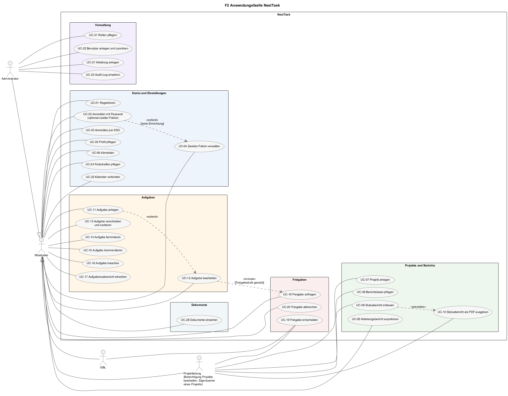
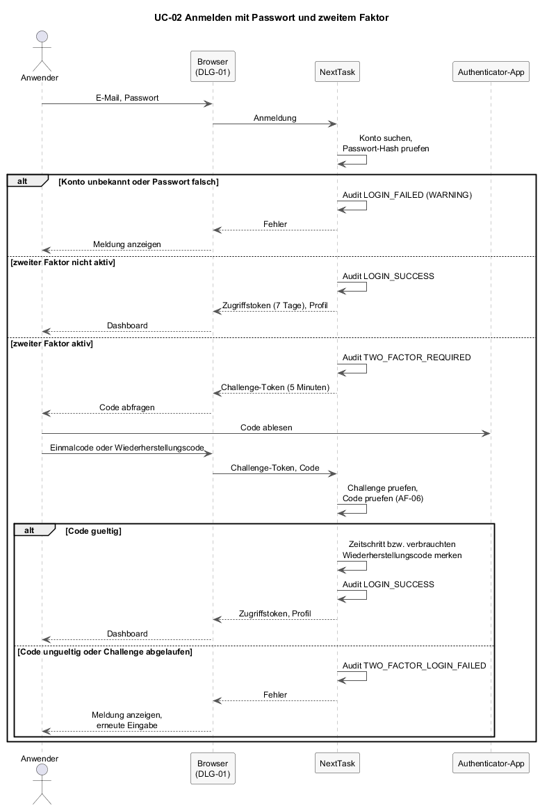
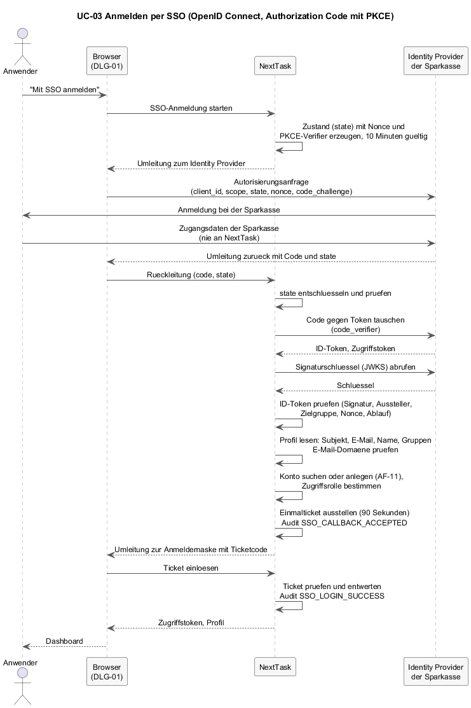
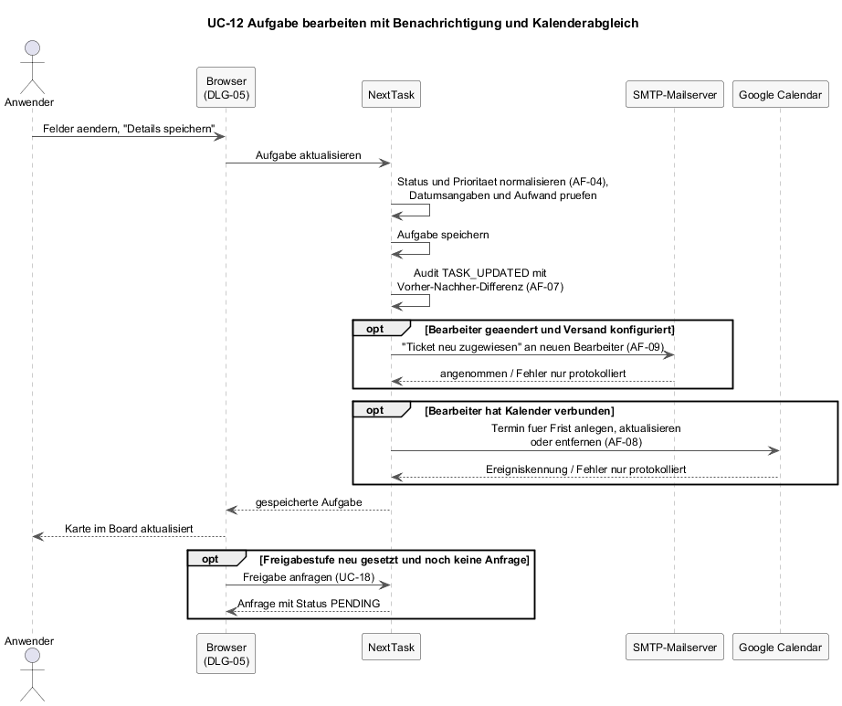
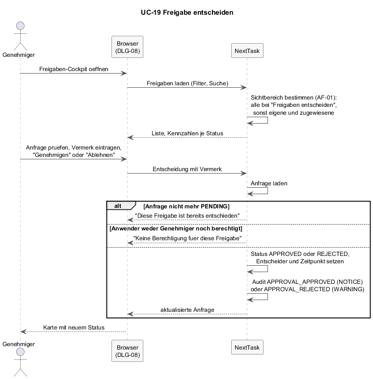

# F2 — Anwendungsfälle

Anwendungsfälle nach Siedersleben (Kapitel 4.4): Interaktionen zwischen einem Anwender und NextTask, die ein für den Anwender sinnvolles Ziel verfolgen und in einem stabilen Zustand enden. F2 ist der von NextTask unterstützte Teil der Geschäftsprozesse aus [F1](F1-geschaeftsprozesse.md). Systeminterne Schritte (Genehmiger bestimmen, Kalender abgleichen) sind keine Anwendungsfälle; sie stehen als Anwendungsfunktionen in [F3](F3-anwendungsfunktionen.md).

Jeder Anwendungsfall ist mit der tabellarischen Schablone nach Pohl und Rupp (2021) beschrieben. Die Zeilen *Priorität*, *Kritikalität* und *Quelle* entfallen, weil sie über die Anwendungsfälle hinweg keinen Unterschied machen würden. Die Zeile *Akzeptanzkriterien* ergänzt die Schablone: Sie nennt prüfbare Bedingungen, an denen sich die Umsetzung messen lässt, und ist die Grundlage für die Testfälle.

Die Spalte *Stand* im Index unterscheidet, ob ein Anwendungsfall vollständig bedienbar ist oder ob nur ein Teil umgesetzt ist (siehe R-01 in [P1](P1-ziele-rahmenbedingungen.md)).

---

## F2.1 Index

| ID | Anwendungsfall | Gruppe | Prozess (F1) | Stand |
|----|----------------|--------|--------------|-------|
| [UC-01](#uc-01--registrieren) | Registrieren | Konto | — | vollständig |
| [UC-02](#uc-02--anmelden-mit-passwort) | Anmelden mit Passwort | Konto | — | vollständig |
| [UC-03](#uc-03--anmelden-per-sso) | Anmelden per SSO | Konto | — | vollständig, Identity Provider muss konfiguriert sein |
| [UC-04](#uc-04--zweiten-faktor-verwalten) | Zweiten Faktor verwalten | Konto | — | vollständig |
| [UC-05](#uc-05--profil-pflegen) | Profil pflegen | Konto | — | vollständig |
| [UC-06](#uc-06--abmelden) | Abmelden | Konto | — | vollständig |
| [UC-07](#uc-07--projekt-anlegen) | Projekt anlegen | Projekte | GP-01 A2 | vollständig |
| [UC-08](#uc-08--berichtsbasis-pflegen) | Berichtsbasis pflegen | Projekte | GP-01 A4 | vollständig |
| [UC-09](#uc-09--statusbericht-erfassen) | Statusbericht erfassen | Projekte | GP-01 A5 | nur Server; die Maske schreibt die Bewertung in die Berichtsbasis |
| [UC-10](#uc-10--statusbericht-als-pdf-ausgeben) | Statusbericht als PDF ausgeben | Projekte | GP-01 A6 | vollständig |
| [UC-26](#uc-26--abteilungsbericht-exportieren) | Abteilungsbericht exportieren | Projekte | GP-01 A6 | vollständig |
| [UC-11](#uc-11--aufgabe-anlegen) | Aufgabe anlegen | Aufgaben | GP-02 A2 | vollständig |
| [UC-12](#uc-12--aufgabe-bearbeiten) | Aufgabe bearbeiten | Aufgaben | GP-02 A4 | vollständig |
| [UC-13](#uc-13--aufgabe-verschieben-und-sortieren) | Aufgabe verschieben und sortieren | Aufgaben | GP-02 A4 | Backlog vollständig; Statuswechsel per Ziehen im Board nur Server |
| [UC-14](#uc-14--aufgabe-terminieren) | Aufgabe terminieren | Aufgaben | GP-02 A4 | vollständig |
| [UC-15](#uc-15--aufgabe-kommentieren) | Aufgabe kommentieren | Aufgaben | GP-02 A4 | vollständig |
| [UC-16](#uc-16--aufgabe-löschen) | Aufgabe löschen | Aufgaben | — | nur Server; keine Schaltfläche in der Oberfläche |
| [UC-17](#uc-17--aufgabenübersicht-einsehen) | Aufgabenübersicht einsehen | Aufgaben | GP-02 | vollständig |
| [UC-18](#uc-18--freigabe-anfragen) | Freigabe anfragen | Freigaben | GP-03 A2 | vollständig aus dem Ticket-Editor |
| [UC-19](#uc-19--freigabe-entscheiden) | Freigabe entscheiden | Freigaben | GP-03 A5 | vollständig |
| [UC-20](#uc-20--freigabe-abbrechen) | Freigabe abbrechen | Freigaben | GP-03 A5' | nur Server; keine Schaltfläche in der Oberfläche |
| [UC-21](#uc-21--rollen-pflegen) | Rollen pflegen | Verwaltung | — | vollständig |
| [UC-22](#uc-22--benutzer-anlegen-und-zuordnen) | Benutzer anlegen und zuordnen | Verwaltung | — | vollständig |
| [UC-27](#uc-27--abteilung-anlegen) | Abteilung anlegen | Verwaltung | — | vollständig |
| [UC-23](#uc-23--audit-log-einsehen) | Audit-Log einsehen | Verwaltung | — | vollständig |
| [UC-24](#uc-24--farbstreifen-pflegen) | Farbstreifen pflegen | Konto | — | vollständig |
| [UC-25](#uc-25--kalender-verbinden) | Kalender verbinden | Konto | — | vollständig, Google-Zugang muss konfiguriert sein |
| [UC-28](#uc-28--dokumente-einsehen) | Dokumente einsehen | Dokumente | — | vollständig, nur lesend |

Das Diagramm ordnet die Anwendungsfälle nach Paketen. Die drei Akteure Projektleitung, GBL und Administrator sind Spezialisierungen von Mitarbeiter: Sie können alles, was ein Mitarbeiter kann, und zusätzlich die an ihnen gezeichneten Fälle. Projektleitung ist keine Rolle im System, sondern ein Anwender mit der Berechtigung „Projekte bearbeiten", der ein Projekt angelegt hat und damit sein Eigentümer ist. Der Abteilungsbericht (UC-26) und das Lesen der Dokumente (UC-28) stehen jedem Mitarbeiter offen; das Anlegen von Abteilungen (UC-27) dem Administrator. Die Beziehungen zwischen Anwendungsfällen:

- **UC-02 `<<extend>>` UC-04:** Bei der ersten Anmeldung eines Kontos ohne zweiten Faktor bleibt es beim Passwort; der zweite Faktor wird in den Einstellungen eingerichtet. Danach verlangt jede Anmeldung den Code.
- **UC-11 `<<extend>>` UC-12:** Nach dem Anlegen wird eine Aufgabe im selben Editor weiterbearbeitet.
- **UC-12 `<<include>>` UC-18:** Wird beim Bearbeiten eine Freigabestufe gesetzt, erzeugt die Oberfläche eine Freigabeanfrage.
- **UC-09 `<<precedes>>` UC-10:** Der Statusbericht muss erfasst sein, bevor er ausgegeben wird.

Alle Anwendungsfälle außer UC-01, UC-02 und UC-03 setzen eine angemeldete Sitzung voraus. Das steht nicht in jeder Vorbedingung, sondern gilt als Systemregel ([N2](N2-querschnittskonzepte.md), Authentifizierung).

---

## F2.2 Konto

### UC-01 — Registrieren

| Abschnitt | Inhalt |
|-----------|--------|
| **Kennung** | UC-01 |
| **Name** | Registrieren |
| **Beschreibung** | Ein neuer Anwender legt sich selbst ein Konto an und ist danach angemeldet. |
| **Auslöser** | Anwender ohne Konto öffnet die Registrierung. |
| **Akteure** | Anwender (primär). |
| **Vorbedingung** | Keine. Die E-Mail-Adresse ist noch nicht vergeben. |
| **Nachbedingung** | Konto existiert mit grober Rolle `DEVELOPER`, Abteilung `Development` und Zugriffsrolle Mitarbeiter OR-IT (`M-OR-IT`). Sitzung ist aktiv. Audit-Eintrag `USER_REGISTERED`. |
| **Hauptszenario** | 1. Anwender öffnet die Registrierung ([DLG-02](B1-dialogspezifikation.md#dlg-02--registrierung)). 2. Anwender gibt Name, E-Mail und Passwort ein. 3. System prüft, dass alle drei Felder gefüllt sind und die E-Mail nicht vergeben ist. 4. System legt das Konto an, speichert das Passwort als Hash, setzt die Benachrichtigungsadresse auf die E-Mail und ordnet die Standardrolle zu. 5. System stellt ein Zugriffstoken aus und zeigt das Dashboard. |
| **Ausnahmeszenarien** | *E-Mail bereits vergeben:* Meldung „E-Mail existiert bereits"; kein Konto. *Feld leer:* Meldung „Name, E-Mail und Passwort sind erforderlich". |
| **Akzeptanzkriterien** | A1. Zwei Registrierungen mit derselben E-Mail, auch in unterschiedlicher Groß-/Kleinschreibung, führen zu genau einem Konto. A2. Das neue Konto hat die Zugriffsrolle `M-OR-IT` und sieht im Kalender nur eigene und abteilungsbezogene Aufgaben (AF-02). A3. Im Audit-Log steht ein Eintrag `USER_REGISTERED` mit Name und E-Mail, ohne Passwort. |
| **Qualitäten** | Passwort-Hashing [NFR-15b-02](N1-nichtfunktional.md). Keine Mindestlänge und keine Bestätigung des Passworts bei der Registrierung; die Mindestlänge von acht Zeichen gilt erst beim Ändern (UC-05). Diese Lücke ist in N1 vermerkt. |

### UC-02 — Anmelden mit Passwort

| Abschnitt | Inhalt |
|-----------|--------|
| **Kennung** | UC-02 |
| **Name** | Anmelden mit Passwort |
| **Beschreibung** | Anwender meldet sich mit E-Mail und Passwort an. Ist der zweite Faktor aktiv, folgt die Abfrage eines Einmalcodes. |
| **Auslöser** | Anwender öffnet NextTask ohne aktive Sitzung. |
| **Akteure** | Anwender (primär); Authenticator-App (unterstützend, NB-03). |
| **Vorbedingung** | Konto existiert und ist lokal oder lokal mit SSO-Verknüpfung (`authProvider` `LOCAL` oder `LOCAL_SSO`). |
| **Nachbedingung** | Sitzung aktiv; Zugriffstoken sieben Tage gültig. Audit-Eintrag `LOGIN_SUCCESS`. |
| **Hauptszenario** | 1. System zeigt die Anmeldemaske ([DLG-01](B1-dialogspezifikation.md#dlg-01--anmeldung)). 2. Anwender gibt E-Mail und Passwort ein. 3. System prüft das Passwort gegen den Hash. 4. Ist kein zweiter Faktor aktiv, stellt das System das Zugriffstoken aus und zeigt das Dashboard. 5. Ist der zweite Faktor aktiv, stellt das System ein Challenge-Token aus (fünf Minuten gültig) und fragt den Code ab. 6. Anwender liest den Code aus der Authenticator-App ab und gibt ihn ein. 7. System prüft den Code ([AF-06](F3-anwendungsfunktionen.md#af-06--zweiten-faktor-prüfen)), merkt den verwendeten Zeitschritt, stellt das Zugriffstoken aus und zeigt das Dashboard.   |
| **Alternativszenarien** | *Wiederherstellungscode statt Einmalcode (Schritt 6):* System akzeptiert den Code, verbraucht ihn und protokolliert `TWO_FACTOR_RECOVERY_CODE_USED` mit `WARNING`. *Anwender wählt „Zurück" in der Code-Abfrage:* zurück zu Schritt 1; das Challenge-Token verfällt. |
| **Ausnahmeszenarien** | *E-Mail unbekannt:* „Benutzer nicht gefunden"; Audit `LOGIN_FAILED`. *Passwort falsch:* „Falsches Passwort"; Audit `LOGIN_FAILED`. *Code ungültig oder bereits verwendet:* „Der 2FA-Code ist ungueltig"; Audit `TWO_FACTOR_LOGIN_FAILED`; Anwender kann erneut eingeben. *Challenge-Token abgelaufen:* „2FA-Anmeldung ist abgelaufen. Bitte erneut einloggen."; zurück zu Schritt 1. |
| **Akzeptanzkriterien** | A1. Ohne zweiten Faktor führt ein korrektes Passwort direkt zum Dashboard. A2. Mit zweitem Faktor führt ein korrektes Passwort allein nicht zu einer Sitzung; erst der gültige Code. A3. Derselbe Einmalcode wird bei einem zweiten Anmeldeversuch innerhalb desselben Zeitschritts abgelehnt. A4. Ein Wiederherstellungscode funktioniert genau einmal. A5. Jeder fehlgeschlagene Versuch erzeugt einen Audit-Eintrag mit `WARNING`. |
| **Qualitäten** | [NFR-15a-01](N1-nichtfunktional.md) Zweiter Faktor, [NFR-15a-02](N1-nichtfunktional.md) Sitzungsdauer. Die Fehlermeldungen unterscheiden zwischen unbekannter E-Mail und falschem Passwort; es gibt keine Begrenzung der Versuche. Beides ist in N1 als Schwäche vermerkt. |

### UC-03 — Anmelden per SSO

| Abschnitt | Inhalt |
|-----------|--------|
| **Kennung** | UC-03 |
| **Name** | Anmelden per SSO |
| **Beschreibung** | Anwender meldet sich über den Identity Provider der Sparkasse an. NextTask erhält nur die bestätigte Identität, nie das Passwort. Beim ersten Mal wird das Konto angelegt oder mit einem vorhandenen verknüpft. |
| **Auslöser** | Anwender wählt „Mit SSO anmelden" auf der Anmeldemaske. |
| **Akteure** | Anwender (primär); Identity Provider (unterstützend, NB-02). |
| **Vorbedingung** | SSO ist konfiguriert (S3); die Rückleitungsadresse von NextTask ist beim Identity Provider registriert. |
| **Nachbedingung** | Sitzung aktiv. Konto ist mit dem SSO-Subjekt verknüpft; `ssoLastLoginAt` gesetzt. Audit-Einträge `SSO_CALLBACK_ACCEPTED` und `SSO_LOGIN_SUCCESS`. |
| **Hauptszenario** | 1. Anwender wählt „Mit SSO anmelden". 2. System erzeugt einen verschlüsselten Zustand mit Nonce und PKCE-Verifier (zehn Minuten gültig) und leitet den Browser zum Identity Provider. 3. Anwender meldet sich beim Identity Provider an. 4. Identity Provider leitet mit Autorisierungscode zurück zu NextTask. 5. System prüft den Zustand, tauscht den Code gegen ID-Token und prüft Signatur, Aussteller, Zielgruppe, Nonce und Ablauf. 6. System liest das Profil und gleicht das Konto ab ([AF-11](F3-anwendungsfunktionen.md#af-11--sso-konto-abgleichen)). 7. System stellt ein Einmalticket aus (90 Sekunden) und leitet den Browser mit dem Ticketcode zur Anmeldemaske. 8. Browser löst das Ticket ein; System entwertet es, stellt das Zugriffstoken aus und zeigt das Dashboard.   |
| **Alternativszenarien** | *Anwender hat bereits ein lokales Konto mit derselben E-Mail:* Es wird verknüpft (`LOCAL_SSO`); beide Anmeldewege bleiben möglich. *Anwender ist Mitglied einer konfigurierten Administratorgruppe:* neues Konto erhält die Rolle Admin. |
| **Ausnahmeszenarien** | *SSO nicht konfiguriert:* Schaltfläche wird nicht angezeigt; direkter Aufruf liefert „SSO-Anmeldung ist nicht verfuegbar". *Anwender bricht beim Identity Provider ab:* Rückleitung mit Fehlermeldung des Providers; keine Sitzung. *Zustand abgelaufen oder manipuliert, Token ungültig, E-Mail-Domäne nicht erlaubt, E-Mail bereits mit anderem SSO-Profil verknüpft, Konto darf nicht automatisch angelegt werden:* Anmeldemaske zeigt die jeweilige Meldung; Audit `SSO_LOGIN_FAILED` mit Grund. *Ticket abgelaufen oder bereits eingelöst:* „SSO-Anmeldung konnte nicht abgeschlossen werden"; Anwender startet erneut. |
| **Akzeptanzkriterien** | A1. Nach erfolgreicher SSO-Anmeldung existiert genau ein Konto mit dem SSO-Subjekt; eine zweite Anmeldung legt kein weiteres an. A2. Das Passwort der Sparkasse taucht in keiner Anfrage an NextTask und in keinem Datensatz auf. A3. Ein Ticketcode, der zweimal eingelöst wird, führt beim zweiten Mal zu einer Fehlermeldung. A4. Eine E-Mail außerhalb der erlaubten Domänen wird abgewiesen und protokolliert. |
| **Qualitäten** | [NFR-15a-03](N1-nichtfunktional.md) SSO ohne Passwortübertragung, [NFR-17b-01](N1-nichtfunktional.md) Standards. Vertrag in [S1](S1-nachbarsysteme.md), NB-02. |

### UC-04 — Zweiten Faktor verwalten

| Abschnitt | Inhalt |
|-----------|--------|
| **Kennung** | UC-04 |
| **Name** | Zweiten Faktor verwalten |
| **Beschreibung** | Anwender richtet für sein Konto einen zweiten Faktor (TOTP) ein oder schaltet ihn ab. |
| **Auslöser** | Anwender öffnet den Abschnitt Sicherheit in den Einstellungen. |
| **Akteure** | Anwender (primär); Authenticator-App (unterstützend). |
| **Vorbedingung** | Sitzung aktiv. Einrichten: zweiter Faktor nicht aktiv. Abschalten: zweiter Faktor aktiv. |
| **Nachbedingung** | Einrichten: `twoFactorEnabled` gesetzt, Geheimnis verschlüsselt gespeichert, zehn Wiederherstellungscodes ausgegeben; Audit `TWO_FACTOR_ENABLED`. Abschalten: Geheimnis und Codes gelöscht; Audit `TWO_FACTOR_DISABLED`. |
| **Hauptszenario (Einrichten)** | 1. Anwender wählt „2FA einrichten" ([DLG-12](B1-dialogspezifikation.md#dlg-12--einstellungen)). 2. System erzeugt ein Geheimnis und zeigt QR-Code und Text; Audit `TWO_FACTOR_SETUP_STARTED`. 3. Anwender scannt den Code mit der Authenticator-App und gibt den ersten Einmalcode ein. 4. System prüft den Code, aktiviert den zweiten Faktor und zeigt die zehn Wiederherstellungscodes einmalig an. 5. Anwender speichert die Codes außerhalb von NextTask. |
| **Hauptszenario (Abschalten)** | 1. Anwender wählt „2FA deaktivieren". 2. Anwender gibt aktuelles Passwort und einen gültigen Code (Einmalcode oder Wiederherstellungscode) ein. 3. System prüft beides und löscht Geheimnis und Codes. |
| **Ausnahmeszenarien** | *Bestätigungscode falsch (Einrichten, Schritt 4):* „Der 2FA-Code ist ungueltig"; das Geheimnis bleibt vorläufig; Audit `TWO_FACTOR_SETUP_FAILED`. *Anwender bricht vor Schritt 4 ab:* zweiter Faktor bleibt inaktiv; der nächste Versuch erzeugt ein neues Geheimnis. *Passwort oder Code falsch (Abschalten):* Meldung; zweiter Faktor bleibt aktiv; Audit `TWO_FACTOR_DISABLE_FAILED`. |
| **Akzeptanzkriterien** | A1. Nach der Einrichtung verlangt UC-02 den Code. A2. Die Wiederherstellungscodes werden genau einmal angezeigt und sind danach nicht mehr abrufbar. A3. Das Geheimnis liegt in der Datenbank nur verschlüsselt vor (Präfix `v1:`). A4. Abschalten ohne gültigen Code ist nicht möglich, auch nicht mit korrektem Passwort. |
| **Qualitäten** | [NFR-15a-01](N1-nichtfunktional.md), [NFR-15b-01](N1-nichtfunktional.md). Kein Zurücksetzen durch Administratoren (R-03). |

### UC-05 — Profil pflegen

| Abschnitt | Inhalt |
|-----------|--------|
| **Kennung** | UC-05 |
| **Name** | Profil pflegen |
| **Beschreibung** | Anwender ändert Name, E-Mail, Abteilung, Benachrichtigungseinstellungen und Passwort. |
| **Auslöser** | Anwender öffnet die Einstellungen. |
| **Akteure** | Anwender (primär); SMTP-Mailserver (unterstützend, nur Testmail). |
| **Vorbedingung** | Sitzung aktiv. |
| **Nachbedingung** | Profil gespeichert; bei geänderten Stammdaten wird ein neues Zugriffstoken ausgestellt. Audit `PROFILE_UPDATED` bzw. `PASSWORD_CHANGED`. |
| **Hauptszenario** | 1. Anwender öffnet den Abschnitt Profil ([DLG-12](B1-dialogspezifikation.md#dlg-12--einstellungen)). 2. Anwender ändert Name, E-Mail, Abteilung, Benachrichtigungsadresse oder den Schalter „Benachrichtigungen aktivieren" und speichert. 3. System prüft Pflichtfelder und Eindeutigkeit der E-Mail, speichert und stellt ein neues Zugriffstoken aus. |
| **Alternativszenarien** | *Passwort ändern:* Anwender gibt aktuelles und neues Passwort ein; System prüft das aktuelle Passwort und die Mindestlänge von acht Zeichen, speichert den neuen Hash. *Testmail:* Anwender löst eine Testmail aus; System sendet sie an die Benachrichtigungsadresse ([AF-09](F3-anwendungsfunktionen.md#af-09--benachrichtigung-per-e-mail)). |
| **Ausnahmeszenarien** | *Name oder Abteilung leer:* „Name und Abteilung sind erforderlich". *E-Mail bereits vergeben:* „Diese E-Mail wird bereits verwendet". *Benachrichtigungen aktiviert ohne Adresse:* „Bitte hinterlege eine E-Mail für Benachrichtigungen." *Aktuelles Passwort falsch:* „Das aktuelle Passwort ist nicht korrekt". *Testmail bei ausgeschaltetem Versand:* „Der E-Mail-Versand ist auf dem Server noch nicht aktiviert." |
| **Akzeptanzkriterien** | A1. Die grobe Rolle lässt sich über das Profil nicht ändern. A2. Ein neues Passwort mit sieben Zeichen wird abgelehnt. A3. Nach dem Ändern der E-Mail ist die Anmeldung nur noch mit der neuen möglich. A4. Der Audit-Eintrag `PROFILE_UPDATED` enthält nur die geänderten Felder mit altem und neuem Wert. |
| **Qualitäten** | [NFR-15b-02](N1-nichtfunktional.md), [NFR-15d-01](N1-nichtfunktional.md). |

### UC-06 — Abmelden

| Abschnitt | Inhalt |
|-----------|--------|
| **Kennung / Name** | UC-06 Abmelden |
| **Beschreibung** | Anwender beendet die Sitzung über „Abmelden" im Profilmenü. Der Browser löscht Zugriffstoken und Profil und zeigt die Anmeldemaske ([DLG-01](B1-dialogspezifikation.md#dlg-01--anmeldung)). |
| **Vor- / Nachbedingung** | Sitzung aktiv → keine Sitzung im Browser. Kein Audit-Eintrag. |
| **Akzeptanzkriterium** | Nach dem Abmelden führt jeder Aufruf einer geschützten Maske zur Anmeldemaske. |
| **Qualitäten** | Das Token wird serverseitig nicht widerrufen und bleibt bis zum Ablauf technisch gültig (R-02, [NFR-15a-02](N1-nichtfunktional.md)). |

---

## F2.3 Projekte und Berichte

Die Berichtsbasis liegt seit dem Stand vom 23. September vollständig auf dem Server: Die Maske „Projekte" ([DLG-04](B1-dialogspezifikation.md#dlg-04--projekte-und-backlog)) legt Projekte über die Schnittstelle an und speichert alle Reiter des Projektdialogs mit einem Aufruf. Der Reiter „Status" schreibt die Bewertung dabei in die Berichtsbasis des Projekts; eigene Statusberichte je Stichtag (UC-09) erzeugt die Maske noch nicht.

### UC-07 — Projekt anlegen

| Abschnitt | Inhalt |
|-----------|--------|
| **Kennung** | UC-07 |
| **Name** | Projekt anlegen |
| **Beschreibung** | Ein Anwender mit der Berechtigung „Projekte bearbeiten" legt in einer Abteilung seines Sichtbereichs ein Projekt mit Stammdaten und Berichtsbasis an und wird sein Eigentümer. |
| **Auslöser** | Projektauftrag liegt vor (GP-01 A2). |
| **Akteure** | Projektleitung (primär). |
| **Vorbedingung** | Berechtigung „Projekte bearbeiten" (AF-01); die gewählte Abteilung liegt im Sichtbereich (AF-02). |
| **Nachbedingung** | `Project` mit eindeutigem Schlüssel, Eigentümer und Abteilung; Meilensteine, Risiken, Budgetpositionen, Schnittstellen und Freigabezeile angelegt, sofern übergeben. Audit `PROJECT_CREATED`. |
| **Hauptszenario** | 1. Anwender öffnet „Neues Projekt" in [DLG-04](B1-dialogspezifikation.md#dlg-04--projekte-und-backlog) oder [DLG-05](B1-dialogspezifikation.md#dlg-05--meine-aufgaben) und füllt die Reiter Projektbasis, Status, Meilensteine, Risiken, Budget, Schnittstellen & Freigabe. 2. Anwender speichert. 3. System prüft Berechtigung und Sichtbereich der Abteilung, verlangt einen Namen, erzeugt den Schlüssel ([AF-05](F3-anwendungsfunktionen.md#af-05--projektschlüssel-erzeugen)), übernimmt Fälligkeit aus dem geplanten Ende, legt Zeilen der Berichtsbasis an, deren Titel gefüllt ist, und setzt den Berichtszyklus auf monatlich, wenn keiner angegeben ist. 4. Die Maske zeigt das neue Projekt in seiner Abteilung. |
| **Ausnahmeszenarien** | *Name leer:* „Projektname ist erforderlich". *Keine Berechtigung:* „Keine Berechtigung zum Erstellen von Projekten". *Abteilung außerhalb des Sichtbereichs:* „Keine Berechtigung für diese Abteilung". *Server lehnt ab oder ist nicht erreichbar:* Die Maske zeigt keine Meldung; das Projekt wird nicht angelegt (R-01). |
| **Akzeptanzkriterien** | A1. Ein Projekt ohne angegebenen Schlüssel erhält einen Schlüssel nach AF-05. A2. Berichtsbasis-Zeilen ohne Titel werden nicht angelegt. A3. Ein Mitarbeiter mit Sichtbereich OR-ID kann kein Projekt in OR-IT anlegen. A4. Das Projekt ist nach dem Neuladen der Maske weiterhin vorhanden; es liegt auf dem Server. |
| **Qualitäten** | [NFR-15d-01](N1-nichtfunktional.md). |

### UC-08 — Berichtsbasis pflegen

| Abschnitt | Inhalt |
|-----------|--------|
| **Kennung** | UC-08 |
| **Name** | Berichtsbasis pflegen |
| **Beschreibung** | Ein Anwender mit „Projekte bearbeiten" aktualisiert Stammdaten, Berichtskopf, Meilensteine, Risiken, Budgetpositionen, Schnittstellen und Freigabezeile eines Projekts in seinem Sichtbereich. |
| **Auslöser** | Vor einem Berichtsstichtag oder bei Änderungen im Projekt (GP-01 A4). |
| **Akteure** | Projektleitung (primär). |
| **Vorbedingung** | Berechtigung „Projekte bearbeiten"; Projekt im Sichtbereich. |
| **Nachbedingung** | Berichtsbasis ersetzt; Audit `PROJECT_REPORTING_UPDATED` mit Differenz der Kopfdaten. |
| **Hauptszenario** | 1. Anwender öffnet „Projekt bearbeiten" in [DLG-04](B1-dialogspezifikation.md#dlg-04--projekte-und-backlog) und ändert die Reiter. 2. Anwender speichert. 3. System prüft Berechtigung und Sichtbereich (auch für eine neu gewählte Abteilung), ersetzt die Listen Meilensteine, Risiken, Budgetpositionen und Schnittstellen vollständig durch die übergebenen Zeilen (Listen, die nicht übergeben werden, bleiben unverändert), aktualisiert die Freigabezeile und speichert die Kopfdaten in einer Transaktion. |
| **Ausnahmeszenarien** | *Projekt außerhalb des Sichtbereichs oder nicht vorhanden:* „Projekt wurde nicht gefunden". *Keine Berechtigung:* „Keine Berechtigung zum Bearbeiten von Projekten". *Neue Abteilung außerhalb des Sichtbereichs:* „Keine Berechtigung für diese Abteilung". |
| **Akzeptanzkriterien** | A1. Nach dem Speichern enthält das Projekt genau die übergebenen Meilensteine in der übergebenen Reihenfolge. A2. Ein Anwender ohne „Projekte bearbeiten" kann die Berichtsbasis nicht ändern, auch nicht als Eigentümer. A3. Eine GBL-Rolle für den Bereich OR kann Projekte aller drei OR-Abteilungen bearbeiten, ein Mitarbeiter OR-IT nur die seiner Abteilung. |
| **Qualitäten** | [NFR-15d-01](N1-nichtfunktional.md). Statuswerte werden nicht geprüft (R-06). |

### UC-09 — Statusbericht erfassen

| Abschnitt | Inhalt |
|-----------|--------|
| **Kennung** | UC-09 |
| **Name** | Statusbericht erfassen |
| **Beschreibung** | Ein Anwender mit „Reports sehen" hält die Bewertung eines Projekts zum Stichtag als eigenen Datensatz fest: Ampeln, Fortschritt, Erläuterungen, nächste Schritte, Ist-Werte. |
| **Auslöser** | Berichtsstichtag (GP-01 A5). |
| **Akteure** | Projektleitung (primär). |
| **Vorbedingung** | Berechtigung „Reports sehen"; Projekt im Sichtbereich. |
| **Nachbedingung** | Neuer `ProjectStatusReport` mit Autor; Audit `PROJECT_STATUS_REPORT_CREATED`. Frühere Berichte bleiben erhalten. |
| **Hauptszenario** | 1. Anwender übergibt Stichtag (Vorgabe: jetzt), Fortschritt in Prozent, Ampeln für Ziel, Termine, Ressourcen, Budget, Erläuterungen, nächste Schritte, Ist-Aufwand, Ist-Budget, Berichtsversion. 2. System legt den Bericht mit dem Anwender als Autor an. |
| **Alternativszenarien** | *Bewertung im Projektdialog, Reiter Status:* Die Maske schreibt Fortschritt, Ampeln und Notizen in die Berichtsbasis des Projekts (UC-08) statt einen eigenen Stichtagsdatensatz anzulegen; der Statusbericht (UC-10) liest diese Werte. Der Aufruf dieses Anwendungsfalls aus der Oberfläche ist offen. |
| **Ausnahmeszenarien** | *Projekt außerhalb des Sichtbereichs:* „Projekt wurde nicht gefunden". *Keine Berechtigung:* „Keine Berechtigung für Statusberichte". |
| **Akzeptanzkriterien** | A1. Jeder gespeicherte Bericht ist ein eigener Datensatz; zwei Berichte am selben Tag sind möglich. A2. Der Bericht trägt den Anwender als Autor. |
| **Qualitäten** | [NFR-15d-01](N1-nichtfunktional.md). |

### UC-10 — Statusbericht als PDF ausgeben

| Abschnitt | Inhalt |
|-----------|--------|
| **Kennung** | UC-10 |
| **Name** | Statusbericht als PDF ausgeben |
| **Beschreibung** | Anwender erzeugt aus einem Projekt den dreiseitigen Statusbericht im Format der Sparkasse und lädt ihn als PDF herunter. |
| **Auslöser** | Bericht soll verteilt oder besprochen werden (GP-01 A6). |
| **Akteure** | Projektleitung (primär). |
| **Vorbedingung** | Projekt mit Berichtsbasis im Sichtbereich des Anwenders. |
| **Nachbedingung** | PDF-Datei `statusbericht-<projekt>.pdf` im Download-Ordner des Anwenders. Kein Datensatz, kein Audit-Eintrag. |
| **Hauptszenario** | 1. Anwender wählt in „Reports" ([DLG-07](B1-dialogspezifikation.md#dlg-07--reports)) das Projekt und „Statusbericht erstellen". 2. System zeigt die Vorschau aus Projekt und Berichtsbasis vom Server ([DR-01](B3-druckausgaben.md#dr-01--projektstatusbericht)). 3. Anwender wählt „PDF herunterladen". 4. System rendert drei Seiten im Browser und startet den Download. |
| **Ausnahmeszenarien** | *Kein Projekt im Sichtbereich:* „Kein Projekt fuer einen Statusbericht verfuegbar." |
| **Akzeptanzkriterien** | A1. Das PDF hat drei Seiten mit Seitenzähler „Seite x von 3". A2. Ampelwerte, Meilensteine, Risiken und Budget im PDF stimmen mit der Berichtsbasis des Projekts auf dem Server überein. A3. Die Erzeugung selbst braucht keine Verbindung zum Server; nur das Laden der Daten. |
| **Qualitäten** | Layout in [B3](B3-druckausgaben.md). |

### UC-26 — Abteilungsbericht exportieren

| Abschnitt | Inhalt |
|-----------|--------|
| **Kennung** | UC-26 |
| **Name** | Abteilungsbericht exportieren |
| **Beschreibung** | Anwender exportiert Kennzahlen, Team-Auslastung, Projekte und Aufgaben einer Abteilung als PDF oder als CSV-Datei. |
| **Auslöser** | Bericht für die Abteilungsleitung oder den Lenkungskreis (GP-01 A6). |
| **Akteure** | Projektleitung, GBL (primär). |
| **Vorbedingung** | Mindestens ein Projekt im gewählten Filter. |
| **Nachbedingung** | Datei `abteilungsbericht-<abteilung>.pdf` oder `.csv` im Download-Ordner. Kein Datensatz, kein Audit-Eintrag. |
| **Hauptszenario** | 1. Anwender wählt in [DLG-07](B1-dialogspezifikation.md#dlg-07--reports), Reiter Abteilungsbericht, Zeitraum, Abteilung, Projektfilter und Exportformat. 2. Anwender wählt „Als PDF/Excel exportieren". 3. System erzeugt die Datei im Browser aus den geladenen Daten ([DR-02](B3-druckausgaben.md#dr-02--abteilungsbericht)) und startet den Download. |
| **Ausnahmeszenarien** | *Keine Projekte im Filter:* Schaltfläche gesperrt. |
| **Akzeptanzkriterien** | A1. Die CSV-Datei enthält je Aufgabe der gefilterten Projekte eine Zeile mit Abteilung, Projekt, Aufgabe, Status, Priorität, Zuständigkeit und Fälligkeit und lässt sich in Excel öffnen. A2. Das PDF trägt Kopfzeile, Seitenzahl und dieselben Kennzahlen wie die Maske. |
| **Qualitäten** | Layout in [B3](B3-druckausgaben.md). Das Format „Excel" ist eine CSV-Datei, keine Arbeitsmappe (DR-02). |

---

## F2.4 Aufgaben

Alle Anwendungsfälle dieser Gruppe verlangen die Berechtigung „Aufgaben bearbeiten" (AF-01), außer dem Einsehen (UC-17). Der Server bearbeitet nur Aufgaben, deren Projekt im Sichtbereich des Anwenders liegt (AF-02); eine Aufgabe außerhalb wird mit „Aufgabe wurde nicht gefunden" beantwortet, als gäbe es sie nicht.

### UC-11 — Aufgabe anlegen

| Abschnitt | Inhalt |
|-----------|--------|
| **Kennung** | UC-11 |
| **Name** | Aufgabe anlegen |
| **Beschreibung** | Anwender legt in einem Projekt eine neue Aufgabe an, optional mit Bearbeiter, Frist, Aufwand, Freigabestufe und den Detailangaben des Ticket-Editors. |
| **Auslöser** | Arbeitsbedarf erkannt (GP-02 A2). |
| **Akteure** | Anwender (primär); SMTP-Mailserver, Google Calendar (unterstützend). |
| **Vorbedingung** | Berechtigung „Aufgaben bearbeiten"; Projekt im Sichtbereich. |
| **Nachbedingung** | `Task` mit Status nach AF-04 am Ende seiner Spalte, mit Tags, Personen, Anhängen, Compliance und Audit-Spur, sofern übergeben; Audit `TASK_CREATED`; Bearbeiter benachrichtigt und Termin angelegt, sofern zutreffend. |
| **Hauptszenario** | 1. Anwender wählt „Neue Aufgabe" im Board ([DLG-05](B1-dialogspezifikation.md#dlg-05--meine-aufgaben)) oder im Kalender ([DLG-06](B1-dialogspezifikation.md#dlg-06--kalender)). 2. Anwender gibt Titel und Projekt an; optional Beschreibung, Status, Priorität, Bearbeiter, Beginn, Frist, Ende, Aufwand, Freigabestufe und im Board die weiteren Reiter. 3. System prüft Berechtigung und Sichtbereich, normalisiert die Eingaben ([AF-04](F3-anwendungsfunktionen.md#af-04--status-priorität-und-eingaben-normalisieren)), setzt die Position ans Ende der Spalte, speichert Aufgabe und Detailentitäten. 4. System benachrichtigt den Bearbeiter ([AF-09](F3-anwendungsfunktionen.md#af-09--benachrichtigung-per-e-mail)) und gleicht den Kalender ab ([AF-08](F3-anwendungsfunktionen.md#af-08--kalenderabgleich)). 5. Die Maske zeigt die Aufgabe erst nach der Bestätigung des Servers. |
| **Alternativszenarien** | *Anlegen im Kalender:* Das Projekt wird über den Projektnamen einer bereits geladenen Aufgabe bestimmt; gibt es im Sichtbereich noch keine Aufgabe dieses Projekts, wird nichts angelegt. |
| **Ausnahmeszenarien** | *Titel leer:* Die Oberfläche lässt das Anlegen nicht zu. *Keine Berechtigung:* „Keine Berechtigung zum Erstellen von Aufgaben". *Projekt außerhalb des Sichtbereichs:* „Projekt wurde nicht gefunden". *Server lehnt ab oder ist nicht erreichbar:* Board und Kalender zeigen keine Meldung; die Aufgabe entsteht nicht (R-01). |
| **Akzeptanzkriterien** | A1. Eine mit Status „review" angelegte Aufgabe hat den Status `QA`; eine mit Priorität „hoch" den Wert `HIGH`. A2. Zwei nacheinander angelegte Aufgaben derselben Spalte haben aufsteigende Positionen. A3. Bei Bearbeiter mit aktivierten Benachrichtigungen und konfiguriertem Versand geht genau eine Mail „Neues Ticket für dich" heraus. A4. Ein Mitarbeiter OR-ID kann keine Aufgabe in einem OR-IT-Projekt anlegen. |
| **Qualitäten** | [NFR-12d-01](N1-nichtfunktional.md) Unabhängigkeit von Nachbarsystemen. |

### UC-12 — Aufgabe bearbeiten

| Abschnitt | Inhalt |
|-----------|--------|
| **Kennung** | UC-12 |
| **Name** | Aufgabe bearbeiten |
| **Beschreibung** | Anwender ändert Felder und Detailangaben einer Aufgabe im Ticket-Editor oder markiert sie als Favorit. Eine gesetzte Freigabestufe löst eine Freigabeanfrage aus. |
| **Auslöser** | Aufgabe muss angepasst werden (GP-02 A4). |
| **Akteure** | Anwender (primär); SMTP-Mailserver, Google Calendar (unterstützend). |
| **Vorbedingung** | Berechtigung „Aufgaben bearbeiten"; Aufgabe im Sichtbereich. |
| **Nachbedingung** | Aufgabe und Detailentitäten gespeichert; Audit `TASK_UPDATED` mit Differenz; bei geändertem Bearbeiter Mail und Kalenderabgleich; bei neuer Freigabestufe eine Freigabeanfrage (UC-18). |
| **Hauptszenario** | 1. Anwender öffnet die Aufgabe im Board ([DLG-05](B1-dialogspezifikation.md#dlg-05--meine-aufgaben)) oder im Backlog ([DLG-04](B1-dialogspezifikation.md#dlg-04--projekte-und-backlog)). 2. Anwender ändert Titel, Beschreibung, Status, Priorität, Frist, Aufwand, Bearbeiter, Farbstreifen, Freigabestufe, Projekt, übergeordnete Aufgabe oder die Reiter Dateien, Organisation, Banking Ready, Audit-Spur und speichert. 3. System prüft Berechtigung und Sichtbereich, bei Projektwechsel auch den des Zielprojekts, normalisiert ([AF-04](F3-anwendungsfunktionen.md#af-04--status-priorität-und-eingaben-normalisieren)), speichert die Aufgabe und ersetzt die übergebenen Listen (Tags, Personen, Anhänge, Audit-Spur) vollständig, schreibt den Audit-Eintrag ([AF-07](F3-anwendungsfunktionen.md#af-07--audit-eintrag-mit-differenz-schreiben)). 4. Hat sich der Bearbeiter geändert, sendet das System „Ticket neu zugewiesen" und gleicht den Kalender ab. 5. Ist die Freigabestufe neu gesetzt und existiert noch keine Anfrage, erzeugt die Oberfläche eine Freigabeanfrage (UC-18). 6. Die Maske übernimmt die Antwort des Servers in die Anzeige.   |
| **Alternativszenarien** | *Favorit setzen oder aufheben (Backlog):* Der Stern schreibt `favoriteBy` und die Rücksprungposition; die Aufgabe wird für diesen Anwender oben einsortiert. |
| **Ausnahmeszenarien** | *Titel leer:* Speichern nicht möglich. *Keine Berechtigung:* „Keine Berechtigung zum Bearbeiten von Aufgaben". *Zielprojekt außerhalb des Sichtbereichs:* „Keine Berechtigung für das Zielprojekt". *Server nicht erreichbar:* Die Änderung wird verworfen; die Anzeige bleibt beim alten Stand. |
| **Akzeptanzkriterien** | A1. Der Audit-Eintrag enthält für jedes geänderte Feld alten und neuen Wert und keine unveränderten Felder. A2. Bleibt der Bearbeiter gleich, wird keine Mail gesendet. A3. Wird der Bearbeiter entfernt, verschwindet der Termin aus seinem Kalender. A4. Ein Favorit bleibt nach dem Neuladen erhalten und ist für andere Anwender kein Favorit. |
| **Qualitäten** | [NFR-15d-01](N1-nichtfunktional.md). |

### UC-13 — Aufgabe verschieben und sortieren

| Abschnitt | Inhalt |
|-----------|--------|
| **Kennung** | UC-13 |
| **Name** | Aufgabe verschieben und sortieren |
| **Beschreibung** | Anwender ändert die Reihenfolge der Aufgaben eines Projekts durch Ziehen im Backlog oder den Status einer Aufgabe durch Verschieben in eine andere Spalte. |
| **Auslöser** | Priorisierung oder Bearbeitungsstand ändert sich (GP-02 A4). |
| **Akteure** | Anwender (primär). |
| **Vorbedingung** | Berechtigung „Aufgaben bearbeiten"; Projekt bzw. Aufgabe im Sichtbereich. |
| **Nachbedingung** | Positionen bzw. Status gespeichert; Audit `TASKS_REORDERED` (`INFO`) bzw. `TASK_MOVED` (`WARNING` bei Ziel `BLOCKED`, sonst `INFO`). |
| **Hauptszenario (Backlog sortieren)** | 1. Anwender zieht im Backlog ([DLG-04](B1-dialogspezifikation.md#dlg-04--projekte-und-backlog)) eine Zeile an eine andere Stelle. 2. Die Maske sendet die vollständige neue Reihenfolge der Aufgabenkennungen. 3. System prüft, dass alle Aufgaben zum Projekt gehören und im Sichtbereich liegen, schreibt die Positionen in einer Transaktion und protokolliert die alte und neue Reihenfolge ([AF-12](F3-anwendungsfunktionen.md#af-12--backlog-reihenfolge-setzen)). |
| **Alternativszenarien** | *Status durch Verschieben in eine Spalte:* Die Schnittstelle nimmt Zielstatus und Position an und setzt beide (nach [D2.3](D2-datentypen.md#d23-taskstatusdt)). Das Board erlaubt derzeit nur das Umsortieren der Spalten, nicht das Ziehen einzelner Karten; Statuswechsel laufen über den Editor (UC-12). |
| **Ausnahmeszenarien** | *Suche oder Filter aktiv:* Sortieren ist im Backlog gesperrt („Sortieren ist pausiert …"). *Eine der Aufgaben liegt außerhalb des Sichtbereichs:* „Keine Berechtigung fuer alle Aufgaben in dieser Reihenfolge". *Server nicht erreichbar:* Die Reihenfolge wird nicht gespeichert; die Anzeige bleibt beim alten Stand. |
| **Akzeptanzkriterien** | A1. Nach dem Neuladen der Maske entspricht die Reihenfolge im Backlog der gezogenen Reihenfolge. A2. Der Audit-Eintrag `TASKS_REORDERED` enthält die Kennungen in neuer Reihenfolge. A3. Ein Wechsel nach `BLOCKED` ist im Audit-Log als Prüffall gekennzeichnet. |
| **Qualitäten** | Keine Einschränkung der Übergänge ([D2.3](D2-datentypen.md#d23-taskstatusdt)). Die Anzeige im Backlog übernimmt die neue Reihenfolge erst nach dem Neuladen (B1.5). |

### UC-14 — Aufgabe terminieren

| Abschnitt | Inhalt |
|-----------|--------|
| **Kennung** | UC-14 |
| **Name** | Aufgabe terminieren |
| **Beschreibung** | Anwender verschiebt die Frist einer Aufgabe im Kalender durch Ziehen auf einen anderen Tag. |
| **Auslöser** | Termin muss angepasst werden (GP-02 A4). |
| **Akteure** | Anwender (primär); Google Calendar (unterstützend). |
| **Vorbedingung** | Berechtigung „Aufgaben bearbeiten"; Aufgabe im Sichtbereich (AF-02). |
| **Nachbedingung** | Beginn, Frist oder Ende gespeichert; Audit `TASK_SCHEDULED`; Kalendertermin des Bearbeiters aktualisiert. |
| **Hauptszenario** | 1. Anwender zieht die Aufgabe im Kalender ([DLG-06](B1-dialogspezifikation.md#dlg-06--kalender)) auf einen anderen Tag. 2. System speichert die neuen Daten und gleicht den Kalender ab ([AF-08](F3-anwendungsfunktionen.md#af-08--kalenderabgleich)). 3. Die Maske zeigt die Karte am neuen Tag, sobald der Server bestätigt hat. |
| **Ausnahmeszenarien** | *Keine Berechtigung:* „Keine Berechtigung zum Planen von Aufgaben". *Server lehnt ab oder ist nicht erreichbar:* Die Karte springt auf den alten Tag zurück. |
| **Akzeptanzkriterien** | A1. Nach dem Verschieben zeigt der Kalender die Aufgabe am neuen Tag, auch nach Neuladen der Seite. A2. Der Termin im Google-Kalender des Bearbeiters trägt das neue Datum. |
| **Qualitäten** | [NFR-12d-01](N1-nichtfunktional.md). |

### UC-15 — Aufgabe kommentieren

| Abschnitt | Inhalt |
|-----------|--------|
| **Kennung** | UC-15 |
| **Name** | Aufgabe kommentieren |
| **Beschreibung** | Anwender schreibt einen Kommentar zu einer Aufgabe; erwähnte Personen werden benachrichtigt. |
| **Auslöser** | Rückfrage, Hinweis oder Abstimmung zur Aufgabe (GP-02 A4). |
| **Akteure** | Anwender (primär); SMTP-Mailserver (unterstützend). |
| **Vorbedingung** | Aufgabe im Sichtbereich. |
| **Nachbedingung** | `Comment` mit Autor und Zeitpunkt; Audit `COMMENT_CREATED`; Mail an erwähnte Anwender. |
| **Hauptszenario** | 1. Anwender öffnet den Reiter Kommentare im Ticket-Editor ([DLG-05](B1-dialogspezifikation.md#dlg-05--meine-aufgaben)) und schreibt den Text, optional mit `@Name`. 2. System speichert den Kommentar und sendet an jeden erwähnten Anwender außer dem Verfasser eine Mail ([AF-09](F3-anwendungsfunktionen.md#af-09--benachrichtigung-per-e-mail)). 3. Der Kommentar erscheint mit Autor und Zeitpunkt in der Liste. |
| **Ausnahmeszenarien** | *Aufgabe außerhalb des Sichtbereichs:* „Aufgabe wurde nicht gefunden". |
| **Akzeptanzkriterien** | A1. Kommentare werden in zeitlicher Reihenfolge angezeigt und können nicht geändert werden. A2. „@Mara Stein" im Text führt zu genau einer Mail an Mara Stein, sofern sie Benachrichtigungen aktiviert hat; der Verfasser erhält keine. |
| **Qualitäten** | [NFR-12d-01](N1-nichtfunktional.md). |

### UC-16 — Aufgabe löschen

| Abschnitt | Inhalt |
|-----------|--------|
| **Kennung / Name** | UC-16 Aufgabe löschen |
| **Beschreibung** | Eine gegenstandslose Aufgabe wird mit Kommentaren und Kalenderverknüpfungen entfernt; Termine im Google-Kalender werden vorher gelöscht ([AF-08](F3-anwendungsfunktionen.md#af-08--kalenderabgleich)). Nur über die Schnittstelle ausführbar; die Oberfläche hat derzeit keine Schaltfläche (B1.5). |
| **Vor- / Nachbedingung** | Berechtigung „Aufgaben bearbeiten"; Aufgabe im Sichtbereich (AF-02) → Aufgabe, Kommentare, Kalenderverknüpfungen gelöscht; Audit `TASK_DELETED` (`WARNING`) mit dem gelöschten Zustand. |
| **Akzeptanzkriterium** | Der Audit-Eintrag enthält Titel, Projekt und Bearbeiter der gelöschten Aufgabe; im Kalender des Bearbeiters existiert kein Termin mehr dazu. |
| **Qualitäten** | [NFR-15d-01](N1-nichtfunktional.md). Auch die Detailentitäten der Aufgabe (D1.3) werden mitgelöscht. |

### UC-17 — Aufgabenübersicht einsehen

| Abschnitt | Inhalt |
|-----------|--------|
| **Kennung** | UC-17 |
| **Name** | Aufgabenübersicht einsehen |
| **Beschreibung** | Anwender verschafft sich einen Überblick über Abteilungen, Projekte und Aufgaben seines Sichtbereichs im Dashboard, im Board, in der Projektmaske oder im Kalender, gefiltert nach Zeitraum, Projekt, Person, Status, Priorität oder Abteilung. |
| **Auslöser** | Tagesbeginn, Planung, Suche nach einer Aufgabe. |
| **Akteure** | Anwender (primär). |
| **Vorbedingung** | Sitzung aktiv. |
| **Nachbedingung** | Keine Zustandsänderung. |
| **Hauptszenario** | 1. Anwender öffnet Dashboard ([DLG-03](B1-dialogspezifikation.md#dlg-03--dashboard)), Board ([DLG-05](B1-dialogspezifikation.md#dlg-05--meine-aufgaben)), Projekte ([DLG-04](B1-dialogspezifikation.md#dlg-04--projekte-und-backlog)) oder Kalender ([DLG-06](B1-dialogspezifikation.md#dlg-06--kalender)). 2. System bestimmt den Sichtbereich ([AF-02](F3-anwendungsfunktionen.md#af-02--sichtbereich-und-sichtbare-aufgaben-bestimmen)) und liefert Abteilungen, Projekte und Aufgaben daraus; die Maske zeigt sie als Kennzahlen und Listen, als Spalten je Status, als Karten je Abteilung oder als Monats- oder Wochenraster. 3. Anwender setzt Filter oder sucht; System zeigt die Teilmenge. |
| **Alternativszenarien** | *Keine Aufgaben im Filter:* Leerhinweis, z. B. „Keine Aufgaben für diesen Tag geplant." *Überfällige Aufgaben:* werden rot und mit „Überfällig" markiert. *Farbstreifen:* Karten im Board tragen den Streifen nach [AF-10](F3-anwendungsfunktionen.md#af-10--farbstreifen-zuordnen). |
| **Ausnahmeszenarien** | *Server nicht erreichbar:* Dashboard, Board und Kalender bleiben leer; es werden keine Beispieldaten mehr angezeigt. |
| **Akzeptanzkriterien** | A1. Ein Mitarbeiter der Abteilung OR-ID sieht keine Aufgabe, deren Projekt zur Abteilung OR-IT gehört, auch wenn sie ihm zugewiesen ist. A2. Eine GBL-Rolle für OR sieht die Aufgaben aller drei OR-Abteilungen; ein Anwender mit Rolle Admin sieht alle. A3. Der Filter „Nur überfällige" zeigt keine Aufgabe mit Status `DONE`. |
| **Qualitäten** | [NFR-12a-01](N1-nichtfunktional.md) Antwortzeit. |

---

## F2.5 Freigaben

### UC-18 — Freigabe anfragen

| Abschnitt | Inhalt |
|-----------|--------|
| **Kennung** | UC-18 |
| **Name** | Freigabe anfragen |
| **Beschreibung** | Anwender stellt eine Freigabeanfrage zu einer Aufgabe, einem Projekt, einem Statusbericht, einem Dokument oder einem freien Anliegen. |
| **Auslöser** | Freigabestufe an einer Aufgabe gesetzt (UC-12) oder Schaltfläche „Freigabe anfragen" (GP-03 A2). |
| **Akteure** | Anfragender (primär). |
| **Vorbedingung** | Sitzung aktiv; bei Aufgabe, Projekt, Statusbericht oder Dokument existiert das Bezugsobjekt und liegt im Sichtbereich des Anfragenden (AF-02). |
| **Nachbedingung** | `ApprovalRequest` mit Status `PENDING`, Anfragendem und Genehmiger nach AF-03; Audit `APPROVAL_REQUESTED`. |
| **Hauptszenario** | 1. Anwender wählt Typ und Bezugsobjekt, gibt Titel, Beschreibung, Nachweis und optional einen Genehmiger an. 2. System prüft Bezugsobjekt und Sichtbereich, bestimmt den Genehmiger ([AF-03](F3-anwendungsfunktionen.md#af-03--genehmiger-bestimmen)), setzt fehlende Titel und Bezeichnung aus dem Bezugsobjekt und speichert. 3. Die Maske meldet „Freigabe wurde im Cockpit angefragt." |
| **Alternativszenarien** | *Anfrage aus dem Ticket-Editor:* Typ `TASK`, Titel „Freigabe: <Aufgabe>". *Dokument oder Sonstiges:* Bezeichnung als Freitext; für Dokumente wird der Sichtbereich geprüft, für freie Anliegen nicht. |
| **Ausnahmeszenarien** | *Bezugsobjekt fehlt oder unbekannt:* „Bezugsobjekt ist erforderlich" bzw. „Bezugsobjekt wurde nicht gefunden". *Bezugsobjekt außerhalb des Sichtbereichs:* „Keine Berechtigung für dieses Bezugsobjekt". *Gewünschter Genehmiger unbekannt:* „Genehmiger wurde nicht gefunden". *Server nicht erreichbar:* Die Maske zeigt eine Fehlermeldung; keine Anfrage. |
| **Akzeptanzkriterien** | A1. Der Anfragende ist nie als Genehmiger eingetragen, auch wenn er sich selbst angibt. A2. Für eine Aufgabe in einem fremden Projekt des eigenen Sichtbereichs ist der Projekteigentümer der Genehmiger. A3. Die Anfrage erscheint beim Genehmiger im Eingang des Freigaben-Cockpits. |
| **Qualitäten** | [NFR-15d-01](N1-nichtfunktional.md). Der Dialog zum Anlegen im Freigaben-Cockpit selbst ist derzeit nicht erreichbar (B1, DLG-08). |

### UC-19 — Freigabe entscheiden

| Abschnitt | Inhalt |
|-----------|--------|
| **Kennung** | UC-19 |
| **Name** | Freigabe entscheiden |
| **Beschreibung** | Genehmiger genehmigt oder lehnt eine offene Anfrage ab, mit Vermerk. |
| **Auslöser** | Offene Anfrage im Eingang (GP-03 A4, A5). |
| **Akteure** | Genehmiger (primär): eingetragener Genehmiger, Projektleitung, GBL oder Administrator. |
| **Vorbedingung** | Anfrage im Status `PENDING`; Anwender ist Genehmiger oder hat „Freigaben entscheiden" (AF-01); Bezugsobjekt im Sichtbereich (AF-02). |
| **Nachbedingung** | Status `APPROVED` oder `REJECTED`; Entscheider, Zeitpunkt, Vermerk gesetzt; Audit `APPROVAL_APPROVED` (`NOTICE`) oder `APPROVAL_REJECTED` (`WARNING`). |
| **Hauptszenario** | 1. Genehmiger öffnet das Freigaben-Cockpit ([DLG-08](B1-dialogspezifikation.md#dlg-08--freigaben)) und liest Beschreibung und Nachweis. 2. Genehmiger trägt einen Vermerk ein und wählt „Genehmigen" oder „Ablehnen". 3. System prüft Status und Berechtigung, setzt Entscheidung, Entscheider und Zeitpunkt und schreibt den Audit-Eintrag.   |
| **Ausnahmeszenarien** | *Anfrage bereits entschieden:* „Diese Freigabe ist bereits entschieden". *Keine Berechtigung:* „Keine Berechtigung für diese Freigabe". |
| **Akzeptanzkriterien** | A1. Ein Mitarbeiter ohne „Freigaben entscheiden", der nicht Genehmiger ist, kann die Anfrage nicht entscheiden. A2. Eine entschiedene Anfrage lässt sich nicht erneut entscheiden. A3. Entscheider und Zeitpunkt sind in der Anfrage und im Audit-Log identisch. |
| **Qualitäten** | [NFR-15d-01](N1-nichtfunktional.md). Der Anfragende wird nicht benachrichtigt (F1.3). |

### UC-20 — Freigabe abbrechen

| Abschnitt | Inhalt |
|-----------|--------|
| **Kennung / Name** | UC-20 Freigabe abbrechen |
| **Beschreibung** | Eine offene Anfrage wird zurückgezogen, ohne entschieden zu werden (GP-03 A5'). Berechtigt sind Anfragender, Genehmiger und Anwender mit „Freigaben entscheiden" ([AF-03](F3-anwendungsfunktionen.md#af-03--genehmiger-bestimmen)). Nur über die Schnittstelle ausführbar; die Oberfläche hat derzeit keine Schaltfläche (B1.5). |
| **Vor- / Nachbedingung** | Anfrage im Status `PENDING` → Status `CANCELLED`, Zeitpunkt und optional Vermerk gesetzt; Audit `APPROVAL_CANCELLED`. Sonst „Nur offene Freigaben können abgebrochen werden" bzw. „Keine Berechtigung für diese Freigabe". |
| **Akzeptanzkriterium** | Der Anfragende kann seine eigene Anfrage abbrechen, aber nicht genehmigen; eine abgebrochene Anfrage zählt im Cockpit nicht als offen. |
| **Qualitäten** | [NFR-15d-01](N1-nichtfunktional.md). |

---

## F2.6 Verwaltung

### UC-21 — Rollen pflegen

| Abschnitt | Inhalt |
|-----------|--------|
| **Kennung** | UC-21 |
| **Name** | Rollen pflegen |
| **Beschreibung** | Administrator legt Zugriffsrollen an, ändert Sichtbereich und Berechtigungen oder löscht selbst angelegte Rollen. |
| **Auslöser** | Neue Abteilung, neues Aufgabengebiet oder geänderte Zuständigkeiten. |
| **Akteure** | Administrator (primär): Anwender mit „Rollen verwalten". |
| **Vorbedingung** | Berechtigung „Rollen verwalten" (AF-01). |
| **Nachbedingung** | Rolle gespeichert oder gelöscht; Audit `ROLE_CREATED`, `ROLE_UPDATED` (`WARNING`) oder `ROLE_DELETED` (`CRITICAL`). |
| **Hauptszenario** | 1. Administrator öffnet die Rollenverwaltung ([DLG-11](B1-dialogspezifikation.md#dlg-11--rollenverwaltung)) und wählt eine Rolle oder „Neue Rolle". 2. Administrator setzt Name, Kurzcode, Rollenart, Beschreibung, Geschäftsbereiche (bei GBL) oder Abteilungen (bei Mitarbeiter) und die sechs Berechtigungen. 3. System prüft Name und Kurzcode, normalisiert Kurzcode und Geschäftsbereiche in Großschreibung, erzwingt „Rollen verwalten" bei Rollenart Admin und speichert. |
| **Alternativszenarien** | *Rolle löschen:* nur bei Rollen ohne `system`; betroffene Benutzer erhalten die Rolle Admin (R-04). *Systemrolle ändern:* Rollenart bleibt unverändert; Name, Beschreibung und Berechtigungen sind änderbar. |
| **Ausnahmeszenarien** | *Name oder Kurzcode leer:* „Name und Kurzcode sind erforderlich". *Kurzcode bereits vergeben:* Fehler beim Speichern. *Systemrolle löschen:* „Systemrollen können nicht gelöscht werden". |
| **Akzeptanzkriterien** | A1. Ein Anwender ohne „Rollen verwalten" erhält beim Aufruf der Rollenverwaltung die Sperrseite und vom Server „Keine Berechtigung für die Rollenverwaltung". A2. Eine Rolle der Art Admin kann nicht ohne „Rollen verwalten" gespeichert werden. A3. Nach dem Löschen einer Rolle hat keiner ihrer Benutzer eine leere Rolle. |
| **Qualitäten** | [NFR-15d-01](N1-nichtfunktional.md), [NFR-15d-02](N1-nichtfunktional.md). |

### UC-22 — Benutzer anlegen und zuordnen

| Abschnitt | Inhalt |
|-----------|--------|
| **Kennung** | UC-22 |
| **Name** | Benutzer anlegen und zuordnen |
| **Beschreibung** | Administrator legt ein Konto mit Startpasswort an oder ordnet einem vorhandenen Konto Zugriffsrolle und Abteilung zu. |
| **Auslöser** | Neuer Mitarbeiter ohne SSO-Zugang oder Wechsel der Zuständigkeit. |
| **Akteure** | Administrator (primär). |
| **Vorbedingung** | Berechtigung „Rollen verwalten". |
| **Nachbedingung** | Konto angelegt oder Zuordnung gespeichert; grobe Rolle aus der Rollenart abgeleitet ([D2.4](D2-datentypen.md#d24-userroledt)); Audit `USER_CREATED` oder `USER_ROLE_ASSIGNED` (`WARNING`). |
| **Hauptszenario (Zuordnen)** | 1. Administrator wählt im Reiter Zuweisungen einen Benutzer, eine Zugriffsrolle und eine Abteilung; die Abteilungen kommen vom Server (UC-27). 2. System prüft, dass die Rolle existiert, leitet die grobe Rolle ab und speichert. Die Abteilung ist ein Anzeigetext am Konto; der Sichtbereich folgt allein aus der Zugriffsrolle (D1.6). |
| **Hauptszenario (Anlegen)** | 1. Administrator gibt Name, E-Mail, Startpasswort, Abteilung und Zugriffsrolle ein. 2. System prüft Pflichtfelder und Eindeutigkeit der E-Mail, speichert das Passwort als Hash und legt das Konto an. |
| **Ausnahmeszenarien** | *E-Mail vergeben:* „E-Mail existiert bereits". *Rolle unbekannt:* „Rolle wurde nicht gefunden". |
| **Akzeptanzkriterien** | A1. Nach Zuordnung einer Rolle der Art GBL hat der Benutzer die grobe Rolle `PROJECT_MANAGER` und sieht die Aufgaben aller Abteilungen seiner Geschäftsbereiche (AF-02). A2. Der neue Benutzer kann sich sofort mit dem Startpasswort anmelden und es unter UC-05 ändern. A3. Das Startpasswort steht nicht im Audit-Log. |
| **Qualitäten** | [NFR-15b-02](N1-nichtfunktional.md), [NFR-15b-03](N1-nichtfunktional.md). |

### UC-27 — Abteilung anlegen

| Abschnitt | Inhalt |
|-----------|--------|
| **Kennung** | UC-27 |
| **Name** | Abteilung anlegen |
| **Beschreibung** | Administrator legt eine neue Abteilung mit Leitung, Beschreibung und Teamgröße an; sie steht danach für Projekte, Rollen und Dokumente zur Verfügung. |
| **Auslöser** | Neue Organisationseinheit im Geschäftsbereich. |
| **Akteure** | Administrator (primär): Anwender mit „Rollen verwalten". |
| **Vorbedingung** | Berechtigung „Rollen verwalten" (AF-01). |
| **Nachbedingung** | `Department` mit der Leitung als erstem Mitglied; kein Audit-Eintrag. |
| **Hauptszenario** | 1. Anwender wählt „Neue Abteilung" im Erstellen-Menü der Projektmaske ([DLG-04](B1-dialogspezifikation.md#dlg-04--projekte-und-backlog)) und gibt Name, Beschreibung, Bereichsleitung und Teamgröße an. 2. System prüft die Berechtigung, verlangt einen Namen, übernimmt Kürzel und Geschäftsbereich in Großschreibung, setzt den anlegenden Anwender als Leitung, wenn keine angegeben ist, und legt die Abteilung mit der Leitung als Mitglied an. 3. Die Maske zeigt die neue Abteilungskarte. |
| **Ausnahmeszenarien** | *Name leer:* „Abteilungsname ist erforderlich". *Keine Berechtigung:* „Keine Berechtigung zum Erstellen von Abteilungen". *Server lehnt ab oder ist nicht erreichbar:* Die Maske zeigt keine Meldung (R-01). |
| **Akzeptanzkriterien** | A1. Ein Mitarbeiter ohne „Rollen verwalten" erhält 403. A2. Die neue Abteilung erscheint in der Abteilungsauswahl der Rollenverwaltung und des Projektdialogs. |
| **Qualitäten** | Anders als alle anderen anlegenden Aktionen schreibt dieser Anwendungsfall keinen Audit-Eintrag; in [N2](N2-querschnittskonzepte.md) als Lücke vermerkt. |

### UC-23 — Audit-Log einsehen

| Abschnitt | Inhalt |
|-----------|--------|
| **Kennung** | UC-23 |
| **Name** | Audit-Log einsehen |
| **Beschreibung** | Administrator oder Prüfer durchsucht die protokollierten Aktionen nach Bereich, Aktion, Kritikalität und Text und liest die Vorher-Nachher-Werte. |
| **Auslöser** | Prüfung, Klärung eines Vorfalls, Nachvollzug einer Entscheidung. |
| **Akteure** | Administrator (primär); Interne Revision über ein Administratorkonto. |
| **Vorbedingung** | Berechtigung „Rollen verwalten". |
| **Nachbedingung** | Keine Zustandsänderung. |
| **Hauptszenario** | 1. Anwender öffnet das Audit-Log ([DLG-09](B1-dialogspezifikation.md#dlg-09--audit-log)). 2. System zeigt die jüngsten Einträge (Vorgabe 150, höchstens 250), Gesamtzahl und Verteilung nach Kritikalität. 3. Anwender filtert nach Bereich, Aktion, Kritikalität oder Suchtext und klappt Einträge auf, um Vorher-Nachher-Werte, Akteur, IP-Adresse und Zeit zu lesen. |
| **Ausnahmeszenarien** | *Keine Berechtigung:* Sperrseite „Audit-Log ist gesperrt"; Server antwortet „Keine Berechtigung für das Audit-Log". |
| **Akzeptanzkriterien** | A1. Ein Mitarbeiter ohne „Rollen verwalten" sieht keinen Eintrag, auch nicht die eigenen. A2. Der Filter Kritikalität `CRITICAL` zeigt genau die Einträge zum Löschen von Rollen. A3. Kein Eintrag enthält ein Feld `password` oder `token`. |
| **Qualitäten** | [NFR-15d-01](N1-nichtfunktional.md), [NFR-15d-02](N1-nichtfunktional.md), [NFR-12e-01](N1-nichtfunktional.md). |

### UC-24 — Farbstreifen pflegen

| Abschnitt | Inhalt |
|-----------|--------|
| **Kennung** | UC-24 |
| **Name** | Farbstreifen pflegen |
| **Beschreibung** | Anwender definiert persönliche Farbregeln für Karten im Board. |
| **Auslöser** | Anwender will Aufgaben nach eigenen Kriterien hervorheben. |
| **Akteure** | Anwender (primär). |
| **Vorbedingung** | Sitzung aktiv. |
| **Nachbedingung** | Farbstreifen des Anwenders ersetzt; Audit `TASK_MARKERS_UPDATED`. |
| **Hauptszenario** | 1. Anwender öffnet „Aufgabenfarben" in den Einstellungen ([DLG-12](B1-dialogspezifikation.md#dlg-12--einstellungen)); System zeigt die vorhandenen oder legt die fünf Standardstreifen an. 2. Anwender ändert Farbe, Name, Bedeutung, Zuordnung und Wert, fügt Streifen hinzu oder entfernt welche. 3. Anwender speichert; System ersetzt den Bestand ([AF-10](F3-anwendungsfunktionen.md#af-10--farbstreifen-zuordnen)). |
| **Ausnahmeszenarien** | *Letzter Streifen soll gelöscht werden:* Oberfläche verhindert es. *Laden schlägt fehl:* Maske bleibt bei „Aufgabenfarben werden geladen …" (bekannter Fehler, B1). |
| **Akzeptanzkriterien** | A1. Ein Streifen mit Zuordnung Priorität und Wert `hoch` färbt im Board alle Karten mit Priorität hoch. A2. Farbstreifen eines Anwenders sind für andere Anwender unsichtbar. A3. Mehr als 60 Streifen werden beim Speichern abgeschnitten. |
| **Qualitäten** | Doppelte Ablage im Browser und auf dem Server (B1.5). |

### UC-25 — Kalender verbinden

| Abschnitt | Inhalt |
|-----------|--------|
| **Kennung** | UC-25 |
| **Name** | Kalender verbinden |
| **Beschreibung** | Anwender verbindet sein Google-Konto, damit Fristen seiner Aufgaben als Termine erscheinen; er kann den Abgleich manuell anstoßen und die Verbindung trennen. |
| **Auslöser** | Anwender möchte Fristen im Kalender sehen. |
| **Akteure** | Anwender (primär); Google Calendar (unterstützend, NB-04). |
| **Vorbedingung** | Google-Zugang ist konfiguriert (S3); Anwender hat ein Google-Konto. |
| **Nachbedingung** | Verbindung mit verschlüsseltem Dauerzugriff gespeichert; Termine für alle zugewiesenen Aufgaben mit Frist angelegt; Audit `CALENDAR_CONNECTED`. |
| **Hauptszenario** | 1. Anwender wählt „Kalender verbinden" in den Einstellungen ([DLG-12](B1-dialogspezifikation.md#dlg-12--einstellungen)). 2. System leitet zur Zustimmung bei Google; Anwender stimmt zu. 3. Google leitet zurück; System speichert Dauerzugriff und Kalenderkonto und führt den Vollabgleich aus ([AF-08](F3-anwendungsfunktionen.md#af-08--kalenderabgleich)). 4. Einstellungen zeigen „Kalender verbunden. n Ticket-Fristen wurden synchronisiert." |
| **Alternativszenarien** | *Manueller Abgleich:* „Jetzt synchronisieren"; Audit `CALENDAR_SYNC_TRIGGERED`. *Trennen:* Verbindung und Dauerzugriff werden gelöscht; Audit `CALENDAR_DISCONNECTED` (`WARNING`). |
| **Ausnahmeszenarien** | *Google liefert keinen Dauerzugriff:* „Google hat kein Refresh-Token geliefert. Bitte Verbindung erneut bestätigen." *Anwender lehnt ab:* Rückleitung mit Fehlermeldung; keine Verbindung. *Zugang nicht konfiguriert:* „Kalender-Integration ist auf dem Server noch nicht konfiguriert." |
| **Akzeptanzkriterien** | A1. Nach dem Verbinden hat jede dem Anwender zugewiesene Aufgabe mit Frist genau einen ganztägigen Termin im Kalender. A2. Nach dem Trennen wird bei einer Friständerung kein Termin mehr angelegt. A3. Der Dauerzugriff liegt in der Datenbank nur verschlüsselt vor. |
| **Qualitäten** | [NFR-15b-01](N1-nichtfunktional.md), [NFR-12d-01](N1-nichtfunktional.md). Vertrag in [S1](S1-nachbarsysteme.md), NB-04. |

---

## F2.7 Dokumente

### UC-28 — Dokumente einsehen

| Abschnitt | Inhalt |
|-----------|--------|
| **Kennung** | UC-28 |
| **Name** | Dokumente einsehen |
| **Beschreibung** | Anwender durchsucht die Dokumentenbibliothek seines Sichtbereichs nach Abteilung, Typ und Status und liest Metadaten, verknüpfte Aufgaben, Kontroll-IDs und Audit-Trail eines Dokuments. |
| **Auslöser** | Suche nach einer Richtlinie, einem Nachweis oder einer Vorlage. |
| **Akteure** | Anwender (primär). |
| **Vorbedingung** | Sitzung aktiv. |
| **Nachbedingung** | Keine Zustandsänderung. |
| **Hauptszenario** | 1. Anwender öffnet die Dokumente ([DLG-10](B1-dialogspezifikation.md#dlg-10--dokumente)). 2. System liefert die Dokumente, deren Abteilung oder Projekt im Sichtbereich liegt ([AF-02](F3-anwendungsfunktionen.md#af-02--sichtbereich-und-sichtbare-aufgaben-bestimmen)), sowie alle Vorlagen. 3. Anwender filtert und öffnet ein Dokument; die Maske zeigt Beschreibung, Metadaten, Aufbewahrung, verknüpfte Aufgaben, Kontroll-IDs und Audit-Trail. |
| **Alternativszenarien** | *Keine Dokumente im Sichtbereich:* leere Liste. |
| **Akzeptanzkriterien** | A1. Ein Mitarbeiter OR-ID sieht kein Dokument, das nur der Abteilung OR-IT zugeordnet ist. A2. Die Statusfilter enthalten genau die Werte, die in den sichtbaren Dokumenten vorkommen. |
| **Qualitäten** | Nur lesend; Anlegen, Hochladen und Ändern sind nicht Teil des Systems (NG-01). Die Einträge des Erstellen-Menüs in DLG-10 haben keine Funktion (B1.5). |

---

## F2.8 Querverweise

| Baustein | Bezug zu F2 |
|----------|-------------|
| [F1](F1-geschaeftsprozesse.md) | Spalte „Prozess" im Index. |
| [F3](F3-anwendungsfunktionen.md) | Anwendungsfunktionen, die in den Szenarien aufgerufen werden. |
| [D1](D1-datenmodell.md), [D2](D2-datentypen.md) | Entitäten und Zustände in Vor- und Nachbedingungen. |
| [B1](B1-dialogspezifikation.md) | Maske je Anwendungsfall (DLG-xx in Schritt 1). |
| [N1](N1-nichtfunktional.md) | Qualitäten je Anwendungsfall. |
| [N2](N2-querschnittskonzepte.md) | Systemregel „angemeldete Sitzung"; Sichtbereich; Liste der Audit-Aktionen. |
